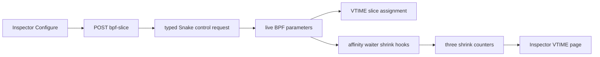

# VTIME slice controls and shrinking

## Goal

Allow the Inspector to update Snake's VTIME base slice and optionally shorten a
running task when an affinity-restricted waiter would otherwise sit behind a
long slice. Defaults preserve the previous 5 ms behavior with shrinking off.

## Control path

The request is atomic at the control level. Snake validates the complete tuple,
temporarily disables shrinking, publishes the base/min/max/multiplier values,
and finally publishes the requested enable state. The base must be at least
1 ms and `0 < min < max <= base` with a nonzero multiplier.

## BPF behavior

Each stopped task updates a runtime EWMA with alpha 1/8. Affinity enqueue checks
the target CPU's current task; run start also checks the head of that CPU's
affinity DSQ. If shrinking is enabled, the waiter's EWMA times the multiplier is
clamped between the configured minimum and maximum and can only reduce the
current runner's remaining slice. The removed time is also removed from the
runner's VTIME service budget.

Existing queued tasks keep their assigned slice after a live base update. New
dispatches converge immediately, and a newly observed waiter may shorten the
current runner. The feature does not change FIFO or EEVDF behavior.
