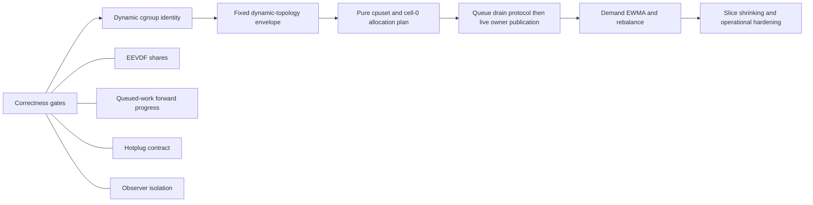

# Snake architecture and readiness review

Review date: 2026-07-29
Committed baseline: `d8185bc3477e05425f56bd50ee5cef73cdd96c88`
Scope: `scx_snake`, `scx_snake_inspector`, `scx_mitosis`, and selected schedulers under `scheds/rust`

This is a read-only design review. It makes no scheduler or inspector source-code
changes. The files in this directory are the review deliverables.

## Bottom line

Snake is a coherent experimental scheduler, not a random collection of scheduler
features. Its center of gravity is clear: userspace compiles declarative placement
and queue policy into a small, topology-blind BPF instruction set; BPF executes
bounded ladders and owns scheduling-time fairness and accounting. The inspector is
also internally coherent, but it has grown quickly enough that its transport and
front-end modules now need boundaries.

The review's estimates are:

| Dimension | Estimate | Interpretation |
| --- | ---: | --- |
| Snake experimental feature implementation | **80%** | Most declared mechanisms exist and have substantial tests. |
| Snake production readiness | **35%** | EEVDF correctness, work conservation, hotplug, scale evidence, and soak time are not adequate for production. |
| Static scheduling-data-plane parity with Mitosis | **73%** | Snake has cells, cell/LLC DSQs, affinity escapes, VTIME, borrowing, and accounting. |
| Overall end-to-end Mitosis behavior parity | **55% ±5%** | The defining dynamic cgroup/cell and CPU-resource control plane is mostly absent. |
| Mitosis dynamic control/resource plane | **33%** | Snake has static allocation and polling membership, but not dynamic lifecycle, cpusets, rebalancing, or safe live reassignment. |
| Inspector, committed baseline | **80%** | Broad and useful; scaling, protocol typing, browser smoke coverage, and documentation lag remain. |

These are engineering estimates, not test-coverage percentages. The scoring rubric
and feature-by-feature evidence are in [Feature completeness](feature-completeness.md).

## Most important conclusions

1. **Do not add another broad scheduling abstraction yet.** The policy compiler,
   ladder ABI, queue topology, and fairness state already cover a wide surface.
   Correctness and dynamic resource management now have higher value than more
   operations or scopes.

2. **Mitosis parity is primarily a control-plane project.** Snake already owns
   most static data-plane primitives. The missing work is direct-child cgroup
   discovery and inheritance, cpuset-aware allocation, live cell/CPU ownership,
   safe queue draining, demand tracking, EWMA/hysteresis, and rebalancing.

3. **Keep Snake's declarative layer above a new dynamic resource provider.** Do
   not make TOML policy replacement responsible for changing DSQ existence. Create
   a fixed attachment-time DSQ envelope, then transactionally activate cells and
   move CPU ownership inside it.

4. **Correctness gates come before Mitosis expansion.** EEVDF weighted shares are
   known incorrect. Queue-mode borrowing cannot drain already queued work and can
   hit the runnable-task watchdog. CPU hotplug is effectively unsupported. A
   diagnostic inspection error can currently unwind the scheduler loop, so observer
   isolation is also a release gate.

5. **The best performance work is targeted and measurable.** Snake already has
   callback, rung, fine-stage, and queue timing. Use it before changing BPF. The
   clearest immediate wins are inspector-side: avoid CPU-pair full-map scans and
   dense `N²` browser work, cache policy validation, and deserialize inspection
   payloads once.

6. **Refactor by ownership, not framework.** Split the largest files into existing
   domain concepts. Avoid a cross-scheduler framework until Snake and Mitosis have
   stable, proven shared interfaces.

## Roadmap priorities

This section is the source of truth for the inspector's **Project > Roadmap**
priority labels. It is a dated planning snapshot, not a promise of delivery order:

- **P0 — release gate:** required for trustworthy forward progress and safe operation;
- **P1 — next major milestone:** required for Mitosis parity, inspector scale, or
  credible validation;
- **P2 — important follow-up:** valuable after the P0/P1 foundations are sound;
- **P3 — evidence-gated research:** implement only when measurement justifies it.

### High-level goals

| Goal | Priority | Intended outcome |
| --- | :---: | --- |
| Correctness & forward progress | **P0** | Every exposed fairness and queue mode has tested service and progress invariants. |
| Production readiness & safe operations | **P0** | Topology and diagnostic failures cannot silently strand work or detach Snake. |
| Feature parity with Mitosis | **P1** | Managed cgroup cells, resource plans, and ownership changes are safe and observable. |
| Inspector scalability & contracts | **P1** | Large hosts avoid quadratic work and scheduler/inspector boundaries are typed. |
| Validation & rollout evidence | **P1** | Privileged, browser, failure, scale, canary, and rollback evidence supports readiness claims. |
| Policy research & selective prior art | **P2** | New algorithms enter Snake only as explicit, measured policies with bounded complexity. |

### Concrete feature priorities

| Key | Feature | Priority | Completion signal |
| --- | --- | :---: | --- |
| `eevdf-shares` | Correct EEVDF weighted shares | **P0** | Nice-weight ratios pass mandatory equal-, mixed-, sleeper-, yield-, and affinity-load VM cases. |
| `queued-work-progress` | Queued-work forward progress | **P0** | An underallocated cell cannot watchdog-stall while an eligible foreign CPU is idle. |
| `hotplug-contract` | CPU hotplug and topology contract | **P0** | Online/offline changes are supported transactionally or rejected and detached safely. |
| `observer-isolation` | Observer isolation | **P0** | Inspection, client, and ring-buffer failures cannot unwind the scheduler loop. |
| `cgroup-identity` | Cgroup-native managed identity | **P1** | Direct children and descendants retain stable logical identities across moves and slot reuse. |
| `complete-config-bank` | Complete atomic configuration bank | **P1** | Callbacks observe an old or new policy/resource/identity tuple, never mixed generations. |
| `cpuset-allocation` | Cpuset-aware allocation and cell-0 holdout | **P1** | Pure plans respect effective claims, preserve a consumer per queue, and report infeasibility. |
| `queue-drain` | Queue draining and live owner publication | **P1** | CPU and cell retirement drains backlog and quarantines reusable slots before publication. |
| `inspector-scaling` | Sparse, large-host inspector pipeline | **P1** | Collection and rendering scale with active CPU pairs instead of configured `CPUs²`. |
| `typed-protocol` | Typed compatibility and inspection protocol | **P1** | Structured codes and shared DTOs replace error-string inference and repeated JSON parsing. |
| `browser-vm-ci` | Browser, privileged VM, and failure CI | **P1** | Route/accessibility smoke, core scheduler contracts, and fault injection run automatically. |
| `demand-controller` | Demand EWMA and controlled rebalance | **P2** | Skew and reversal converge without burst oscillation or unnecessary ownership churn. |
| `numa-distance-order` | NUMA-distance placement order | **P2** | A measured explicit policy improves remote placement without enlarging the default hot path. |
| `pinned-latency` | Pinned-waiter latency control | **P3** | Benchmarks justify waiter-aware slice shrinking and prove fairness remains bounded. |
| `pick-two` | Pick-two approximate stealing | **P3** | A bounded explicit policy outperforms current shard search under demonstrated high fanout. |

## Recommended order of work



The first useful Mitosis-compatible milestone is not "all Mitosis features." It is:

- direct child cgroups automatically receive stable cell identities;
- descendants inherit that identity in BPF;
- userspace can update primary and borrowable CPU masks without recreating DSQs;
- one complete policy/resource/identity-binding transaction is applied atomically
  or rejected with the active bank intact;
- CPU reassignment cannot strand runnable work;
- the inspector shows lifecycle, allocation, drain, and rebalancing state.

## Document map

- [Architecture](architecture.md) — components, state ownership, scheduling path,
  policy replacement, cells, and inspector data flow.
- [Feature completeness](feature-completeness.md) — all major capabilities, percent
  estimates, evidence, gaps, and confidence.
- [Mitosis compatibility](mitosis-compatibility.md) — exact parity matrix, target
  architecture, implementation phases, invariants, and acceptance tests.
- [Modularity and performance](modularity-and-performance.md) — prioritized risks
  and low-complexity improvements.
- [Scheduler prior art](scheduler-prior-art.md) — useful features and patterns from
  Mitosis, Layered, Rusty, P2DQ, and LAVD, including what not to import.
- [Validation and risk plan](validation-and-risk-plan.md) — correctness gates,
  scale campaigns, failure injection, and production-readiness criteria.

## Review snapshot and uncommitted work

At review start, the following files had pre-existing uncommitted changes from a
different worker:

```text
scheds/rust/scx_snake/src/bpf/fairness.h
scheds/rust/scx_snake/src/bpf/intf.h
scheds/rust/scx_snake/src/bpf/main.bpf.c
scheds/rust/scx_snake/src/bpf/main.h
scheds/rust/scx_snake/src/bpf/queue_fairness.h
scheds/rust/scx_snake/src/inspection.rs
scheds/rust/scx_snake/src/main.rs
tools/scx_snake_inspector/src/dashboard.rs
tools/scx_snake_inspector/src/web/app.js
tools/scx_snake_inspector/src/web/inspection.js
tools/scx_snake_inspector/tests/api.rs
tools/scx_snake_inspector/tests/web/inspection.test.mjs
```

That work adds sampled per-DSQ insert/move timing, FIFO enqueue/dispatch fine
timing, inspector summaries, and tests. It is described as **current WIP** where
relevant but is not credited as committed functionality. Source line references
to WIP files describe the working tree observed during this review.

The source worktree continued moving during the review: by final verification,
the Snake and inspector READMEs were also modified by another worker. Those edits
are not part of this review's committed baseline or scores. This review changed
only files under `docs/snake-review/`.

### Citation convention

Relative source links open the shared working tree so they remain useful locally.
Unless a paragraph explicitly says **current WIP**, the claim was assessed against
commit `d8185bc3`; WIP paragraphs describe the dirty snapshot observed during the
review. Because the source worktree is shared and moving, the commit is the source
of truth for baseline reproduction (`git show d8185bc3:<path>`), while linked line
numbers are navigation aids for the final observed tree.

## What this review did not claim

- Percentages do not imply production certification.
- Unit-test count is not a substitute for live-kernel correctness or workload
  validation.
- Mitosis itself is not treated as a perfect reference; its configuration apply
  is explicitly non-atomic and fatal on partial failure.
- Existing scheduler features are recommended only when they align with Snake's
  policy-experiment purpose and do not add disproportionate complexity.
