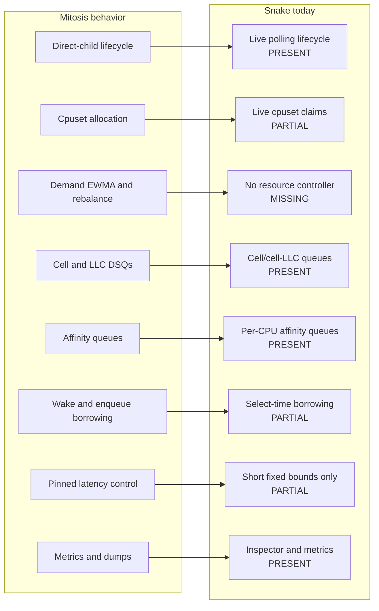
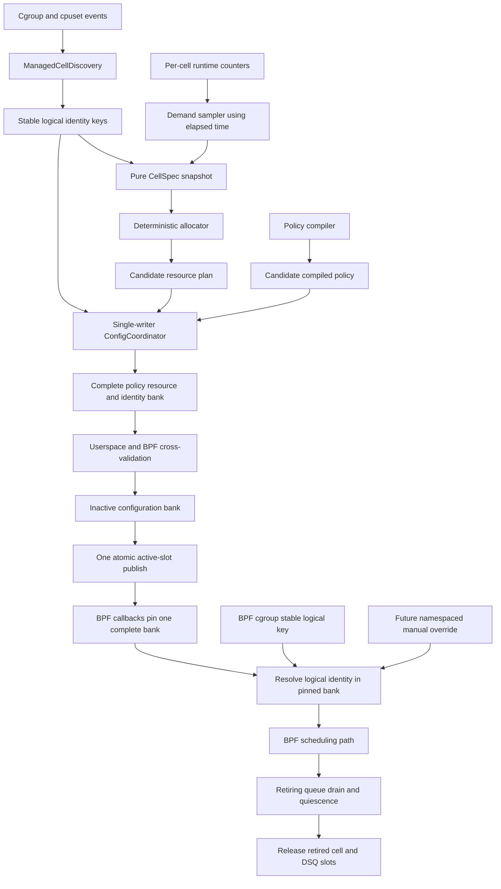
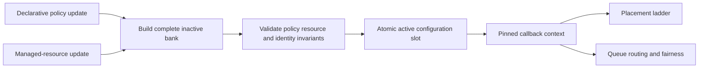

# Mitosis compatibility

## Executive assessment

Snake contains the scheduling data plane and a transactional direct-child cell
lifecycle needed to model a Mitosis host. It does not yet contain Mitosis's
demand-driven CPU control loop.

| Dimension | Snake parity | Meaning |
| --- | ---: | --- |
| Static scheduling data plane | **73%** | Cells, cell/LLC queues, affinity queues, VTIME, borrowing, and accounting exist. |
| Dynamic cell/resource control | **58%** | Direct-child lifecycle and cpuset topology publication exist; demand allocation and rebalancing do not. |
| Operations and diagnostics | **70%** | Inspector topology and transition errors exist, but managed allocation/rebalance/dump state is absent. |
| Weighted end-to-end behavior | **70% ±5%** | Snake can simulate managed Mitosis cells, but it cannot adapt CPU ownership to demand. |

The missing dependency chain is:

```text
automatic cgroup cells                         DONE (userspace polling)
  -> inherited task identity                  DONE (userspace polling)
  -> live cpuset topology publication         DONE
  -> demand-aware CPU ownership               MISSING
  -> feedback and controlled rebalancing      MISSING
```

## What Mitosis actually implements

Mitosis describes dynamic cell split/merge as a goal
([main.rs](../../scheds/rust/scx_mitosis/src/main.rs#L76-L82)), but the current
implementation uses one cell per managed direct child. Workload-driven cell
split/merge is not current parity scope.

| Mitosis capability | Current implementation evidence |
| --- | --- |
| Automatic direct-child lifecycle | Parent inotify plus full reconcile in [cell_manager.rs](../../scheds/rust/scx_mitosis/src/cell_manager.rs#L753-L863) and [cell_manager.rs](../../scheds/rust/scx_mitosis/src/cell_manager.rs#L918-L1045) |
| Excluded child names and catch-all cell 0 | CLI semantics in [main.rs](../../scheds/rust/scx_mitosis/src/main.rs#L122-L142) |
| Cell ID reuse | Freed-ID tracking in [cell_manager.rs](../../scheds/rust/scx_mitosis/src/cell_manager.rs#L1029-L1033) and [cell_manager.rs](../../scheds/rust/scx_mitosis/src/cell_manager.rs#L1107-L1119) |
| Hierarchical cgroup identity | Task refresh in [mitosis.bpf.c](../../scheds/rust/scx_mitosis/src/bpf/mitosis.bpf.c#L300-L400) and hierarchy propagation in [mitosis.bpf.c](../../scheds/rust/scx_mitosis/src/bpf/mitosis.bpf.c#L2116-L2188) |
| Cpuset-aware allocation | Cpuset reads and overlap allocation in [cell_manager.rs](../../scheds/rust/scx_mitosis/src/cell_manager.rs#L1048-L1228) |
| Cell-0 CPU holdout | Protected allocation in [cell_manager.rs](../../scheds/rust/scx_mitosis/src/cell_manager.rs#L290-L418) |
| Demand/EWMA CPU rebalance | Threshold/cooldown loop in [main.rs](../../scheds/rust/scx_mitosis/src/main.rs#L636-L707) and demand calculation in [main.rs](../../scheds/rust/scx_mitosis/src/main.rs#L1092-L1215) |
| Cell/LLC queue domains | Queue creation in [mitosis.bpf.c](../../scheds/rust/scx_mitosis/src/bpf/mitosis.bpf.c#L1809-L1823) and clock/queue structures in [intf.h](../../scheds/rust/scx_mitosis/src/bpf/intf.h#L114-L163) |
| Same-cell recovery and orphan drain | [llc_aware.bpf.h](../../scheds/rust/scx_mitosis/src/bpf/llc_aware.bpf.h#L213-L435) |
| Affinity-safe per-CPU queues | [mitosis.bpf.c](../../scheds/rust/scx_mitosis/src/bpf/mitosis.bpf.c#L227-L294) |
| Idle borrowing on wake and enqueue | [mitosis.bpf.c](../../scheds/rust/scx_mitosis/src/bpf/mitosis.bpf.c#L455-L510) |
| Pinned-waiter slice shrinking | [slice_shrinking.bpf.h](../../scheds/rust/scx_mitosis/src/bpf/slice_shrinking.bpf.h#L6-L175) |
| Live complete configuration | Userspace [main.rs](../../scheds/rust/scx_mitosis/src/main.rs#L709-L794), BPF [mitosis.bpf.c](../../scheds/rust/scx_mitosis/src/bpf/mitosis.bpf.c#L2194-L2242) |
| Managed telemetry and dumps | [stats.rs](../../scheds/rust/scx_mitosis/src/stats.rs#L18-L125), [mitosis.bpf.c](../../scheds/rust/scx_mitosis/src/bpf/mitosis.bpf.c#L1557-L1682) |

Mitosis's apply operation is explicitly **not atomic** and may leave partial state;
userspace treats failure as fatal
([mitosis.bpf.c](../../scheds/rust/scx_mitosis/src/bpf/mitosis.bpf.c#L2207-L2210)).
Snake should not copy that property.

## Capability mapping

| Mitosis behavior | Snake status | Gap |
| --- | --- | --- |
| Direct-child cgroup becomes a cell | Present | Reconciliation discovers additions and atomically publishes their queue topology. |
| Descendants inherit and live moves refresh | Partial | Recursive userspace polling eventually writes per-thread storage; Mitosis refreshes identity in BPF. |
| Excluded children remain in cell 0 | Present | Exact exclusions are omitted from managed identity and queue allocation. |
| Cell create/delete and ID reuse | Present | Stable IDs are retained; freed slots advance an epoch before reuse. |
| Cpuset-aware resource claims | Partial | Live discovery reads effective cpusets into the deterministic allocator; demand sizing and configurable holdout are absent. |
| Configurable cell-0 holdout | Partial | Snake guarantees cell 0 capacity but has no configurable minimum or diagnostic. |
| Demand measurement | Partial | Runtime, primary, borrowed, and lent counters exist; utilization/EWMA does not. |
| Demand-driven CPU allocation | Missing | No resource controller updates ownership. |
| Live cell/CPU topology | Partial | Managed changes use complete configuration banks; arbitrary policy topology mutation and CPU hotplug remain unsupported. |
| Cell and cell/LLC DSQs | Present | One cell clock is shared across a cell's LLC shards. |
| Per-CPU affinity queues | Present | One escape DSQ per configured CPU. |
| Weighted VTIME | Present | Bounded weight-scaled slices and inverse-weight service. |
| Normal/affinity min-vtime | Present | Both heads are compared in the CPU-owner cell clock. |
| Primary and borrowable placement | Present | Live affinity is intersected and foreign ownership validated. |
| Enqueue-time borrowing | Partial/missing | Direct borrowing occurs from `select_cpu`; queued backlog cannot borrow. |
| Cell intersect previous LLC placement | Missing | `previous_llc` and `task_cell` are separate sources. |
| Same-cell sibling-shard recovery | Present | Earliest remote shard head is scanned. |
| Orphaned shard drain after owner move | Partial | Managed transitions drain the fixed DSQ pool; no demand controller initiates owner moves. |
| Pinned-waiter slice shrinking | Missing | Snake's slice is shorter, but no waiter-aware mechanism exists. |
| Task rehome across clocks | Present | One stale run is preserved, then bounded-lag translation converges. |
| Detailed metrics/inspection | Present or stronger | Managed allocation and rebalance fields are missing. |
| Exit and task dumps | Partial | Exit buffer exists; `.dump` and `.dump_task` callbacks do not. |
| Queued-wakeup optimization | Missing | Mitosis conditionally enables it; Snake does not. |

The queue evidence is in
[queue_topology.rs](../../scheds/rust/scx_snake/src/queue_topology.rs#L131-L230),
borrowing in
[queue_fairness.h](../../scheds/rust/scx_snake/src/bpf/queue_fairness.h#L367-L393),
and managed topology publication in
[main.rs](../../scheds/rust/scx_snake/src/main.rs).



## How the 70% end-to-end estimate is derived

The 73% static-data-plane, 58% dynamic-control, and 70% operations figures are
rounded expert bands using the rubric in
[Feature completeness](feature-completeness.md). The 70% figure is additionally
cross-checked with the following explicit 100-point behavior model. “Snake
points” credit complete behavior, not merely a related primitive.

| Behavior | Weight | Snake points |
| --- | ---: | ---: |
| Automatic direct-child lifecycle | 8 | 8 |
| Descendant membership and live moves | 7 | 6 |
| Stable IDs, exclusions, and cell 0 | 5 | 5 |
| Cpuset allocation and holdout | 10 | 5 |
| Demand controller | 8 | 0 |
| Safe live resource publication | 4 | 4 |
| Cell/LLC and affinity DSQs | 8 | 8 |
| Weighted VTIME and clocks | 8 | 8 |
| Affinity-safe primary placement | 6 | 5 |
| Borrowing on wake and enqueue | 6 | 3 |
| LLC locality, stealing, and orphan drain | 7 | 4 |
| Pinned-task latency control | 5 | 1 |
| Metrics and monitoring | 6 | 6 |
| Exit and debug diagnostics | 4 | 2 |
| Scale and compatibility | 4 | 2 |
| End-to-end acceptance evidence | 4 | 3 |
| **Total** | **100** | **70** |

The ±5 range reflects unmeasured live-kernel behavior, especially borrowing,
fairness, churn, and scale. It is not statistical confidence.

## Managed-mode v1 contract

The current implementation supports `parent`, `exclude_children`,
`max_children`, and `reconcile_ms`. It polls direct children, retains their
numeric IDs while their names and inodes remain stable, reads
`cpuset.cpus.effective`, and keeps descendants flat inside the direct child's
cell. Deletion frees a slot; reuse or same-name inode replacement increments its
epoch. Policy, masks, and queue topology are published together through the
inactive configuration bank.

The following fields remain proposed for the demand controller:

An illustrative configuration shape is:

```toml
[managed_cells]
parent = "/sys/fs/cgroup/workloads"
exclude_children = ["system.slice"]
max_children = 31
reconcile_ms = 1000
cell0_min_cpus = 1
overflow = "cell0"
allocation = "equal_then_demand"
rebalance_threshold_pct = 20
rebalance_cooldown_ms = 5000
demand_ewma_alpha = 0.30

[queues]
layout = "cell_llc"
```

The controller, holdout, and rebalance fields are proposed syntax; the first
four fields described above are current. Current live semantics are:

- `[managed_cells]` enables the mode at attachment. It requires VTIME and a
  queue layout; changing the parent, maximum, layout, or fairness mode requires
  restart because it changes the fixed resource envelope.
- Each non-excluded direct child gets a stable numeric ID while its identity is
  retained. Descendants receive the same `(cell_id, slot_epoch)` through task
  storage. Exact-basename exclusions and children without an admitted slot
  remain in cell 0.
- A child claims its successfully read `cpuset.cpus.effective` mask. Missing,
  invalid, and empty masks reject the candidate rather than becoming an
  unconstrained claim. Nested cpuset restrictions remain authoritative through
  each task's live allowed-CPU mask.
- Allocation is deterministic within those cpuset constraints. Cell 0 has its
  configured weight, but no `cell0_min_cpus` guarantee or demand sizing exists.
- The first release supports at most 31 active managed children plus cell 0, but
  pool space alone does not admit a child. A new child becomes active only if a
  complete feasible plan gives every active normal queue at least one eligible,
  online consumer and preserves the cell-0 contract. Otherwise its logical key
  remains unbound, its tasks resolve to cell 0, an admission/capacity health
  error is emitted, and admission is retried after resources change.
- If a child set or effective cpuset changes, Snake resolves a complete
  candidate. An infeasible allocation is not published and is retried on the
  next interval. A feasible candidate enables transition routing, drains custom
  DSQs, prepares the inactive bank, atomically switches it, waits for old
  readers, and then updates membership.
- Managed mode is mutually exclusive with static `[[cell]]` and `[membership]`
  configuration. A manual numeric assignment resolves to the slot's active
  epoch; stale task storage cannot resolve into a later occupant of that slot.
- Policies may use generic task-cell placement, enqueue, and dispatch semantics,
  but may not embed managed slot IDs. A policy candidate is compiled against the
  resource sub-epoch in the active configuration bank, then the coordinator
  rechecks the complete configuration epoch before publishing. Resource churn
  causes a retry, never publication of a policy validated against stale cells or
  masks.
- Threshold, cooldown, and EWMA constants can become live tunables once the
  controller exists. Parent, pool size, fairness, and queue layout remain
  attachment-time settings.

Static and managed cells should not be mixed until ID namespaces, manual
override precedence, and cross-mode queue retirement have independent tests.

## Critical semantic decisions

These decisions must be explicit before implementation.

### 1. Managed identity and manual overrides

Mitosis has only managed cgroup identity. Snake also has per-thread manual
annotations. Snake uses this precedence rule:

```text
effective cell = manual task override ?? managed cgroup cell ?? cell 0
```

Every managed reference carries both the numeric ID and its slot epoch. Clearing
a manual override reveals the current managed assignment. A sleeping task or
manual reference from an older epoch cannot resolve into a later occupant of the
same numeric slot.

### 2. Queue pool and cell deletion

Snake precreates a fixed pool of normal DSQs at attachment, then assigns pool
slots to active cell/LLC shards. Before rebinding descriptors it diverts new work
to CPU-local DSQs and drains the pool. A retired binding is not reused until:

- readers of the old configuration bank are gone;
- no task remains queued on it;
- a drain target has observed it empty.

Do not encode cgroup identity directly into a reusable DSQ ID.

### 3. Affinity clocks during CPU-owner changes

A CPU affinity DSQ is ordered in its owner cell's clock. Snake therefore does
not rewrite `owner_cell_index` under queued work. Managed transitions divert new
enqueues to CPU-local DSQs and wait for every normal and affinity DSQ in the pool
to become empty before publishing new ownership. A task that next enqueues under
a different topology generation validates the destination identity and rebases
to its clock before ordered insertion.

The future demand controller must use this same transaction; independently
rewriting ownership remains unsafe.

### 4. Clock and task-cache epochs

Mitosis has per-cell/per-LLC clocks plus per-CPU clocks. Snake intentionally has
one fairness clock per cell, even with LLC shards. Preserve Snake's cell-clock
model for normal work unless benchmarks demonstrate a need to change its fairness
semantics. Mitosis parity should mean operational behavior, not byte-for-byte
algorithm identity.

Mutable clocks, DSQs, and task state are not copied into a configuration bank.
They live in fixed pools. Banked cell descriptors carry an external ID and slot
epoch, while each task runtime caches the topology generation, dense index,
external ID, and epoch used for its normal and affinity VTIME coordinates.

On a generation mismatch, an unchanged identity retains its coordinate. A
different dense index, external ID, or epoch initializes at the destination
frontier with neutral lag; ordinary task moves within one generation retain the
existing bounded-lag translation. Old-bank readers and queued work must drain
before slot publication. Sleeping task caches do not block reuse because their
stale generation and identity force neutral initialization before a new ordered
insert.

### 5. Complete configuration publication

Do not add independently published policy and resource slots. Even if each slot
is internally atomic, a callback can otherwise observe a new policy with old
resources or vice versa. Broaden Snake's existing two policy banks into two
**complete configuration banks**:

```text
Configuration bank
  compiled policy, mask tables, labels, policy generation
  identities: stable logical key -> cell slot/epoch/state
  cells: active, epoch, primary, borrowable, shard descriptors
  cpus: owner cell/epoch, affinity clock epoch and normal route
  shards: DSQ slot, cell/LLC identity, active|retiring|free
  one configuration epoch covering every field above
```

Fixed mutable DSQ and clock objects remain outside the banks because they are
created at attach; the banks contain their assignments and expected epochs. One
userspace `ConfigCoordinator` serializes policy and resource updates. It
snapshots the active bank, applies one candidate change, validates all
cross-invariants, stages the complete inactive bank, rechecks the source epoch,
and publishes one `active_config_slot`. If the epoch changed, it rebuilds rather
than merging.

Cross-validation requires each logical key and slot epoch to be unique, every
active normal shard to have an eligible online consumer, every owner to satisfy
the effective claim, every route to reference an active DSQ/clock epoch, and cell
0 to satisfy its declared holdout or enter the explicit degraded result.

Every BPF callback uses the existing read-pin pattern on that one active slot:
read slot, increment its reader count, re-read the active slot, retry if it
changed, and then use policy and resource fields only from the pinned bank. The
inactive bank cannot be reused until its readers reach zero. Therefore a callback
observes an old or new complete configuration, never a mixed pair. Validation or
staging failure leaves the active bank untouched.

Cgroup storage contains only the stable logical key, never a bank or cell slot.
Lifecycle ordering makes that external input safe:

1. On create, allocate a never-reused birth key, write and reconcile it through
   the existing descendant hierarchy, and leave it unbound so callbacks fall
   back to cell 0. Only after propagation and allocation succeed may a complete
   bank bind that key and be published.
2. On delete, first publish a bank that removes or retires the key binding. New
   callbacks then fall back to cell 0 while callbacks pinned to the old bank may
   finish. Clear cgroup state and reuse the cell slot only after reader
   quiescence, queue drain, running-task quiescence, and slot quarantine.
3. On a task cgroup move, the BPF cgroup-move hook invalidates its cached
   resolution before its next scheduling use. Both the old and new logical keys
   resolve through whichever complete bank the callback pins.

If create-time propagation cannot be confirmed, the key is not admitted. This
ordering is part of the transaction contract, not eventual cleanup.

## Target architecture



Policy and resource updates converge through the same transaction boundary:



## Implementation sequence

### Phase 0: correctness and semantics

- Decide managed/manual namespaces, deletion behavior, maximum cells, and clock
  semantics.
- Fix or disable EEVDF as a selectable production path.
- Define queued-work forward-progress and CPU-hotplug contracts.
- Add generation/epoch types before any ID reuse.

Exit gate: design invariants and tests are written; no managed cell can be confused
with a reused slot.

### Phase 1: cgroup-native identity

The attach-time scanner is a precursor, not completion of this phase: it
synthesizes cells and recursively tags existing child trees, but it does not
provide live logical identity or create/delete/recreate ordering.

- Add direct-child discovery by path and inode.
- Add exact child exclusions.
- Port only the narrow BPF cgroup-storage inheritance and task-move refresh logic,
  storing a stable logical key rather than a reusable cell slot.
- Implement create-before-bind and unbind-before-clear ordering. Do not publish an
  identity until existing descendants have reconciled.
- Use task storage for cached logical key and resolved configuration/slot epochs;
  reject numeric assignment requests in managed v1 and allow idempotent clear.
- Expose lifecycle and identity generation in inspection.

Exit gate: create/delete/recreate, hierarchy propagation, bank publication, and
descendant task moves can race without resolving a task to a reused slot.

### Phase 2: stable dynamic resource envelope

- Precreate a bounded normal-DSQ pool and existing per-CPU affinity DSQs.
- Broaden the two ladder banks into complete configuration banks with one active
  slot and one reader count per bank.
- Add a single update coordinator and stage/validate/publish the full bank for
  either policy or resource changes.
- Add active, retiring, and free queue-slot states.

Exit gate: a fault-injected update cannot expose a mixed
policy/resource/identity-binding tuple; cell descriptors can be staged without
DSQ creation or partial publication.

### Phase 3: cpuset allocation and cell-0 protection

- Generalize Snake's allocator to consume pure specs:

  ```text
  { identity, optional_claim_mask, weight, minimum_cpus }
  ```

- Treat an explicitly unavailable parent cpuset controller as an all-CPU claim.
- Read effective cpuset constraints so inherited masks are concrete.
- Distinguish a successfully empty effective mask from missing-file, parse,
  permission, and I/O failures.
- Retain a last-good claim after read failure only when the independent BPF
  cpuset-change generation proves no mutation occurred; otherwise detach.
- Add configurable cell-0 minimum and holdout diagnostics.
- Reject new-child admission when no feasible consumer-preserving plan exists.
- Define controlled detach for an existing cell whose new claim invalidates the
  current plan and has no safely publishable replacement.

Exit gate: overlapping, disjoint, empty, inherited, and full-coverage cpuset tests
are deterministic; every active normal queue has an eligible online consumer; and
infeasible changes follow the explicit admission-or-detach result. This phase
produces a pure plan only; it does not yet publish live owner changes.

### Phase 4: CPU moves and draining

- Implement the selected affinity-clock strategy.
- Implement a retirement transition that prevents new work from entering an old
  route while retaining a designated consumer for its backlog.
- Keep disappearing normal shards drainable after publication.
- Kick designated drain CPUs.
- Publish the final CPU-owner change only after affected queues and running state
  satisfy the drain/quiescence contract.
- Quarantine retired cell and DSQ slots until empty, quiescent, and reader-free.
- Epoch every clock and task-cached route. Translate bounded lag only while the
  source epoch exists; initialize stale sleepers at neutral destination lag after
  clock reuse.
- Add same-cell orphan-drain and final-CPU-removal tests.

Exit gate: removing a cell's final CPU in an LLC under backlog cannot trigger the
runnable-task watchdog.

### Phase 5: demand controller

- Convert existing runtime counters using actual elapsed time.
- Apply idle EWMA decay.
- Seed new cells from active-cell average demand.
- Add threshold, cooldown, and no-op assignment suppression.
- Recompute only when inputs or allocation outcome change.
- Publish controller reason, old/new ownership, and convergence metrics.

Exit gate: skew converges, reversal converges, and burst load does not oscillate.

### Phase 6: small data-plane gaps and hardening

- Add a composite `task_cell_previous_llc` placement scope.
- Allow queue-safe enqueue-time primary/borrowable placement reevaluation.
- Add `.dump` and `.dump_task` callbacks.
- Evaluate queued-wakeup optimization.
- Benchmark pinned latency before deciding whether to port slice shrinking.
- Add restart/churn/failure-injection and scale campaigns.

## Mitosis implementation details not to copy

The reference code contains useful concepts and several controller weaknesses:

- idle cells can skip zero-demand EWMA decay;
- capacity uses configured monitor interval rather than actual elapsed time;
- a high spread with unchanged integer allocation can recompute every loop;
- CPU-only rebalance reapplies cgroup ownership and walks the hierarchy;
- stats and demand paths scan all configured cell slots;
- cpuset read errors are collapsed into “no cpuset”;
- the inotify watch omits rename/move events;
- argument validation is effectively empty;
- live BPF configuration is non-atomic.

Snake should import the lifecycle, identity, allocation inputs, and drain concepts,
not the implementation wholesale.

## Acceptance matrix

| Area | Required test |
| --- | --- |
| Identity | Create/delete/path-reuse with new inode; logical key and slot epoch prevent stale reference |
| Inheritance | Fork/exec, descendant moves, hierarchy propagation, and bank publication races resolve through the pinned binding or safely fall back to cell 0 |
| Overrides | Managed v1 rejects numeric set requests; clear is idempotent and falls back to current cgroup identity; future namespaced overrides get separate precedence tests |
| Cpuset | New infeasible/read-failed child stays unbound; unchanged generation may retain a last-good plan; changed or unknown generation plus read failure detaches |
| Cell 0 | Configured minimum held without taking a child's last CPU |
| Publication | Failed inactive validation leaves the active complete bank unchanged; readers see an old or new policy/resource/identity-binding tuple, never mixed state |
| Clock reuse | Live source epoch translates bounded lag; a sleeper waking after source-clock reset starts at neutral destination lag and records the fallback |
| Affinity | CPU owner move with affinity backlog preserves ordering or defers safely |
| Drain | Final consumer removal drains to zero without watchdog stall |
| Demand | Idle decay, elapsed-time normalization, seeding, cooldown, no-op suppression |
| Rebalance | Skew, reversal, burst, and churn converge without oscillation |
| Fairness | Nice-weight shares remain correct across normal, affinity, and borrowed work |
| Operations | Dump and inspector identify active generation, reason, owner, drain, and retirement |

Operational campaigns are expanded in
[Validation and risk plan](validation-and-risk-plan.md).
