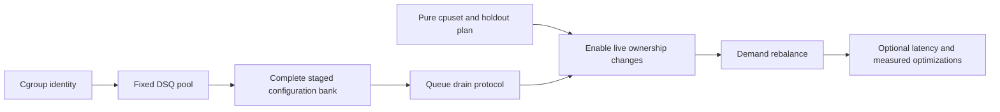

# Scheduler prior art

## Selection rule

Snake is an experimental declarative-policy mechanism, not a general-purpose
scheduler ([README](../../scheds/rust/scx_snake/README.md#L5-L10)). Existing
scheduler features are useful only when they:

- preserve the userspace-policy/BPF-execution boundary;
- solve a demonstrated Mitosis, correctness, or scale gap;
- can be represented explicitly rather than silently changing semantics;
- do not require importing an unrelated classification, power, or queueing system.

The strongest shared pattern in this repository is:

```text
userspace discovers resources and computes a complete plan
    -> validates bounded state
    -> publishes a small BPF representation
    -> BPF performs scheduling without a userspace round trip
```

## Borrow/adapt/avoid matrix

| Priority | Source pattern | Benefit to Snake | Complexity/dependency | Verdict |
| --- | --- | --- | --- | --- |
| P0 | Mitosis direct-child discovery and inode reconciliation | Automatic cell lifecycle and safe path reuse | Managed-mode semantics | Borrow discovery, separate from allocation |
| P0 | Mitosis BPF cgroup identity/inheritance | Removes per-thread classification window | Cgroup storage and override precedence | Required for real parity |
| P0 | Mitosis lazy generation refresh | Refresh task state only after config/cgroup changes | Requires cgroup/resource generation | Borrow |
| P0 | Mitosis fixed DSQ envelope | Enables cell and CPU activation without DSQ creation | Attach cost and fixed limits | Adapt to Snake's smaller pool |
| P0 | Mitosis orphaned-shard drain | Prevents stranded work after CPU reassignment | High concurrency risk | Required before live owner moves |
| P0 | Snake's existing staged publication | Preserves active generation on validation failure | Complete-bank reader/quiescence design | Retain; do not copy Mitosis partial apply |
| P1 | Mitosis cpuset/holdout semantics | Overlap, claims, borrowable masks, cell-0 protection | Pure allocator input design | Extend Snake's allocator |
| P1 | Mitosis demand EWMA/hysteresis | Sustained-demand CPU ownership | Depends on identity, transaction, drain | Opt-in managed profile |
| P1 | Mitosis cpuset change signal | Avoids constant file polling | Kernel hook compatibility | Add with polling fallback |
| P1 | Mitosis lifecycle test scenarios | Exercises real isolation and churn | VM harness work | Port per phase |
| P2 | Mitosis capability-gated lockless peek | Potential dispatch reduction with fallback | Kernel feature and benchmark | Borrow only if measured |
| P2 | Mitosis pinned-waiter slice shrinking | Reduces wait behind long affinity slices | Runtime EWMA and context-switch cost | Explicit optional policy only |
| P2 | Layered quantity/order separation | Allocator chooses counts; small strategy chooses locality | One or two initial strategies | Strong boundary to borrow |
| P2 | Layered pure allocator/property tests | Deterministic resource planning | Low | Strong pattern |
| P2 | Layered IRQ/stolen-time compensation | More accurate demand on capacity-reduced CPUs | Per-CPU capacity accounting | Later hardening |
| P2 | Rusty fast sampler / slow planner split | Keeps frequent work bounded | Controller boundaries | Borrow structurally |
| P2 | LAVD distance-ordered candidates | Fills Snake's remote NUMA ordering gap | Topology lowering and new explicit scope/order | Good focused addition |
| P3 | P2DQ bounded pick-two | Approximate remote selection without full scan | Requires load signal; changes semantics | New explicit operation only |
| P3 | P2DQ hot-field cacheline separation | Can reduce clock/load contention | Hardware-sensitive | Only after profiling |
| P3 | Cosmos local-underload/shared-saturation model | Locality plus work conservation | Changes queue/fairness behavior | Future explicit policy, not default |

## Mitosis: control plane, not wholesale scheduler policy

### Borrow

#### Direct-child discovery and identity

Mitosis watches one parent, rescans on events, and reconciles by path and inode.
That handles event coalescing, overflow, and deletion/recreation better than trusting
individual inotify events
([cell_manager.rs](../../scheds/rust/scx_mitosis/src/cell_manager.rs#L918-L1045)).

The BPF side stores inherited cgroup cell identity and lazily refreshes task state
after a configuration or cgroup move. This is the correct semantic basis for strict
managed isolation; Snake's current recursive `cgroup.threads` scan is an eventual
classifier.

#### Stable queue envelope and drain concept

Mitosis precreates cell/LLC queues and retains enough state to find and drain queues
that lose their last normal consumer. Snake should adapt the idea as a bounded pool
of DSQ slots with active/retiring/free states, not duplicate Mitosis's dense maximum
of 256 cells by 16 LLCs.

#### Cpuset and cell-0 inputs

Mitosis's allocator handles overlapping cpusets, unclaimed CPUs, borrowable masks,
demand weights, and a protected cell 0. Snake already has a smaller pure allocator;
add these inputs to it rather than copying the 3,800-line cell manager.

#### Acceptance scenarios

Mitosis's shell tests cover borrowing, sensitive-versus-hog isolation, demand
rebalance, cpuset swaps, live child creation, and churn. Port each scenario into an
isolated VM/ktstr-style harness as the corresponding Snake phase is implemented.

### Adapt or reject

Mitosis's live apply is explicitly non-atomic and fatal after a partial failure.
Snake already has the better stage/validate/publish/readers model. Use a complete
plan, but preserve Snake transaction semantics.

Mitosis's demand accounting scans dense CPU-by-cell capacity. Snake should iterate
active cells and sample only counters required by the controller.

Pinned-waiter slice shrinking addresses Mitosis's long slice exposure. Snake's
VTIME base slice and waiter-aware shrink limits are now live parameters. Measure
pinned wake-to-run p95/p99 and context-switch cost before enabling it by default.

## Layered: allocator structure and capacity signals

Layered's allocator explicitly separates resource quantity from placement order.
Its pure water-fill logic documents conservation, weight, demand caps, and exact
rounding
([alloc.rs](../../scheds/rust/scx_layered/src/alloc.rs#L1-L226)); topology growth is
a separate strategy
([layer_core_growth.rs](../../scheds/rust/scx_layered/src/layer_core_growth.rs#L215-L353)).

That boundary maps cleanly to managed Snake:

```text
DemandSampler -> desired CPU counts
CellAllocator -> exact per-cell counts and constraints
CpuOrderStrategy -> which concrete CPUs preserve locality
ConfigTransaction -> staged publication
```

Initially implement only deterministic topology-local and balanced strategies.
Importing Layered's full classifier and growth-algorithm surface would duplicate a
different scheduler's policy language.

Layered also compensates utilization for IRQ, softirq, and stolen time so a workload
does not appear to need less CPU merely because its CPUs lost capacity
([README](../../scheds/rust/scx_layered/README.md#L70-L99)). This is useful after
the basic demand controller is correct; it is not a phase-one requirement.

## Rusty: fast sampling and slow planning

Rusty clearly separates domains, tuner, load balancer, and statistics at the module
level
([main.rs](../../scheds/rust/scx_rusty/src/main.rs#L9-L18)). Its userspace design
uses fast, cheap tuning and slower, more expensive balancing
([main.rs](../../scheds/rust/scx_rusty/src/main.rs#L65-L86)).

Use the same cadence split:

- `DemandSampler`: frequent, bounded counter deltas;
- `CellPlanner`: slower, runs only after threshold/cooldown/input change;
- `ConfigApplier`: validates and publishes only a changed plan.

Do not import Rusty's task-migration hierarchy. It solves a different multi-domain
balancing problem and lacks Snake's cgroup/cell semantics.

## LAVD: topology ordering without hot-path topology objects

LAVD precomputes distance-ordered CPU candidates in userspace and lets BPF traverse
the bounded representation
([cpu_order.rs](../../scheds/rust/scx_lavd/src/cpu_order.rs#L290-L365),
[balance.bpf.c](../../scheds/rust/scx_lavd/src/bpf/balance.bpf.c#L344-L448)). This
directly addresses Snake's documented lack of distance-ordered remote NUMA search.

A focused Snake addition could be an explicit scope/order such as
`topology_nearest_idle` or a userspace-lowered sequence of distance tiers. It should
remain declarative and optional.

Do not import LAVD's latency-criticality classifier, virtual-deadline policy,
preemption system, frequency control, or core compaction. Those define a different
scheduler.

## P2DQ: bounded approximation, not invisible semantics

P2DQ uses bounded pick-two load balancing across LLC/NUMA queues and has extensive
arena, queue, power, autoslice, and heterogeneous-core functionality
([README](../../scheds/rust/scx_p2dq/README.md#L5-L14),
[README](../../scheds/rust/scx_p2dq/README.md#L73-L112)).

Pick-two is useful if Snake later adds explicit cross-cell queued stealing: choose
two eligible remote domains, compare a small load signal, and try the heavier one.
It is not a drop-in replacement for exact `min_vtime`; silently substituting it
would change policy semantics.

Do not import arenas/ATQ/DHQ, interactive classification, power management,
autoslicing, or big/little policy merely to gain pick-two. Those are disproportionate
to Snake's purpose.

## Cosmos and other scheduler families

Cosmos keeps local queues below saturation and switches to shared deadline queues
under pressure
([README](../../scheds/rust/scx_cosmos/README.md#L7-L21)). The concept is relevant
to locality versus work conservation, but it changes queue topology and fairness.
If explored, expose it as an explicit adaptive policy with observable state—not a
backend optimization.

The remaining Rust schedulers were screened rather than assumed irrelevant:

| Scheduler | Relevant idea | Decision for Snake |
| --- | --- | --- |
| [Beerland](../../scheds/rust/scx_beerland/README.md) | Per-CPU deadline DSQs and saturation-time remote pull | Useful work-conservation comparison; do not import its fairness model |
| [Forge](../../scheds/rust/scx_forge/README.md) | Closed-loop workload and evaluation workflow | Borrow validation discipline, not generated hot-path behavior |
| [Chaos](../../scheds/rust/scx_chaos/README.md) | Deliberate scheduling fault injection | Borrow failure-test ideas; never production policy |
| [Cake](../../scheds/rust/scx_cake/README.md) | Workload classification and latency tiers | Different product scope; avoid implicit classification |
| [Pandemonium](../../scheds/rust/scx_pandemonium/README.md) | Adaptive classification, deadlines, and migration | Too much coupled policy for a Mitosis-control-plane project |
| [Flash](../../scheds/rust/scx_flash/README.md) and [Bpfland](../../scheds/rust/scx_bpfland/README.md) | Interactivity classification and EDF-style prioritization | Scope expansion; consider only as future explicit policies |
| [Rustland](../../scheds/rust/scx_rustland/README.md) | Userspace scheduling decisions | Conflicts with Snake's BPF hot-path execution boundary |
| [Tickless](../../scheds/rust/scx_tickless/README.md) | NO_HZ/HPC-oriented event routing | Operationally specialized and unrelated to managed cells |

These schedulers do not change the prioritized import list. Their most reusable
contribution is validation technique, not scheduling behavior.

## Recommended imported module shape

```text
dynamic_cells/
  discovery.rs       direct children, inode identity, excludes
  demand.rs          active-cell deltas, elapsed time, EWMA
  allocation.rs      pure CellPlan computation
  transaction.rs     validate, stage, publish complete bank

BPF
  cell_membership.h  cgroup storage and lazy task refresh
  dynamic_cells.h    active cells, owners, masks, generation
  queue_drain.h      retired/orphaned shard protocol
  slice_shrink.h     optional and policy controlled, if justified
```

Dependency order:



The allocator can be built and tested before drain support. Its results must not
be published as live CPU-owner changes until the drain and quiescence protocol is
implemented.

The design should remain intentionally asymmetric: use Mitosis for dynamic resource
identity and lifecycle, Layered for allocator structure, Rusty for controller
cadence, LAVD for optional topology ordering, and P2DQ only for a future explicit
approximate stealing policy. Snake's compiler, accounting, transaction style, and
inspector remain the organizing system.
