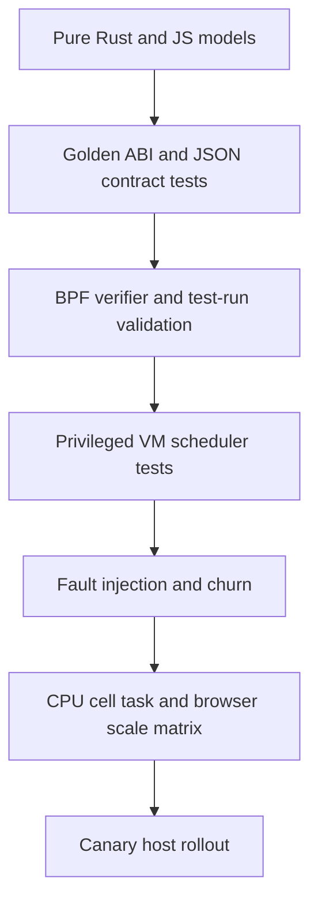
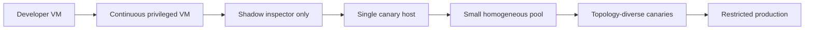

# Validation and risk plan

## Risk register

### P0: release blockers

#### EEVDF weighted fairness is known incorrect

Confidence: high. Impact: top-level fairness mode cannot be trusted.

The project records that pinned nice-level tasks receive approximately equal
service instead of expected weighted shares
([FAIRNESS.md](../../scheds/rust/scx_snake/docs/FAIRNESS.md#L3-L6)). Current CI runs
the EEVDF affinity-forward-progress case but not the weighted-share contract
([ci.yml](../../.github/workflows/ci.yml#L376-L384)).

Gate:

- hide or clearly disable EEVDF in non-experimental control surfaces;
- turn nice-share validation into a mandatory VM regression;
- compare BPF state transitions with a small reference model using captured event
  vectors;
- require equal-weight, two-weight, three-weight, sleeper, yield, and affinity
  cases before enabling it.

#### Static queue cells are intentionally not work-conserving

Confidence: high. Impact: Mitosis parity and production forward progress.

Direct borrowing helps newly runnable work, but an already queued normal task is
not stolen by another cell. An undersized cell can hit the sched_ext watchdog while
foreign CPUs are idle
([QUEUE_POLICY.md](../../scheds/rust/scx_snake/docs/QUEUE_POLICY.md#L83-L90)).

This is documented behavior, not a small hidden bug. Near-term safety should add
overload warnings based on queue age/depth and reject obvious capacity mistakes.
Full resolution requires dynamic ownership or an explicit cross-cell queued-work
policy with clock semantics.

#### CPU hotplug and dynamic owner changes lack safe contracts

Confidence: high. Impact: current topology support and future Mitosis mode.

Managed cell ID reuse can retarget stale annotations, and changing a CPU owner can
reinterpret queued affinity VTIME in the wrong cell clock. No dynamic topology work
should ship until epoch/retirement and affinity-clock invariants are tested. See
[Mitosis compatibility](mitosis-compatibility.md#critical-semantic-decisions).

Current hotplug is also undefined: queue descriptors and custom DSQs are
attachment-time state, and Snake registers no CPU online/offline callbacks
([main.bpf.c](../../scheds/rust/scx_snake/src/bpf/main.bpf.c#L498-L507)). Until a
drain/reassignment design exists, explicitly reject or document hotplug as
unsupported and test that contract.

#### Diagnostic failure can stop the scheduler

`inspection()` performs task storage and `/proc` inspection for every tracked task
and propagates a non-disappearance error
([main.rs](../../scheds/rust/scx_snake/src/main.rs#L2144-L2202)). The scheduler
request loop uses `?` on `metrics()` and `inspection()`
([main.rs](../../scheds/rust/scx_snake/src/main.rs#L2223-L2229)), so an observer
failure can unwind the scheduler and detach it.

Required behavior:

- task inspection is best-effort per row;
- diagnostic errors are returned in the response, not as scheduler-loop failure;
- last-good inspector data remains available with freshness/error state;
- a disconnected or malformed client cannot affect scheduler attachment.

## P1: high-priority correctness and scale risks

### Membership clear failure is not retried

The removal path forgets the task and retained pidfd before clearing managed task
storage. A non-exit error is logged, but the next reconciliation has no state with
which to retry
([membership.rs](../../scheds/rust/scx_snake/src/membership.rs#L107-L121)). A stale
managed cell can later become visible when a manual override is cleared.

Required behavior: retain known task and pidfd until clear succeeds or task exit is
confirmed. Add a deterministic injected-failure retry test.

### Inspector polling amplification is large-host material

At 1,024 CPUs and 32 cells, one full metrics request reads approximately:

```text
74 global stats × 1024 CPUs × 8 bytes
+ 32 cells × 9 stats × 1024 CPUs × 8 bytes
+ 7 callbacks × 1024 CPUs × 520 bytes
= 6,692,864 bytes
```

Four top-stat requests plus one inspection request per second are roughly 32 MiB/s
of raw map data and 1,845 per-CPU map lookup calls per second, before task inspection,
allocation, JSON, and rendering. The migration collector additionally walks its
map every 250 ms, and the browser performs dense `N²` work.

Required campaigns compare inspector absent and present at 8, 64, 256, and 1,024
CPUs. Required implementation direction is in
[Modularity and performance](modularity-and-performance.md#performance-findings).

### Dispatch has data-dependent scans

- EEVDF scans future and eligible DSQs for CPU-compatible tasks; only promotion is
  capped.
- Cell/LLC VTIME scans every normal shard of a cell after a local miss.
- Random placement scans up to 1,024 CPUs.

Do not cap EEVDF walks blindly; that can break forward progress. Keep EEVDF gated
until it has an affinity-indexed design or equivalent proof. Use existing remote
scan timing before optimizing VTIME.

### Timing transport can bias the measurement and delay control

Fine and rung ring-buffer output failures are ignored
([main.h](../../scheds/rust/scx_snake/src/bpf/main.h#L249-L263),
[main.h](../../scheds/rust/scx_snake/src/bpf/main.h#L354-L368)). Userspace drains
4,096-event batches until it sees a short batch, without a per-loop maximum. Under
sustained sampling this can monopolize the scheduler loop.

Add emitted/dropped counters per stream, cap drain batches per loop iteration, and
make rung streaming independently sampled or enabled. The current DSQ WIP should
emit one detailed event and derive aggregate views in userspace.

## P2: bounded defects and debt

### Reset does not clear rung timing

Rung timing is keyed by policy generation, while reset intentionally preserves the
generation. The reset path clears fine and queue accumulators but not rung timing.
Old and new samples therefore mix after “Reset all statistics.”

Add a rung accumulator clear/prune operation and test every reset surface: global,
rung, callback, fine, queue, dashboard rolling history, and frozen-slot behavior.

### Queue mode allocates a cpumask per task

Queue-mode `init_task` creates a cpumask kptr for temporary intersections. At high
task counts this is material memory. After proving callbacks cannot reenter on one
CPU, evaluate the existing per-CPU scratch mechanism. Do not change this before a
memory profile demonstrates value.

### Documentation and protocol drift

Inspector route count, EEVDF exposure, queue metrics, timing availability, and ABI
version have drifted. Golden protocol fixtures and a single capability table should
be test inputs, not prose maintained independently.

## Existing validation inventory

Approximate source-level inventory at review time:

| Surface | Count or coverage |
| --- | --- |
| Snake Rust `#[test]` functions | 191 committed; 2 more in current WIP |
| Snake privileged VM shell scripts | 12 |
| Inspector Rust tests | 95 |
| Inspector JavaScript tests | 104 committed; 2 more in current WIP |
| Mitosis Rust tests | 67 |
| Mitosis shell/ktstr integration files | 6 |

Snake's VM scripts cover FIFO fallback, VTIME cells, queue ladders, borrowing,
maximum cells, mixed affinity, low-weight yield, and live rehome. The combined
gauntlet deliberately excludes EEVDF
([FAIRNESS.md](../../scheds/rust/scx_snake/docs/FAIRNESS.md#L348-L370)). Normal CI
also runs a generic Snake stress case and checks activation, expected rung activity,
and kernel errors
([ci.yml](../../.github/workflows/ci.yml#L245-L290)).

The main gaps are live BPF/model equivalence, failure injection, browser DOM smoke,
multi-client scale, hotplug, and systematic performance curves.

### Automation gaps

The inspector declares its own Cargo workspace, is not a member of the root
workspace, and its Rust and Node tests are not run by the repository's normal
nextest job. Add one CI job using its documented commands:

```bash
cargo test --manifest-path tools/scx_snake_inspector/Cargo.toml
cargo check --all-targets --manifest-path tools/scx_snake_inspector/Cargo.toml
node --test tools/scx_snake_inspector/tests/web/*.test.mjs
```

The 104 committed JavaScript tests exercise pure models and some source/markup
contracts; they do not run a browser. Add a small headless suite for five workflows:
route navigation, disclosure/focus survival through polls, unapplied selector state,
policy apply/restart behavior, and cell task expansion.

The strong Snake VM gauntlet is mostly manual. Run a short FIFO/VTIME subset for
relevant pull requests and the full gauntlet nightly. Mitosis CI currently starts an
empty managed parent but does not exercise lifecycle, cpuset changes, borrowing,
draining, or rebalancing; parity work needs those tests as phase gates.

## Test architecture



Each layer should fail a different class of error. More unit tests do not replace
VM tests; more VM tests do not replace observer and controller scale measurement.

## Required correctness campaigns

### Fairness and forward progress

- mandatory EEVDF nice-share ratios against kernel weights;
- equal and unequal VTIME weights with direct, normal, affinity, and borrowed work;
- yield, sleep/wake, overrun, weight change, and request-boundary transitions;
- hundreds or thousands of mutually incompatible affinity tasks;
- queue under-allocation with overload warning and no silent diagnosis;
- owner wake while a foreign borrower runs; borrower yields after one slice.

### Configuration publication

- repeated live policy swaps during wake-heavy load;
- concurrent policy and resource candidates serialize through one coordinator;
- monotonic epochs and correct active/frozen bank identity;
- reader quiescence and bounded activation latency;
- callbacks observe an old or new complete policy/resource/identity-binding
  tuple, never a mixed generation;
- invalid candidate leaves the active bank, counters, topology, and captures
  unchanged;
- reset and replacement races with every timing capture state.

### Task identity and membership

- fork/exec and thread churn during reconciliation;
- task moves between assigned, unassigned, and manually overridden cgroups;
- clear failure retries;
- TID reuse with retained pidfd;
- scheduler restart documents annotation loss;
- 10,000–100,000 managed-thread churn to expose scan and inspection costs.

### Affinity and topology

- dynamic `sched_setaffinity()` while sleeping, runnable, queued, and running;
- sparse CPU IDs near the 1,024 limit;
- SMT/no-SMT, one and many LLCs, one and many NUMA nodes;
- CPU offline/online with normal and affinity backlog;
- remote cell/LLC shard scans at increasing fanout.

### Observer and control isolation

- `/proc` read failure, task-storage read failure, poisoned/closed client, and
  malformed request cannot detach Snake;
- ring-buffer saturation reports drops and does not starve controls;
- API timeout does not leave an unreported background mutation;
- multiple inspector clients do not multiply scheduler map reads unnecessarily;
- stopped-scheduler policy validation rejects invalid TOML before launch.

## Mitosis-mode campaigns

Port or parameterize the contracts in Mitosis's cell churn, exclusion, isolation,
affinity load-balance, smoke, and cell-0 starvation tests. Add:

- child delete/recreate with the same path and a new inode;
- create/delete and descendant propagation racing complete-bank publication;
- cell-slot epoch reuse while stale task/queue state exists;
- sleeping task wake after its former slot and clock have been reused;
- cgroup move while sleeping, running, on normal DSQ, on affinity DSQ, and borrowed;
- cpuset swaps under CPU-bound load;
- infeasible new-child admission remains in cell 0 with an explicit health error;
- cpuset read failure after a confirmed or unprovable generation change causes
  controlled detach instead of retaining potentially invalid owners;
- existing-cell cpuset shrink either retains a still-valid plan or causes the
  specified controlled detach;
- sleeper wake after source-clock reuse starts at neutral destination lag and
  records the epoch-fallback counter;
- final CPU removed from an LLC shard with queued work;
- demand skew, reversal, idle decay, and burst/no-oscillation;
- failed inactive-bank validation leaves the complete active
  policy/resource/identity-binding configuration untouched;
- restart/detach while cgroups and cpusets churn.

## Performance matrix

| Axis | Values |
| --- | --- |
| CPUs | 8, 64, 128, 256, 512, 1,024 |
| Cells | 1, 8, 32; higher only after scale limit changes |
| LLCs | 1, 4, 8, 16 and a high-fanout host if available |
| Runnable tasks | 1×, 4×, and 32× CPU count; plus 100k sleeping/managed tasks |
| Affinity | unrestricted, one CPU, one LLC, fragmented masks |
| Sampling | disabled, 1/64, every callback; captures off/on |
| Inspector | absent, one client, four clients |
| Policy churn | none, 1 Hz validation, repeated live swaps |
| Managed control | stable, cgroup churn, cpuset churn, demand rebalance |

Measure:

- workload throughput and tail latency;
- callback/rung/stage p50, p95, p99;
- runqueue delay, context switches, migrations, LLC misses;
- watchdog margin and invalid/accounting errors;
- scheduler and inspector CPU/RSS;
- map-read bytes and calls per second;
- SSE/REST bytes and browser frame/render time;
- ring emitted/dropped counts;
- controller reconciliation/rebalance duration and owner moves;
- queue-drain duration and retired-slot count.

## Rollout gates



Required at every scheduler rollout stage:

- zero sched_ext stalls and BPF invalid/accounting errors;
- no observer-caused detach;
- known fairness ratios within tolerance;
- callback p99 within an agreed budget relative to FIFO/control baseline;
- ring-drop rates visible and below threshold;
- queue ages and depths bounded for the declared resource policy;
- rollback is a normal scheduler detach/restart, not manual state repair.

Additional managed-mode gates:

- every cell/CPU assignment has a generation and reason;
- no stale identity crosses an epoch;
- no retired queue slot is reused before drain/quiescence;
- rebalance rate and owner churn remain bounded;
- cell 0 retains configured capacity;
- inspector and dump data can explain every active, retiring, or failed resource.

## Definition of production-ready

Production readiness should not be declared until all of the following are true:

1. no fairness mode exposed as supported has a known correctness failure;
2. every declared resource policy has a forward-progress/work-conservation contract;
3. CPU hotplug is either supported or safely rejected;
4. diagnostics cannot affect scheduler lifetime;
5. privileged CI runs the important FIFO, VTIME, queue, and EEVDF contracts;
6. scale curves exist for target CPU/cell/task counts with and without inspector;
7. dump, metrics, and alerts identify stalls, drops, topology generations, and
   rebalancing decisions;
8. canary and rollback procedures have been exercised under workload and churn;
9. documentation, protocol fixtures, UI availability, and implementation agree.

## Operational completeness estimate

These scores measure validation and rollout readiness, not feature implementation:

| Area | Complete |
| --- | ---: |
| Static Snake policy/unit validation | 85% |
| FIFO/VTIME VM validation | 65% |
| Automated CI coverage of the VM suite | 30% |
| EEVDF validation | 30% |
| Inspector API/model validation | 75% |
| Inspector real-browser validation | 20% |
| Dynamic Mitosis-parity validation | 15% |
| Performance regression coverage | 15% |
| Production rollout/runbook readiness | 10% |
| **Overall production validation readiness** | **approximately 25%** |

The fastest material improvements are an inspector CI job, nightly use of the
existing Snake gauntlet, and a fault-injected complete-configuration publication
harness before dynamic cells are implemented.
