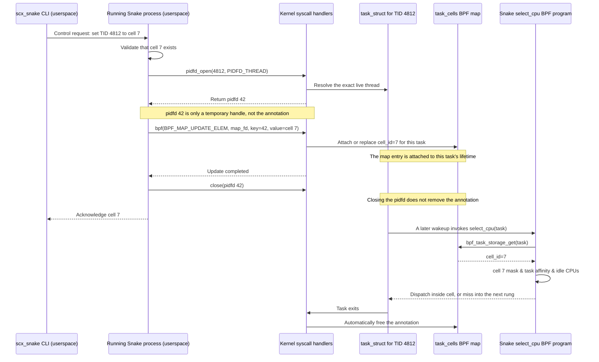

# Task Cell Annotations

This proposal lets userspace assign an integer cell to an individual thread.
A policy separately maps each cell ID to an arbitrary CPU set; cell CPU sets
may overlap. BPF sees only a task-local integer and generic CPU masks.

## Who writes what



There are two separate phases:

1. **Control phase:** the running Snake userspace process makes syscalls that
   write the annotation into a BPF map managed by the kernel.
2. **Scheduling phase:** the BPF scheduler reads that annotation when the task
   later reaches the cell rung. BPF does not contact userspace on this path.

Task-local storage is not a literal field added to `struct task_struct`. It is
kernel-managed sidecar storage addressed through the task pointer and destroyed
automatically when the task exits.

## What is a pidfd?

A pidfd is a file descriptor referring to one specific live process or thread.
Unlike a numeric TID, it cannot silently start referring to a different thread
after the original exits and the number is reused. `PIDFD_THREAD` tells
`pidfd_open()` that the supplied number may identify an individual thread
rather than only a process leader.

`pidfd_open()` does **not** modify the task or its annotation. It only returns
the stable handle used as the key for the next syscall. The actual write is a
`bpf(BPF_MAP_UPDATE_ELEM, ...)` syscall, normally invoked through libbpf's
`bpf_map_update_elem()` wrapper. The kernel resolves the pidfd, finds that
task's local storage, and copies the new `cell_id` into it synchronously.

The update syscall receives two different file descriptors and one value:

```text
task_cells map FD  -> which BPF map to update
pidfd              -> which exact thread owns the storage
cell_id             -> what annotation to store
```

Yes, a syscall performs the update. No scheduler BPF program runs during the
write; scheduler BPF reads the resulting value later.

| Actor | Responsibility |
| --- | --- |
| Policy author | Defines `cell_id -> CPU set` in TOML. |
| CLI | Sends a typed assignment request; it does not write BPF maps. |
| Running Snake process | Validates the request and issues pidfd/BPF syscalls. |
| Kernel | Resolves the pidfd, updates task storage, and cleans it up at exit. |
| Snake BPF program | Reads `cell_id` during scheduling and applies the cell rung. |

## BPF representation

The presence of a task-storage entry is the validity marker, so its value needs
only a cell ID:

```c
struct snake_task_cell {
    __u32 cell_id;
    __u32 reserved;
};

struct {
    __uint(type, BPF_MAP_TYPE_TASK_STORAGE);
    __uint(map_flags, BPF_F_NO_PREALLOC);
    __type(key, int);
    __type(value, struct snake_task_cell);
} task_cells SEC(".maps");
```

The cell rung receives `struct task_struct *p`, reads `task_cells` with
`bpf_task_storage_get(&task_cells, p, NULL, 0)`, and uses `cell_id` to look up a
generic cell mask. It intersects that mask with `p->cpus_ptr` before selecting
an idle CPU. Missing annotations, missing cell definitions, and empty
intersections are normal rung misses so later policy rungs remain authoritative.

## Userspace updates

The CLI should send a typed request to the existing Snake control socket. The
running scheduler owns the task-storage map FD and performs the update:

```text
set-thread-cell(tid=4812, cell=7)
  1. Confirm that cell 7 exists in the active policy.
  2. Call pidfd_open(4812, PIDFD_THREAD) to get a stable task handle.
  3. Call bpf_map_update_elem(task_cells_fd, &pidfd, &cell, BPF_ANY).
     This wrapper issues the bpf(BPF_MAP_UPDATE_ELEM) syscall that writes.
  4. Close pidfd and acknowledge the update.

clear-thread-cell(tid=4812)
  1. Call pidfd_open(4812, PIDFD_THREAD).
  2. Call bpf_map_delete_elem(task_cells_fd, &pidfd).
     This wrapper issues the bpf(BPF_MAP_DELETE_ELEM) syscall that deletes.
  3. Close pidfd and acknowledge the update.
```

Using a pidfd as the userspace map key binds the update to the exact live
thread, avoiding TID-reuse races. Closing the pidfd does not remove the
annotation. Thread exit removes its task-local storage automatically. The map
update is synchronous: after it returns successfully, the next BPF lookup sees
the new cell ID without polling or an asynchronous propagation step.

This direct path requires a kernel with `PIDFD_THREAD`. On older kernels, the
fallback is a small BPF control program that resolves the TID with
`bpf_task_from_pid()` and updates the same task-storage map.

Illustrative CLI commands:

```bash
sudo scx_snake --set-thread-cell 4812:7
sudo scx_snake --clear-thread-cell 4812
```

Batch assignment should let a caller update several threads in one control
request. The scheduler should validate the entire batch first and return the
result for each TID. All-or-nothing application would require snapshot and
rollback logic and remains a separate design choice.

## Policy shape

One possible userspace policy syntax is:

```toml
[[cell]]
id = 7
cpus = "0-7"

[[cell]]
id = 8
cpus = "4-11" # Overlap is intentional.

[[rung]]
operation = "pick_idle"
scope = "task_cell"

[[rung]]
operation = "pick_idle"
scope = "task_allowed"
```

Userspace parses the CPU lists, validates CPU IDs, and installs the cell masks.
The BPF ABI remains topology-blind: the new rung means only "read this task's
integer key and use the corresponding generic mask."

## Why not a TID hash map?

A regular `TID -> cell` map would be simpler to write, but it would require a
lookup on every placement, explicit exit cleanup, and protection against stale
entries after TID reuse. Reading such a map only from `init_task` also loses
updates made after thread creation. Task-local storage provides live updates,
stable task identity, and automatic lifetime management.

## Simpler version's placement timing

The map value is current as soon as the update syscall returns, but the simpler
cell rung reads it only from `select_cpu`, which runs when a task wakes. A task
that is sleeping uses the new cell on its next wakeup. A continuously runnable
task does not necessarily call `select_cpu` again promptly and therefore may
remain on its old CPU even though its annotation is already current.

If placement must converge within one time slice for continuously runnable
tasks, Snake also needs a generic rehome check in its stop/enqueue path. That is
separate from storage freshness and should not be hidden inside this simpler
design.

## Open decisions

- Whether new threads inherit their parent's cell or start unannotated.
- Whether cell annotations survive a policy replacement when the new policy
  does not define that cell ID. The safest behavior is to retain the integer
  annotation but make the cell rung miss until the ID is defined again.
- Whether the first version is idle-only or may queue onto a busy cell CPU.
  Idle-only composes directly with Snake's current select ladder.
- Authorization for annotating another process's threads. The initial CLI can
  require root while the control protocol keeps room for finer checks later.
- Whether batch assignment is best-effort per TID or atomic with rollback.
