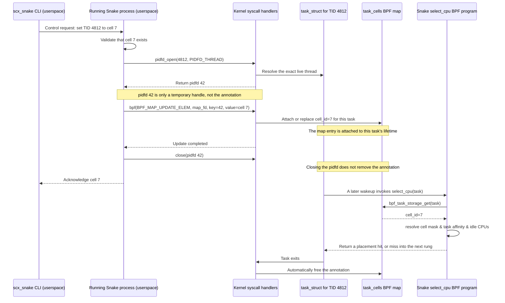

# Task Cell Annotations

This interface lets userspace assign an integer cell to an individual thread.
A policy separately maps each cell ID to an arbitrary CPU set; cell CPU sets
may overlap. BPF sees only a task-local integer and generic CPU masks.

Cell annotations have two policy interpretations:

- Without `[queues]`, `task_cell` uses the declared CPU set as a generic
  placement mask.
- With `[queues]`, userspace converts declarations into disjoint primary CPU
  ownership and borrowable masks. `task_cell` means the allocated primary mask;
  `task_cell_borrowable` means the remainder of that cell's claim.

The annotation format and pidfd control path are identical in both modes.
This document is the control-path and annotation-lifecycle reference. See
[`QUEUE_POLICY.md`](QUEUE_POLICY.md) for queue allocation and
[`FAIRNESS.md`](FAIRNESS.md) for service-ordering clocks.

## Who writes what



There are two separate phases:

1. **Control phase:** the running Snake userspace process makes syscalls that
   write the annotation into a BPF map managed by the kernel.
2. **Scheduling phase:** the BPF scheduler reads that annotation when the task
   later reaches the cell rung. BPF does not contact userspace on this path.

Task-local storage is not a literal field added to `struct task_struct`. It is
kernel-managed sidecar storage addressed through the task pointer and destroyed
automatically when the task exits.

## What is a pidfd?

A pidfd is a file descriptor referring to one specific live process or thread.
Unlike a numeric TID, it cannot silently start referring to a different thread
after the original exits and the number is reused. `PIDFD_THREAD` tells
`pidfd_open()` that the supplied number may identify an individual thread
rather than only a process leader.

`pidfd_open()` does **not** modify the task or its annotation. It only returns
the stable handle used as the key for the next syscall. The actual write is a
`bpf(BPF_MAP_UPDATE_ELEM, ...)` syscall, normally invoked through libbpf's
`bpf_map_update_elem()` wrapper. The kernel resolves the pidfd, finds that
task's local storage, and copies the new `cell_id` into it synchronously.

The update syscall receives two different file descriptors and one value:

```text
task_cells map FD  -> which BPF map to update
pidfd              -> which exact thread owns the storage
cell_id             -> what annotation to store
```

Yes, a syscall performs the update. No scheduler BPF program runs during the
write; scheduler BPF reads the resulting value later.

| Actor | Responsibility |
| --- | --- |
| Policy author | Defines `cell_id -> CPU set` in TOML. |
| CLI | Sends a typed assignment request; it does not write BPF maps. |
| Running Snake process | Validates the request and issues pidfd/BPF syscalls. |
| Kernel | Resolves the pidfd, updates task storage, and cleans it up at exit. |
| Snake BPF program | Reads `cell_id` during scheduling and applies the cell rung. |

## BPF representation

The presence of a task-storage entry is the validity marker, so the value does
not need a separate validity field. It carries the requested cell ID and a
rehome flag used to converge live updates:

```c
struct snake_task_cell {
    __u32 cell_id;
    __u32 needs_rehome;
};

struct {
    __uint(type, BPF_MAP_TYPE_TASK_STORAGE);
    __uint(map_flags, BPF_F_NO_PREALLOC);
    __type(key, int);
    __type(value, struct snake_task_cell);
} task_cells SEC(".maps");
```

The cell rung receives `struct task_struct *p` and reads `task_cells` with
`bpf_task_storage_get(&task_cells, p, NULL, 0)`. Placement-only mode uses
`cell_id` directly as a generic mask-table key. Queue mode translates it to a
dense queue-cell index; a missing or unknown annotation resolves to synthetic
cell 0. In both modes, BPF intersects the chosen mask with live `p->cpus_ptr`
before selecting an idle CPU.

Missing placement-only annotations, missing definitions, no idle CPU, and empty
intersections are normal rung misses, so later policy rungs remain
authoritative. `needs_rehome` is set by a live userspace update. Placement-only
mode clears it on a successful cell placement; queue mode clears it after a
scheduling callback has adopted and translated the requested identity. Queue
dispatch will not replenish an expired running task while its annotation
targets another cell, so even an otherwise isolated CPU-bound task returns
through enqueue to complete the clock translation. A normal task already
linked on its old cell DSQ cannot be removed by the annotation update. If it is
dispatched before re-enqueue, Snake charges that one execution to the old cell,
suppresses renewal, and adopts the new cell on its next enqueue.

## Userspace updates

The CLI sends a typed request to the existing Snake control socket. The
running scheduler owns the task-storage map FD and performs the update:

```text
set-thread-cell(tid=4812, cell=7)
  1. Confirm that cell 7 exists in the active policy.
  2. Call pidfd_open(4812, PIDFD_THREAD) to get a stable task handle.
  3. Build task_cell = { cell_id: 7, needs_rehome: 1 }.
  4. Call bpf_map_update_elem(task_cells_fd, &pidfd, &task_cell, BPF_ANY).
     This wrapper issues the bpf(BPF_MAP_UPDATE_ELEM) syscall that writes.
  5. Close pidfd and acknowledge the update.

clear-thread-cell(tid=4812)
  1. Call pidfd_open(4812, PIDFD_THREAD).
  2. Call bpf_map_delete_elem(task_cells_fd, &pidfd).
     This wrapper issues the bpf(BPF_MAP_DELETE_ELEM) syscall that deletes.
  3. Close pidfd and acknowledge the update.
```

Using a pidfd as the userspace map key binds the update to the exact live
thread, avoiding TID-reuse races. Closing the pidfd does not remove the
annotation. Thread exit removes its task-local storage automatically. The map
update is synchronous: after it returns successfully, the next BPF lookup sees
the new cell ID, or no annotation after a clear, without polling or an
asynchronous propagation step.

This direct path requires a kernel with `PIDFD_THREAD`; older kernels return an
error. A future compatibility path could use a small BPF control program that
resolves the TID with `bpf_task_from_pid()` and updates the same map.

Illustrative CLI commands:

```bash
sudo scx_snake --set-thread-cell 4812:7
sudo scx_snake --clear-thread-cell 4812
```

The interface updates one TID per request. New threads do not inherit this
task-storage entry and therefore begin unannotated.

## Placement-only policy shape

The userspace policy syntax is:

```toml
[[cell]]
id = 7
cpus = "0-7"

[[cell]]
id = 8
cpus = "4-11" # Overlap is intentional.

[[rung]]
operation = "pick_idle"
scope = "task_cell"

[[rung]]
operation = "pick_idle"
scope = "task_allowed"
```

Userspace parses the CPU lists, validates CPU IDs, and installs the cell masks.
The BPF ABI remains topology-blind: the rung means only "read this task's
integer key and use the corresponding generic mask." Placement-only policies
allow cell ID 0 and up to 1024 cell IDs in the mask-key space.

## Queue-mode policy shape

```toml
[queues]
layout = "cell_llc"

[[cell]]
id = 7
cpus = "0-7"
cpu_weight = 2

[[rung]]
operation = "pick_idle"
scope = "task_cell"

[[rung]]
operation = "pick_idle"
scope = "task_cell_borrowable"
```

Queue mode reserves ID 0 for unannotated tasks and permits at most 31 declared
cells. Userspace creates synthetic cell 0, resolves overlapping declarations
into dense cells with disjoint primary masks, and derives borrowable masks.
These masks do not consume generic placement mask-table slots.

A `task_cell` hit records a preferred primary CPU and still enters the queue
enqueue ladder. A `task_cell_borrowable` hit is the direct-dispatch exception:
it verifies that another cell owns the idle CPU before dispatching. See
[`QUEUE_POLICY.md`](QUEUE_POLICY.md) for allocation, DSQ, clock, and accounting
rules.

## Why not a TID hash map?

A regular `TID -> cell` map would be simpler to write, but it would require a
lookup on every placement, explicit exit cleanup, and protection against stale
entries after TID reuse. Reading such a map only from `init_task` also loses
updates made after thread creation. Task-local storage provides live updates,
stable task identity, and automatic lifetime management.

## Placement timing

The map value is current as soon as the update syscall returns. A sleeping task
uses it from `select_cpu` at its next wakeup. In placement-only mode, `enqueue`
also evaluates configured task-cell rungs for annotated runnable tasks. If all
eligible cell CPUs are busy, normal fairness enqueue continues and cell
placement is retried later.

Queue mode does not re-run placement rungs from `enqueue`. The queue callback
ladder uses the current cell identity directly. Normal-cell enqueue requires
the task to be allowed on the complete primary mask; otherwise its terminal
affinity target provides forward progress. A live annotation change translates
the task's vruntime between cell clocks when a scheduling callback adopts the
new identity. A task already linked on an old normal DSQ retains that identity
for its next execution, then must return through enqueue before translation.

For the lifetime of the running Snake instance, annotations remain attached
until explicitly cleared or the thread exits. Restarting or unloading Snake
destroys its task-storage map and all annotations with it.
Placement-only policy replacement does not rewrite them; an ID absent from the
new policy simply makes its cell rung miss. Queue topology, including its cell
IDs, cannot change during live replacement. The control path requires the
privileges needed to update BPF task storage and currently has no batch or
inheritance operation.
