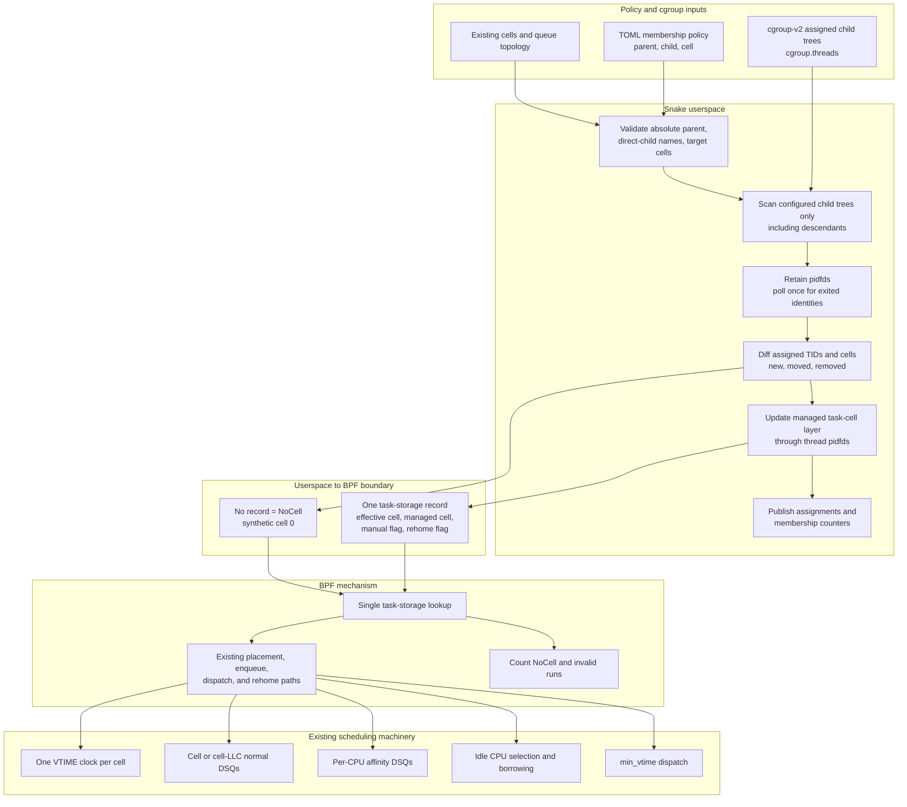

# Userspace Cgroup Cell Membership

Snake can derive task-to-cell assignments from a cgroup-v2 subtree without
putting cgroup policy in BPF. Userspace owns paths, lifecycle, and validation;
BPF receives only the resolved numeric cell for assigned threads.



## Policy

```toml
[membership]
parent = "/sys/fs/cgroup/workloads"
reconcile_ms = 1000

[[membership.assignment]]
child = "batch"
cell = 1

[[membership.assignment]]
child = "latency"
cell = 2
```

Each `child` is one direct child name beneath `parent`. The assignment applies
to threads in that child and all of its descendants. The parent must already
exist. Assigned child directories may appear and disappear while Snake runs.

Membership requires a cell queue layout (`cell` or `cell_llc`) and every target
cell must be declared.
It is attachment-time configuration: live policy replacement may change
ladders but must not change membership paths or assignments.

## Semantics

- A managed cell assignment creates the task-storage record consumed by BPF.
- A task outside every assigned child is `NoCell`. It has no managed record and
  therefore schedules in synthetic cell 0.
- `membership_no_cell_runs` counts actual running callbacks for this policy;
  `running` is its denominator. `membership_invalid_runs` must remain zero.
- A manual `--set-thread-cell` override takes precedence over the managed
  layer. Clearing it reveals the current managed assignment, or `NoCell` when
  there is none. Manual cell 0 is an explicit `NoCell` override.
- Rehoming is requested only when the effective numeric cell changes. Merely
  confirming the same membership does not perturb queue state.

## Lifecycle

Userspace reads `cgroup.threads` only under configured child trees. It does not
sweep all of `/proc`, which proved disruptive under large runnable workloads.
For a newly assigned TID it reads `/proc/TID/stat` once, writes task storage
through a thread pidfd, and retains a pidfd for identity. One nonblocking
`poll()` prunes exited identities on each reconciliation. This prevents TID
reuse without repeating per-task procfs reads.

Task storage is removed automatically at exit. When a live thread leaves an
assigned subtree, userspace clears only the managed layer. Any manual override
remains intact; otherwise absence immediately selects the `NoCell` policy.

## Boundary

Paths, cgroup IDs, and hierarchy operations never enter the BPF ABI. BPF does
one task-storage lookup and uses the same cell clocks, DSQs, affinity fallback,
borrowing, and rehome mechanics as manual assignments.
