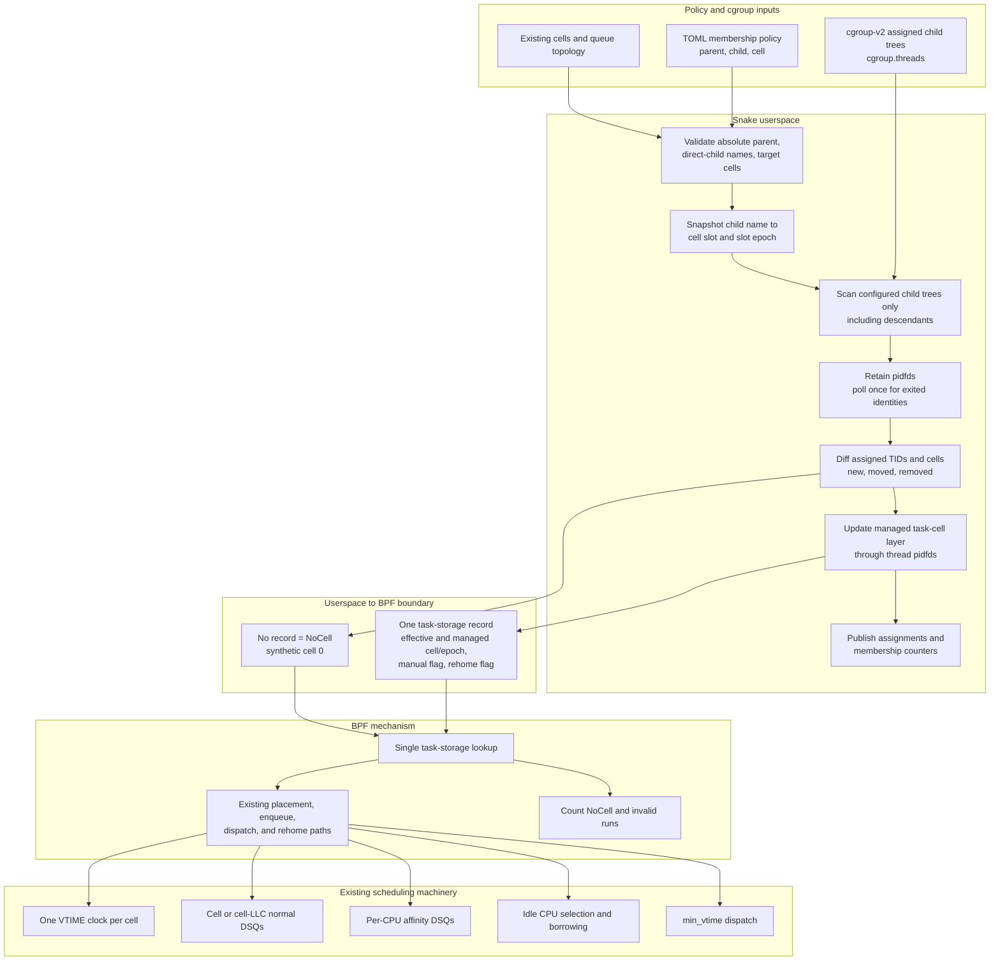

# Userspace Cgroup Cell Membership

Snake can derive task-to-cell assignments from a cgroup-v2 subtree without
putting cgroup policy in BPF. Userspace owns paths, lifecycle, and validation;
BPF receives the resolved cell slot and slot epoch for assigned threads.



## Policy

```toml
[membership]
parent = "/sys/fs/cgroup/workloads"
reconcile_ms = 1000

[[membership.assignment]]
child = "batch"
cell = 1

[[membership.assignment]]
child = "latency"
cell = 2
```

Each `child` is one direct child name beneath `parent`. The assignment applies
to threads in that child and all of its descendants. The parent must already
exist. Assigned child directories may appear and disappear while Snake runs.

Membership requires a cell queue layout (`cell` or `cell_llc`) and every target
cell must be declared.
It is attachment-time configuration: live policy replacement may change
ladders but must not change membership paths or assignments.

## Managed Direct Children

Snake can synthesize and maintain cells and membership assignments instead of
listing them individually:

```toml
[managed_cells]
parent = "/workload.slice/workload-tw.slice"
exclude_children = ["systemd-workaround.service"]
max_children = 31
reconcile_ms = 1000

[queues]
layout = "cell_llc"
```

`parent` is an absolute cgroup path. A path already rooted beneath
`/sys/fs/cgroup` is also accepted. Each non-excluded direct child is assigned a
cell ID and its `cpuset.cpus.effective` mask becomes that cell's CPU claim.
Existing children retain their IDs across reconciliations. New children take the
lowest free ID, and slot reuse or same-name inode replacement advances the slot
epoch. A child beyond `max_children` remains in cell 0 and is retried when a slot
becomes free. Snake rejects a candidate whose effective mask is missing,
invalid, or empty.

Only direct children create cells. All nested cgroups remain flat within their
direct child's cell, and the membership walker applies the same cell reference
to their threads. A nested cgroup's narrower effective cpuset is still enforced
through each task's kernel allowed-CPU mask; it does not create a nested cell or
another queue domain.

Managed discovery runs at `reconcile_ms`. For a changed child set or effective
cpuset, userspace resolves a complete candidate, drains the fixed custom-DSQ
pool, prepares policy and topology in the inactive configuration bank, and
publishes the bank atomically. The active bank remains unchanged if preparation
fails. Membership is updated only after old-bank readers have quiesced.

Discovery records each managed child's cgroup inode. Deletion removes its cell;
same-name replacement is a new identity even if it reuses the numeric slot.
Both paths advance the topology generation, and reuse advances the slot epoch so
sleeping tasks cannot carry old VTIME state into the replacement cell.

## Semantics

- A managed cell assignment creates the task-storage record consumed by BPF.
- Static policy assignments use slot epoch zero. Managed cells use nonzero slot
  epochs and increment them whenever a slot is rebound.
- A task outside every assigned child is `NoCell`. It has no managed record and
  therefore schedules in synthetic cell 0.
- `membership_no_cell_runs` counts actual running callbacks for this policy;
  `running` is its denominator. `membership_invalid_runs` must remain zero.
- A manual `--set-thread-cell` override takes precedence over the managed
  layer. Clearing it reveals the current managed assignment, or `NoCell` when
  there is none. Manual cell 0 is an explicit `NoCell` override. The control
  path resolves a managed target to its active slot epoch before writing the
  override.
- Rehoming is requested only when the effective `(cell, epoch)` reference
  changes. Merely confirming the same membership does not perturb queue state.
  Reusing the same numeric slot with a new epoch is an effective change and
  requests rehome.

## Lifecycle

Userspace reads `cgroup.threads` only under configured child trees. It does not
sweep all of `/proc`, which proved disruptive under large runnable workloads.
For a newly assigned TID it reads `/proc/TID/stat` once, writes task storage
through a thread pidfd, and retains a pidfd for identity. One nonblocking
`poll()` prunes exited identities on each reconciliation. This prevents TID
reuse without repeating per-task procfs reads.

Task storage is removed automatically at exit. When a live thread leaves an
assigned subtree, userspace clears only the managed layer. Any manual override
remains intact; otherwise absence immediately selects the `NoCell` policy.

A reconciliation can observe a moving TID in both its old and new cgroups. A
previously unknown duplicate remains unannotated until the next pass. A known
duplicate retains its last valid assignment instead of choosing a cell based on
directory traversal order.

## Boundary

Paths, cgroup IDs, and hierarchy operations never enter the BPF ABI. BPF does
one task-storage lookup, validates the annotated epoch against the active cell
descriptor, and uses the same cell clocks, DSQs, affinity fallback, borrowing,
and rehome mechanics as manual assignments. A stale epoch is invalid and routes
through synthetic cell 0 rather than a reused slot.
