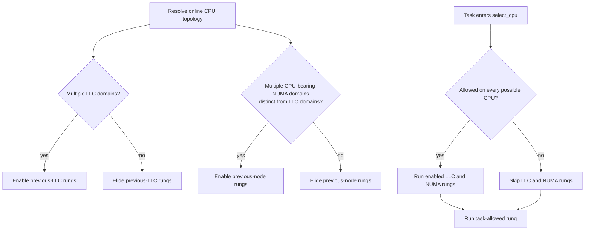

# Kernel-Style Topology Gating

This note describes a proposed follow-up for `kernel-default-sim.toml`. It is
not implemented yet. The goal is to make the explicit Snake ladder skip LLC
and NUMA searches in the same cases as the Linux 6.13 default selector.

## Decision flow



Host-level decisions are made when topology is resolved. Task affinity is
checked on every `select_cpu` invocation because it can change while the
scheduler is running.

## Resulting ladders

The synchronous-wake stage and exact previous-CPU claims are never gated. Only
the broad LLC and NUMA searches are conditional.

```text
Unrestricted task                    Restricted task
-----------------                    ---------------
sync_wake_affine                     sync_wake_affine
claim_idle_core(previous_cpu)        claim_idle_core(previous_cpu)
pick_idle_core(previous_llc)         pick_idle_core(task_allowed)
pick_idle_core(previous_node) *      claim_idle(previous_cpu)
pick_idle_core(task_allowed)         pick_idle(task_allowed)
claim_idle(previous_cpu)
pick_idle(previous_llc)
pick_idle(previous_node) *
pick_idle(task_allowed)

* Present only when NUMA is a distinct, CPU-bearing topology tier.
```

"Unrestricted" matches the kernel check: `nr_cpus_allowed >=
num_possible_cpus()`. A task restricted by `taskset`, cpusets, or another
affinity mechanism therefore treats its allowed mask as one flat scheduling
domain.

## This host

This machine has ten LLC domains, so the previous-LLC rungs remain useful. All
316 CPUs belong to NUMA node 0; node 1 has no CPUs. The previous-node mask is
therefore identical to the task-wide mask, so both previous-node rungs should
be elided. The following task-allowed rung already performs the same search.

## Proposed policy expression

The task-dependent part can be explicit on topology rungs:

```toml
[[rung]]
operation = "pick_idle_core"
scope = "previous_llc"
when = "all_cpus_allowed"
```

Userspace should resolve the host-dependent part and omit a rung when its
scope is not a distinct topology tier. This avoids putting static topology
checks in the BPF hot path while keeping affinity gating visible in policy.
