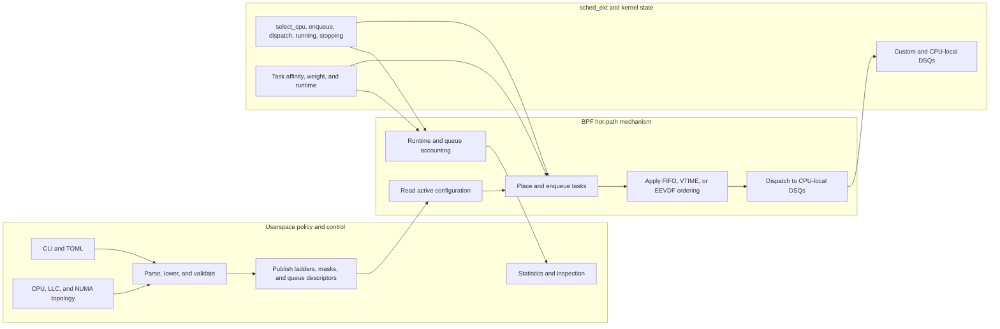

# Policy Lowering and BPF Data Flow

Snake policy files are semantic userspace configuration. The BPF scheduler does
not parse TOML, know topology names such as `previous_llc`, or interpret the
application-specific meaning of a cell ID. Userspace lowers those concepts into
a small mechanical instruction ABI, generic CPU-mask tables, and optional
banked queue descriptors.

This document describes that boundary, the opcode encoding, the data available
to the BPF hot path, and the information returned to userspace.

## Policy and mechanism boundary



The boundary follows five rules:

- Userspace owns semantic policy, topology discovery, static validation, and
  atomic publication.
- BPF owns decisions that depend on the current task, CPU, runtime, idle state,
  or DSQ contents and therefore cannot tolerate a userspace round trip.
- Userspace resolves queue and clock domains; BPF creates a fixed custom-DSQ
  pool when the scheduler attaches and operates the active bank's bindings.
- Queue storage and fairness clocks are separate concepts. For example,
  cell/LLC shards and per-CPU affinity queues can use the same owner-cell clock.
- BPF still enforces live affinity, idle claims, fallbacks, and forward progress
  after userspace validates the static configuration.

## End-to-end pipeline

```mermaid
flowchart LR
    TOML["Policy TOML"] --> Parse["Parse and validate semantics"]
    Parse --> Lower["Lower operation + scope"]
    Lower --> Resolve["Resolve masks, cell ownership, and queues"]
    Resolve --> Encode["Encode placement and callback ladders"]
    Encode --> Stage["Write inactive ladder slot"]
    Stage --> Prepare["BPF validate + materialize cpumasks"]
    Prepare --> Publish["Atomically publish active slot"]
    Publish --> HotPath["select_cpu / enqueue / dispatch"]
```



The implementation is split across:

- [`src/policy.rs`](../src/policy.rs): TOML parsing, semantic validation, opcode
  selection, and mask-table allocation.
- [`src/mask_tables.rs`](../src/mask_tables.rs): topology and cell resolution into
  key-to-CPU-set tables.
- [`src/cell_allocation.rs`](../src/cell_allocation.rs): weighted primary CPU
  ownership and borrowable masks for queue cells.
- [`src/queue_topology.rs`](../src/queue_topology.rs): global LLC shards or cell
  and cell/LLC normal queues, plus per-CPU affinity-safe queues.
- [`src/main.rs`](../src/main.rs): ABI encoding, map writes, BPF preparation, and
  publication.
- [`src/runtime_policy.rs`](../src/runtime_policy.rs): ordered two-slot replacement
  transaction.
- [`src/bpf/intf.h`](../src/bpf/intf.h): shared userspace/BPF ABI.
- [`src/bpf/ladder.h`](../src/bpf/ladder.h): placement instruction validation
  and execution.
- [`src/bpf/queue_ladder.h`](../src/bpf/queue_ladder.h): enqueue and dispatch
  callback ladder execution.
- [`src/bpf/main.bpf.c`](../src/bpf/main.bpf.c): sched_ext callbacks and fallback.

## Stage 1: parse semantic policy

The userspace compiler accepts semantic declarations such as:

```toml
fallback = "previous_cpu"

[[cell]]
id = 7
cpus = "0-3"

[[rung]]
operation = "pick_random_idle"
scope = "task_cell"

[[rung]]
operation = "pick_idle"
scope = "task_allowed"
```

Parsing rejects unknown fields, operations, and scopes. It also checks rung
count, cell IDs, CPU-list syntax, duplicate cells, incompatible
operation/scope pairs, and the requirement that `kernel_default` be terminal.
Generic ladders may contain at most nine rungs. The only wider form is the
exact 16-rung expanded Mitosis template described below. At this point the
policy still contains semantic concepts.

The global LLC layout declares explicit callback actions and topology-neutral
sources:

```toml
[queues]
layout = "llc"
enqueue = [
  { action = "try_insert", target = "local" },
  { action = "insert", target = "cpu" },
]
dispatch = [
  { action = "peek", source = "cpu" },
  { action = "peek", source = "local" },
  { action = "peek", source = "remote" },
  { action = "consume", operation = "min_vtime", fallback = ["cpu", "local", "remote"] },
]
```

Cell queue policies add layout, cell CPU weights, and legacy callback ladders:

```toml
[queues]
layout = "cell_llc"
cell0_cpu_weight = 1

enqueue = [{ target = "cell" }, { target = "affinity" }]
dispatch = [{ operation = "min_vtime" }]

[[cell]]
id = 7
cpus = "0-7"
cpu_weight = 2
```

For cell layouts, userspace enforces a maximum of 31 declared queue cells plus
synthetic cell 0, positive weights, and complete callback pairs. For `llc`, it
rejects cells and validates unique peek sources, terminal consume and CPU insert
rungs, and an exact bounded fallback source set. Queue policies are accepted at
runtime only with `--fairness vtime`.

## Stage 2: lower to mechanical instructions

Every rung becomes one `snake_rung`:

```c
struct snake_rung {
    u32 opcode;
    u32 input;
    u32 flags;
    u32 reserved;
    u64 data;
};
```

`opcode` says what operation to perform. `input` says how to obtain its operand
or lookup key. `flags` select orthogonal behavior. `data` is zero, one mask
table ID, or packed table IDs depending on the opcode.

### Opcodes

| Opcode | Value | BPF behavior |
| --- | ---: | --- |
| `CLAIM_IDLE` | 1 | Claim `prev_cpu` only if it is allowed, belongs to the selected queue-cell or restricted-affinity scope when one is specified, and is idle. |
| `PICK_IDLE` | 2 | Ask sched_ext for any allowed idle CPU. |
| `PICK_IDLE_MASK_TABLE` | 3 | Pick an idle CPU from a prebuilt table mask intersected with task affinity. |
| `PICK_RANDOM_IDLE` | 4 | Uniformly choose and claim an eligible idle CPU, either globally or from a table mask. |
| `KERNEL_DEFAULT` | 5 | Call `scx_bpf_select_cpu_dfl()` and accept only an idle result. |
| `SYNC_WAKE_AFFINE` | 6 | Apply synchronous wake-affine checks using previous-LLC and previous-NUMA-node tables. |
| `PICK_IDLE_QUEUE_MASK` | 7 | Pick from a queue cell's active-bank LLC-local, primary, or borrowable mask, or from restricted task affinity. |
| `PICK_IDLE_PREFER_PREVIOUS` | 8 | Apply the Mitosis idle-core/CPU preference order to an active queue-cell mask or restricted task affinity. |

Opcode zero is invalid. BPF validates every opcode/input/flag/data combination
while preparing a policy. Generic `select_cpu` execution also rechecks each
rung. The expanded Mitosis form is validated as an exact template during
preparation and then uses its fixed verifier-bounded execution path.

### Input sources

| Input | Value | Meaning |
| --- | ---: | --- |
| `CPU_PREV` | 1 | Use the hook's `prev_cpu`, directly or as a mask-table key. |
| `MASK_TASK_ALLOWED` | 2 | Use the task's live `p->cpus_ptr` affinity mask. |
| `TASK_CELL` | 3 | Read the task-local cell ID and use it as a mask-table key. |
| `QUEUE_CELL` | 4 | Translate the annotation to a dense queue cell and use the active bank's cell mask. |
| `TASK_ALLOWED_RESTRICTED` | 5 | Use live task affinity only when it cannot consume the cell's complete primary or borrowable mask. |

An input source is not a userspace callback. It selects data already available
inside the BPF scheduling callback.

### Flags

| Flag | Value | Meaning |
| --- | ---: | --- |
| `INTERSECT_TASK_ALLOWED` | `1 << 0` | The table mask must be intersected with `p->cpus_ptr`. |
| `PICK_IDLE_CORE` | `1 << 1` | Require an idle SMT core rather than only one idle logical CPU. |
| `PICK_RANDOM` | `1 << 2` | Use uniform random idle selection for a queue-cell mask. |

The compiler adds `INTERSECT_TASK_ALLOWED` to table-backed placement. This is
why a task's affinity remains authoritative even when userspace changes its
cell assignment.

### Lowering table

| TOML operation | TOML scope | Opcode | Input | Flags | `data` |
| --- | --- | --- | --- | --- | --- |
| `claim_idle` | `previous_cpu` | `CLAIM_IDLE` | `CPU_PREV` | none | 0 |
| `pick_idle` | `task_allowed` | `PICK_IDLE` | `MASK_TASK_ALLOWED` | none | 0 |
| `pick_idle_core` | `task_allowed` | `PICK_IDLE` | `MASK_TASK_ALLOWED` | idle-core | 0 |
| `pick_idle[_core]` | LLC, node, or named partition | `PICK_IDLE_MASK_TABLE` | `CPU_PREV` | affinity intersection, optional idle-core | table ID |
| `pick_idle[_core]` | placement-only `task_cell` | `PICK_IDLE_MASK_TABLE` | `TASK_CELL` | affinity intersection, optional idle-core | table ID |
| `pick_random_idle[_core]` | `task_allowed` | `PICK_RANDOM_IDLE` | `MASK_TASK_ALLOWED` | optional idle-core | 0 |
| `pick_random_idle[_core]` | LLC, node, or named partition | `PICK_RANDOM_IDLE` | `CPU_PREV` | affinity intersection, optional idle-core | table ID |
| `pick_random_idle[_core]` | placement-only `task_cell` | `PICK_RANDOM_IDLE` | `TASK_CELL` | affinity intersection, optional idle-core | table ID |
| `pick_idle[_core]` | queue-mode `task_cell` | `PICK_IDLE_QUEUE_MASK` | `QUEUE_CELL` | optional idle-core | 1: primary mask |
| `pick_random_idle[_core]` | queue-mode `task_cell` | `PICK_IDLE_QUEUE_MASK` | `QUEUE_CELL` | random, optional idle-core | 1: primary mask |
| `pick_idle[_core]` | `task_cell_borrowable` | `PICK_IDLE_QUEUE_MASK` | `QUEUE_CELL` | optional idle-core | 2: borrowable mask |
| `pick_random_idle[_core]` | `task_cell_borrowable` | `PICK_IDLE_QUEUE_MASK` | `QUEUE_CELL` | random, optional idle-core | 2: borrowable mask |
| `claim_idle[_core]` | queue-mode `task_cell` | `CLAIM_IDLE` | `QUEUE_CELL` | optional idle-core | 1: primary mask |
| `claim_idle[_core]` | `task_cell_borrowable` | `CLAIM_IDLE` | `QUEUE_CELL` | optional idle-core | 2: borrowable mask |
| `claim_idle[_core]` | `task_cell_llc` | `CLAIM_IDLE` | `QUEUE_CELL` | optional idle-core | 3: previous-LLC normal-queue consumers |
| `pick_idle[_core]` | `task_cell_llc` | `PICK_IDLE_QUEUE_MASK` | `QUEUE_CELL` | optional idle-core | 3: previous-LLC normal-queue consumers |
| `claim_idle[_core]` | `task_allowed_restricted` | `CLAIM_IDLE` | `TASK_ALLOWED_RESTRICTED` | optional idle-core | 0 |
| `pick_idle[_core]` | `task_allowed_restricted` | `PICK_IDLE_QUEUE_MASK` | `TASK_ALLOWED_RESTRICTED` | optional idle-core | 0 |
| `pick_idle_prefer_previous` | `task_cell_llc` | `PICK_IDLE_PREFER_PREVIOUS` | `QUEUE_CELL` | none | 3: previous-LLC normal-queue consumers |
| `pick_idle_prefer_previous` | queue-mode `task_cell` | `PICK_IDLE_PREFER_PREVIOUS` | `QUEUE_CELL` | none | 1: primary mask |
| `pick_idle_prefer_previous` | `task_cell_borrowable` | `PICK_IDLE_PREFER_PREVIOUS` | `QUEUE_CELL` | none | 2: borrowable mask |
| `pick_idle_prefer_previous` | `task_allowed_restricted` | `PICK_IDLE_PREFER_PREVIOUS` | `TASK_ALLOWED_RESTRICTED` | none | 0 |
| `kernel_default` | `task_allowed` | `KERNEL_DEFAULT` | `MASK_TASK_ALLOWED` | none | 0 |
| `sync_wake_affine` | `task_allowed` | `SYNC_WAKE_AFFINE` | `MASK_TASK_ALLOWED` | none | low 32 bits: LLC table; high 32 bits: node table |

`pick_idle_core` and `pick_random_idle_core` are not separate opcodes. They are
the normal opcode plus `PICK_IDLE_CORE`. Queue-mode random selection also uses
the `PICK_RANDOM` flag rather than a separate opcode. Queue-cell `claim_idle`
always tests the callback's `prev_cpu` against the selected scope before making
the destructive idle claim. Queue-cell primary, borrowable, and LLC-local
operations require unrestricted cell affinity; restricted tasks skip those
operations and can only match `task_allowed_restricted`.

The Production `mitosis-sim.toml` profile deliberately expands the fused
`pick_idle_prefer_previous` behavior into 16 placement rungs for inspection.
For each of LLC-local, primary, borrowable, and restricted-affinity scope it
executes `claim_idle_core`, `pick_idle_core`, `claim_idle`, then `pick_idle`.
The compiler and BPF preparation require this exact order for any ladder over
nine rungs. At attach time userspace selects specialized `select_cpu` and
enqueue BPF programs and disables the unused generic programs. The hot path
resolves each scope once but attributes attempts, hits, misses, errors, and
sampled timing to the four declared rung indices. Changing between the generic
and expanded program variants requires restarting Snake. The fused operation
remains supported for policies that prefer a smaller ladder over per-stage
counters and timings.

### Queue callback instructions

`snake_compiled_ladder` also contains up to eight fixed-size enqueue rungs and
eight dispatch rungs. Queue rungs use the same mechanical
`{ opcode, input, flags, reserved, data }` shape as placement rungs:

| Callback | Opcode | Value | Input | BPF behavior |
| --- | --- | ---: | --- | --- |
| enqueue | `CELL` | 1 | legacy cell | Insert into the task cell's normal queue. |
| enqueue | `AFFINITY` | 2 | legacy affinity | Insert into one allowed CPU's affinity queue. |
| enqueue | `TRY_INSERT` | 3 | `LOCAL` (2) | Insert into the selected CPU's normal queue only when all consumers are allowed. |
| enqueue | `INSERT` | 4 | `CPU` (1) | Insert into an allowed CPU's ordered escape queue. |
| enqueue | `TRY_DIRECT` | 5 | `CELL` (4) | When `select_cpu` was skipped, retry cell idle placement and dispatch unrestricted work directly. |
| enqueue | `INSERT_CPU` | 6 | `CPU` (1) | Insert restricted work into a per-CPU queue, redistributing when the initial queue is occupied. |
| dispatch | `CELL` | 1 | legacy cell | Consume the CPU owner's normal queue class. |
| dispatch | `AFFINITY` | 2 | legacy affinity | Consume that CPU's affinity queue. |
| dispatch | `MIN_VTIME` | 3 | legacy pair | Compare both heads in the owner-cell clock domain. |
| dispatch | `PEEK` | 4 | `CPU` (1), `LOCAL` (2), `REMOTE` (3), or `CELL` (4) | Record one candidate without moving it. |
| dispatch | `CONSUME` | 5 | `MIN_VTIME` (5) | Select the earliest peek and try its packed bounded fallback. |
| dispatch | `DRAIN` | 6 | `CELL_ORPHAN` (6) | Move at most one task from a same-cell shard with no consumers. |
| dispatch | `STEAL` | 7 | `CELL_SIBLING` (7) | Move at most one task from a populated same-cell sibling shard. |

Cell enqueue is first-success and requires terminal `AFFINITY`. Source-based
cell dispatch advances a per-CPU cyclic cursor after a source supplies work;
legacy `MIN_VTIME` must be the sole dispatch rung. Global LLC enqueue requires
terminal `INSERT / CPU`. Its three `PEEK` rungs feed terminal `CONSUME /
MIN_VTIME`; `data` packs up to three eight-bit CPU, local, and remote fallback
identifiers. The global remote cursor bounded-scans flat queue descriptors,
advances past empty or head-incompatible sources, and returns at most one remote
candidate rather than exposing LLC IDs to BPF.

The Mitosis enqueue ladder is an exact three-rung sequence: `TRY_DIRECT / CELL`,
`TRY_INSERT / CELL`, then `INSERT / CPU`. Its expanded dispatch ladder is
`DRAIN / CELL_ORPHAN`, `PEEK / CELL`, `PEEK / CPU`, `CONSUME / MIN_VTIME`
with CPU fallback, then `STEAL / CELL_SIBLING`. Ties prefer the cell queue. The
CPU fallback is used only when a selected cell move races; sibling stealing is
used only when both peeked queues were empty. The legacy fused three-rung
dispatch remains accepted for compatible policies.

## Stage 3: resolve semantic scopes into masks

BPF mask tables are deliberately topology-blind. Userspace constructs them
from the discovered host topology:

| Semantic source | Table key | Table value |
| --- | --- | --- |
| `previous_llc` | CPU ID | All CPUs sharing that CPU's LLC. |
| `previous_node` | CPU ID | All CPUs sharing that CPU's NUMA node. |
| `split_llcs` partition | CPU ID | CPUs in the same core-preserving LLC partition. |
| placement-only `task_cell` | Cell ID | CPUs declared for that cell. |

Tables with the same semantic name are interned and reused by multiple rungs.
Each CPU set is serialized as `snake_mask_data`, written into the inactive
slot's `mask_data` map, and materialized by BPF as an immutable
`bpf_cpumask`. BPF only sees a table number, key, and mask.

Queue descriptor masks do not consume one of the four generic placement tables.
For `llc`, userspace groups online CPUs by discovered LLC, emits one normal
queue and consumer mask per group, maps each CPU to its local queue, and selects
one global clock domain. No cell record or LLC identifier is required by the
BPF routing mechanism. For cell layouts, userspace adds cell 0, resolves all
online CPUs to one primary owner, derives each cell's borrowable mask, assigns
dense indices, and builds one normal queue per cell or every active cell/LLC
pair. Empty cell/LLC descriptors preserve stable DSQ identities across
same-cell CPU resizing.
Every layout also emits one per-CPU escape route. BPF materializes consumer,
primary, and borrowable masks while preparing each bank; the selected bank is
immutable for the lifetime of one pinned callback reader.

## Stage 4: encode the shared ABI

Userspace encodes the lowered rungs into `snake_compiled_ladder` with:

- policy generation;
- ABI version;
- rung and mask-table counts;
- exhaustion fallback mode;
- at most sixteen fixed-size placement rungs;
- enqueue and dispatch callback rung counts and arrays.

ABI version 31 limits placement ladders to sixteen rungs and enqueue/dispatch
ladders to eight rungs. It also limits generic placement to four mask tables,
CPU and mask keys to 1024, queue cells to 32 including cell 0, and policy
storage to two ladder slots. Userspace and BPF share definitions from
[`src/bpf/intf.h`](../src/bpf/intf.h); an ABI-version mismatch is rejected.

Use the compiler dump to inspect the exact result without attaching BPF:

```bash
./target/release/scx_snake \
  --policy scheds/rust/scx_snake/examples/kernel-default-sim.toml \
  --dump-compiled-policy
```

For automation, validate without loading BPF and emit a versioned JSON record:

```bash
./target/release/scx_snake \
  --policy scheds/rust/scx_snake/examples/kernel-default-sim.toml \
  --validate-policy
```

A valid policy exits zero and reports its ABI, fixed limits, and compiled counts.
`limits.placement_rungs` is the ABI capacity, while
`limits.generic_placement_rungs` is the limit for policies other than the exact
expanded Mitosis template.
An invalid policy exits 2 and reports a stable error code, message, and source
line/column when TOML deserialization provides a span. Schema version 1 uses the
error codes `policy_read_failed`, `invalid_policy_toml`, `invalid_policy`,
`mask_resolution_failed`, and `queue_topology_resolution_failed`.

## Stage 5: prepare and atomically publish

Runtime replacement is an ordered transaction:

1. Compile the new source and resolve all tables in userspace.
2. Choose the inactive slot (`active_slot ^ 1`).
3. Wait until that slot's per-CPU reader counts are zero.
4. Write its compiled ladder, serialized mask data, and queue descriptors.
5. Run the BPF `prepare_ladder` syscall program with `test_run()`.
6. BPF validates the ABI and complete topology, then materializes every valid
   generic and queue mask.
7. Clear the inactive slot's statistics.
8. Publish one new value in the `active_ladder` map.

Publication is the commit point. Any failure before step 8 leaves the previous
slot active. Each scheduling callback increments the chosen slot's per-CPU
reader count, verifies the active slot did not change, uses the ladder, and
decrements the count. Userspace therefore never rebuilds a slot still in use.

Queue topology is pinned by the same slot as the policy. BPF creates a fixed DSQ
pool from the initial envelope in `init()`; later banks rebind descriptors and
masks but never create or destroy DSQs. An explicit policy replacement must
still resolve to the same topology, and it cannot remove an active enqueue
target or represented dispatch source because an old generation may have left
work there. Legacy cell `MIN_VTIME` represents both cell and affinity classes;
global `CONSUME` represents its declared peek and fallback sources.

Managed-cell reconciliation can change the banked topology. It first enables a
transition path that routes new work to CPU-local DSQs and waits for every custom
DSQ to empty. Userspace then stages the candidate policy, topology, and masks in
the inactive slot, prepares them as one unit, publishes the slot, waits for old
readers, disables the transition path, and finally updates task membership. A
failure before publication disables the transition path and leaves the old bank
active.

## Map ownership and data direction

| Map or state | Writer | Reader | Purpose |
| --- | --- | --- | --- |
| `compiled_ladders` | Userspace | BPF | Two slots of encoded policy instructions. |
| `mask_data` | Userspace | BPF preparation program | Serialized CPU bits for the inactive slot. |
| `mask_slots` | BPF preparation program | BPF hot path | Materialized `bpf_cpumask` pointers. |
| `active_ladder` | Userspace | BPF and userspace | Single published slot ID. |
| `ladder_readers` | BPF callbacks | Userspace | Per-CPU in-flight reader counts for slot reuse. |
| `stats` | BPF callbacks | Userspace | Per-CPU scheduler and per-rung counters. |
| `task_cells` | Userspace through pidfd updates; BPF clears/restores `needs_rehome` | BPF hot path | Optional live cell assignment for one thread. |
| `task_runtimes` | BPF task lifecycle and scheduling callbacks | BPF callbacks | Per-task placement and execution accounting state. |
| `queue_header`, `queue_cells` | Userspace before attach and into inactive banks | BPF | Banked global/cell mode, topology generation, and optional dense cells and clocks. |
| `queue_cell_masks`, `normal_queue_masks` | BPF preparation program | BPF hot path | Banked materialized cell and normal-consumer `bpf_cpumask` pointers. |
| `normal_queues`, `cpu_queues` | Userspace before attach and into inactive banks | BPF | Banked normal DSQ descriptors and topology-neutral CPU routing. |
| `queue_cell_lookup` | Userspace before attach and into inactive banks | BPF | Banked external cell ID to dense queue-cell index. |
| `vtime_domain` | BPF callbacks | BPF callbacks | One global VTIME clock shared by unsharded and LLC-sharded global modes. |
| `cell_vtime_domains` | BPF callbacks | BPF callbacks | One VTIME clock per queue cell, shared by its normal and affinity queues. |
| `cell_stats` | BPF callbacks | Userspace | Runtime, borrowing/lending, queue, and clock-transition counters. |

Policy instructions and masks flow from userspace to BPF. Statistics, reader
counts, preparation status, and scheduler exit information flow back. Task-cell
storage is written synchronously by userspace through the kernel and consumed
later by BPF.

## Data available to BPF at runtime

The current policy executor consumes the following runtime information.

### Hook arguments

`select_cpu` receives:

- `struct task_struct *p` for the task being placed;
- `prev_cpu`, the task's previous CPU;
- `wake_flags`, including `SCX_WAKE_SYNC`.

`enqueue` receives the task and `enq_flags`. Placement-only mode re-evaluates
task-cell rungs there, allowing a live cell update to converge for a task that
did not enter through a normal wakeup. Queue mode instead runs its compiled
enqueue callback ladder; an ordinary select result is only a preferred CPU
hint for that ladder.

`dispatch` receives the CPU and previous task. Cell queue mode runs either the
cyclic source ladder or legacy `MIN_VTIME`. Global LLC mode runs every peek rung
and then one terminal consume rung when the CPU's local DSQ is empty.

### Live kernel and task state

- `p->cpus_ptr`: the task's current affinity/cpuset mask;
- CPU-ID upper bound (`nr_cpu_ids`) and attachment-time online CPU descriptors;
- idle logical-CPU and idle-SMT-core masks;
- the current/waker CPU;
- local DSQ queue depth for synchronous wake affinity;
- current and waker task flags such as `PF_EXITING`;
- task execution runtime in `running`/`stopping` callbacks;
- kernel time for placement-latency accounting;
- kernel pseudo-random values for reservoir sampling.

### Snake BPF state

- the active compiled ladder and generation;
- materialized generic mask tables;
- optional task-local `cell_id` and `needs_rehome` annotation;
- active-bank queue mode, topology generation, normal consumer masks, CPU routes,
  and optional dense cell ownership descriptors;
- per-task global or cell/affinity vruntime coordinates;
- per-slot reader counters and per-CPU statistics.

The hot path does **not** receive TOML strings, scope names, Rust topology
objects, image definitions, or a userspace response. It performs no round trip
to userspace for an individual scheduling decision.

## Rung results, misses, and fallback

One BPF rung returns:

- a non-negative CPU ID for a hit;
- `-ENOENT` for a normal miss, which advances to the next rung;
- another negative error for an invalid state or helper failure.

The ladder verifies that a returned CPU exists and remains in `p->cpus_ptr`.
Without queue topology, a successful idle result is normally inserted directly
into the local DSQ. In queue mode, a primary or general result is recorded as
an enqueue hint. Only a successful borrowable-cell result verifies the foreign
CPU owner and dispatches directly. If all rungs miss, the configured fallback
either keeps the previous allowed CPU or chooses any CPU from the task's
allowed mask; queue mode records that result as another enqueue hint.

Missing task-cell annotation, undefined cell key, no idle CPU, an unsafe local
consumer mask, and empty queue sources are expected misses rather than policy
errors.

## Information returned from BPF to userspace

There is no per-placement response stream. Userspace observes aggregate state
through maps and program return values:

| BPF information | Userspace use |
| --- | --- |
| Per-rung attempts, hits, misses, and errors | Explains which ladder stages make decisions. |
| Queue-rung selections, atomic move misses, and bounded fallback results | Explains enqueue and dispatch arbitration. |
| Global callback, FIFO shared-DSQ, fallback, dispatch, equal-head tie, latency, and invalid-error counters | Scheduler health and behavior. |
| Per-CPU runtime counters | Shows where Snake tasks actually ran. |
| Cell rehome, deferred-rehome, queue-preemption, and stale-run counters | Tracks convergence after live cell changes, including one old normal-DSQ execution. |
| Per-cell runtime, primary, borrowed, and lent counters | Separates task fairness identity from CPU-owner resource consumption. |
| Per-cell normal/affinity enqueues, execution selections, and clock transitions | Explains queue path selection and cell changes. |
| Per-CPU ladder reader counts | Prevents reuse of an in-flight inactive slot. |
| `prepare_ladder` return value | Rejects invalid ABI or mask preparation before publication. |
| sched_ext user-exit information (`uei`) | Reports scheduler shutdown and kernel-side failures. |

The running Snake process reads and aggregates the per-CPU statistics, then
labels them with the generation it published for that slot. The stats/control
socket exposes those metrics and accepts policy replacement or thread-cell
commands, but it is a userspace control plane around BPF maps, not part of the
scheduling hot path.

## Worked examples

### Previous LLC, then any allowed CPU

```toml
[[rung]]
operation = "pick_idle"
scope = "previous_llc"

[[rung]]
operation = "pick_idle"
scope = "task_allowed"
```

The first rung becomes `PICK_IDLE_MASK_TABLE / CPU_PREV` with table 0 and the
affinity-intersection flag. Userspace fills table 0 so each CPU key points to
its LLC mask. The second becomes `PICK_IDLE / MASK_TASK_ALLOWED` with no table.

### Random placement inside a task cell

```toml
[[cell]]
id = 7
cpus = "20,44"

[[rung]]
operation = "pick_random_idle"
scope = "task_cell"
```

This becomes `PICK_RANDOM_IDLE / TASK_CELL`, with affinity intersection and a
task-cell table ID in `data`. At runtime BPF reads the task's integer cell ID,
loads that mask, intersects it with `p->cpus_ptr` and the idle mask, uniformly
chooses a candidate, and atomically claims it. Nothing in BPF knows why those
two CPUs were grouped.

### Synchronous wake affinity

`sync_wake_affine / task_allowed` allocates or reuses LLC and NUMA-node tables.
Their IDs are packed into `data`. For `SCX_WAKE_SYNC`, BPF first tries an idle
previous CPU in the waker's LLC. It may then choose the allowed waker CPU with
preemption when its local DSQ is empty and its NUMA node has idle capacity.

### Queue-cell borrowing

```toml
[queues]
layout = "cell"

[[rung]]
operation = "pick_random_idle_core"
scope = "task_cell_borrowable"
```

This becomes `PICK_IDLE_QUEUE_MASK / QUEUE_CELL` with `PICK_RANDOM` and
`PICK_IDLE_CORE`; `data=2` selects the active bank's borrowable mask. BPF
translates the task annotation to a dense index, intersects the mask with live
affinity, and claims a wholly idle core. A hit directly dispatches only after
confirming that another cell owns the CPU.

## Related documents

- [`CELL_POLICY.md`](CELL_POLICY.md): live task-cell annotations and pidfd map
  updates.
- [`FAIRNESS.md`](FAIRNESS.md): queueing and service models, which are separate
  from placement lowering.
- [`QUEUE_POLICY.md`](QUEUE_POLICY.md): global LLC and cell DSQ layouts,
  callback ladders, clocks, borrowing, and live-update restrictions.
