# Policy Lowering and BPF Data Flow

Snake policy files are semantic userspace configuration. The BPF scheduler does
not parse TOML, know topology names such as `previous_llc`, or understand
application concepts such as gallery images. Userspace lowers those concepts
into a small mechanical instruction ABI, generic CPU-mask tables, and optional
attachment-time queue descriptors.

This document describes that boundary, the opcode encoding, the data available
to the BPF hot path, and the information returned to userspace.

## End-to-end pipeline

```mermaid
flowchart LR
    TOML["Policy TOML"] --> Parse["Parse and validate semantics"]
    Parse --> Lower["Lower operation + scope"]
    Lower --> Resolve["Resolve masks, cell ownership, and queues"]
    Resolve --> Encode["Encode placement and callback ladders"]
    Encode --> Stage["Write inactive ladder slot"]
    Stage --> Prepare["BPF validate + materialize cpumasks"]
    Prepare --> Publish["Atomically publish active slot"]
    Publish --> HotPath["select_cpu / enqueue / dispatch"]
```



The implementation is split across:

- [`src/policy.rs`](../src/policy.rs): TOML parsing, semantic validation, opcode
  selection, and mask-table allocation.
- [`src/mask_tables.rs`](../src/mask_tables.rs): topology and cell resolution into
  key-to-CPU-set tables.
- [`src/cell_allocation.rs`](../src/cell_allocation.rs): weighted primary CPU
  ownership and borrowable masks for queue cells.
- [`src/queue_topology.rs`](../src/queue_topology.rs): cell or cell/LLC normal
  queues plus per-CPU affinity escape queues.
- [`src/main.rs`](../src/main.rs): ABI encoding, map writes, BPF preparation, and
  publication.
- [`src/runtime_policy.rs`](../src/runtime_policy.rs): ordered two-slot replacement
  transaction.
- [`src/bpf/intf.h`](../src/bpf/intf.h): shared userspace/BPF ABI.
- [`src/bpf/ladder.h`](../src/bpf/ladder.h): placement instruction validation
  and execution.
- [`src/bpf/queue_ladder.h`](../src/bpf/queue_ladder.h): enqueue and dispatch
  callback ladder execution.
- [`src/bpf/main.bpf.c`](../src/bpf/main.bpf.c): sched_ext callbacks and fallback.

## Stage 1: parse semantic policy

The userspace compiler accepts semantic declarations such as:

```toml
fallback = "previous_cpu"

[[cell]]
id = 7
cpus = "0-3"

[[rung]]
operation = "pick_random_idle"
scope = "task_cell"

[[rung]]
operation = "pick_idle"
scope = "task_allowed"
```

Parsing rejects unknown fields, operations, and scopes. It also checks rung
count, cell IDs, CPU-list syntax, duplicate cells, incompatible
operation/scope pairs, and the requirement that `kernel_default` be terminal.
At this point the policy still contains semantic concepts.

Queue policies add semantic configuration for layout, cell CPU weights, and
callback ladders:

```toml
[queues]
layout = "cell_llc"
cell0_cpu_weight = 1

enqueue = [{ target = "cell" }, { target = "affinity" }]
dispatch = [{ source = "affinity" }, { source = "cell" }]

[[cell]]
id = 7
cpus = "0-7"
cpu_weight = 2
```

Userspace enforces a maximum of 31 declared queue cells plus synthetic cell 0,
positive weights, a valid layout, and complete callback pairs. Queue policies
are accepted at runtime only with `--fairness vtime`.

## Stage 2: lower to mechanical instructions

Every rung becomes one `snake_rung`:

```c
struct snake_rung {
    u32 opcode;
    u32 input;
    u32 flags;
    u32 reserved;
    u64 data;
};
```

`opcode` says what operation to perform. `input` says how to obtain its operand
or lookup key. `flags` select orthogonal behavior. `data` is zero, one mask
table ID, or packed table IDs depending on the opcode.

### Opcodes

| Opcode | Value | BPF behavior |
| --- | ---: | --- |
| `CLAIM_IDLE` | 1 | Claim `prev_cpu` only if it is allowed and idle. |
| `PICK_IDLE` | 2 | Ask sched_ext for any allowed idle CPU. |
| `PICK_IDLE_MASK_TABLE` | 3 | Pick an idle CPU from a prebuilt table mask intersected with task affinity. |
| `PICK_RANDOM_IDLE` | 4 | Uniformly choose and claim an eligible idle CPU, either globally or from a table mask. |
| `KERNEL_DEFAULT` | 5 | Call `scx_bpf_select_cpu_dfl()` and accept only an idle result. |
| `SYNC_WAKE_AFFINE` | 6 | Apply synchronous wake-affine checks using previous-LLC and previous-NUMA-node tables. |
| `PICK_IDLE_QUEUE_MASK` | 7 | Pick from a queue cell's attachment-time primary or borrowable mask, intersected with live affinity. |

Opcode zero is invalid. BPF validates every opcode/input/flag/data combination
while preparing a policy. The `select_cpu` ladder also rechecks each rung
before executing it.

### Input sources

| Input | Value | Meaning |
| --- | ---: | --- |
| `CPU_PREV` | 1 | Use the hook's `prev_cpu`, directly or as a mask-table key. |
| `MASK_TASK_ALLOWED` | 2 | Use the task's live `p->cpus_ptr` affinity mask. |
| `TASK_CELL` | 3 | Read the task-local cell ID and use it as a mask-table key. |
| `QUEUE_CELL` | 4 | Translate the annotation to a dense queue cell and use an attachment-time cell mask. |

An input source is not a userspace callback. It selects data already available
inside the BPF scheduling callback.

### Flags

| Flag | Value | Meaning |
| --- | ---: | --- |
| `INTERSECT_TASK_ALLOWED` | `1 << 0` | The table mask must be intersected with `p->cpus_ptr`. |
| `PICK_IDLE_CORE` | `1 << 1` | Require an idle SMT core rather than only one idle logical CPU. |
| `PICK_RANDOM` | `1 << 2` | Use uniform random idle selection for a queue-cell mask. |

The compiler adds `INTERSECT_TASK_ALLOWED` to table-backed placement. This is
why a task's affinity remains authoritative even when userspace changes its
cell assignment.

### Lowering table

| TOML operation | TOML scope | Opcode | Input | Flags | `data` |
| --- | --- | --- | --- | --- | --- |
| `claim_idle` | `previous_cpu` | `CLAIM_IDLE` | `CPU_PREV` | none | 0 |
| `pick_idle` | `task_allowed` | `PICK_IDLE` | `MASK_TASK_ALLOWED` | none | 0 |
| `pick_idle_core` | `task_allowed` | `PICK_IDLE` | `MASK_TASK_ALLOWED` | idle-core | 0 |
| `pick_idle[_core]` | LLC, node, or named partition | `PICK_IDLE_MASK_TABLE` | `CPU_PREV` | affinity intersection, optional idle-core | table ID |
| `pick_idle[_core]` | placement-only `task_cell` | `PICK_IDLE_MASK_TABLE` | `TASK_CELL` | affinity intersection, optional idle-core | table ID |
| `pick_random_idle[_core]` | `task_allowed` | `PICK_RANDOM_IDLE` | `MASK_TASK_ALLOWED` | optional idle-core | 0 |
| `pick_random_idle[_core]` | LLC, node, or named partition | `PICK_RANDOM_IDLE` | `CPU_PREV` | affinity intersection, optional idle-core | table ID |
| `pick_random_idle[_core]` | placement-only `task_cell` | `PICK_RANDOM_IDLE` | `TASK_CELL` | affinity intersection, optional idle-core | table ID |
| `pick_idle[_core]` | queue-mode `task_cell` | `PICK_IDLE_QUEUE_MASK` | `QUEUE_CELL` | optional idle-core | 1: primary mask |
| `pick_random_idle[_core]` | queue-mode `task_cell` | `PICK_IDLE_QUEUE_MASK` | `QUEUE_CELL` | random, optional idle-core | 1: primary mask |
| `pick_idle[_core]` | `task_cell_borrowable` | `PICK_IDLE_QUEUE_MASK` | `QUEUE_CELL` | optional idle-core | 2: borrowable mask |
| `pick_random_idle[_core]` | `task_cell_borrowable` | `PICK_IDLE_QUEUE_MASK` | `QUEUE_CELL` | random, optional idle-core | 2: borrowable mask |
| `kernel_default` | `task_allowed` | `KERNEL_DEFAULT` | `MASK_TASK_ALLOWED` | none | 0 |
| `sync_wake_affine` | `task_allowed` | `SYNC_WAKE_AFFINE` | `MASK_TASK_ALLOWED` | none | low 32 bits: LLC table; high 32 bits: node table |

`pick_idle_core` and `pick_random_idle_core` are not separate opcodes. They are
the normal opcode plus `PICK_IDLE_CORE`. Queue-mode random selection also uses
the `PICK_RANDOM` flag rather than a separate opcode.

### Queue callback instructions

`snake_compiled_ladder` also contains up to eight fixed-size enqueue rungs and
eight dispatch rungs. These have a smaller ABI because they select only a queue
class:

| Callback | Opcode 1 | Opcode 2 |
| --- | --- | --- |
| enqueue | `CELL` target | `AFFINITY` target |
| dispatch | `CELL` source | `AFFINITY` source |

Enqueue is first-success and requires terminal `AFFINITY`. Dispatch uses the
configured sources cyclically, advancing a per-CPU cursor after a source
supplies work. A policy contains `CELL` in both callback ladders or neither.

## Stage 3: resolve semantic scopes into masks

BPF mask tables are deliberately topology-blind. Userspace constructs them
from the discovered host topology:

| Semantic source | Table key | Table value |
| --- | --- | --- |
| `previous_llc` | CPU ID | All CPUs sharing that CPU's LLC. |
| `previous_node` | CPU ID | All CPUs sharing that CPU's NUMA node. |
| `split_llcs` partition | CPU ID | CPUs in the same core-preserving LLC partition. |
| placement-only `task_cell` | Cell ID | CPUs declared for that cell. |

Tables with the same semantic name are interned and reused by multiple rungs.
Each CPU set is serialized as `snake_mask_data`, written into the inactive
slot's `mask_data` map, and materialized by BPF as an immutable
`bpf_cpumask`. BPF only sees a table number, key, and mask.

For the cell-art gallery, the flower, heart, cat, and cobra exist only in the
userspace generator. BPF sees ordinary two-CPU cell masks and thread-local cell
IDs.

Queue-mode cell masks do not consume one of the four generic mask tables.
Userspace adds cell 0, resolves all online CPUs to one primary owner, derives
each cell's borrowable mask, and assigns dense cell indices. It then builds one
normal queue per cell or per populated cell/LLC ownership pair, plus one
affinity escape queue per online CPU. BPF materializes each primary and
borrowable mask once during attachment.

## Stage 4: encode the shared ABI

Userspace encodes the lowered rungs into `snake_compiled_ladder` with:

- policy generation;
- ABI version;
- rung and mask-table counts;
- exhaustion fallback mode;
- at most eight fixed-size placement rungs;
- enqueue and dispatch callback rung counts and arrays.

ABI version 15 limits each ladder to eight rungs, generic placement to four
mask tables, CPU and mask keys to 1024, queue cells to 32 including cell 0, and
policy storage to two ladder slots. Userspace and BPF share definitions from
[`src/bpf/intf.h`](../src/bpf/intf.h); an ABI-version mismatch is rejected.

Use the compiler dump to inspect the exact result without attaching BPF:

```bash
./target/release/scx_snake \
  --policy scheds/rust/scx_snake/examples/kernel-default-sim.toml \
  --dump-compiled-policy
```

## Stage 5: prepare and atomically publish

Runtime replacement is an ordered transaction:

1. Compile the new source and resolve all tables in userspace.
2. Choose the inactive slot (`active_slot ^ 1`).
3. Wait until that slot's per-CPU reader counts are zero.
4. Write its compiled ladder and serialized mask data.
5. Run the BPF `prepare_ladder` syscall program with `test_run()`.
6. BPF validates the ABI and materializes every valid mask.
7. Clear the inactive slot's statistics.
8. Publish one new value in the `active_ladder` map.

Publication is the commit point. Any failure before step 8 leaves the previous
slot active. Each scheduling callback increments the chosen slot's per-CPU
reader count, verifies the active slot did not change, uses the ladder, and
decrements the count. Userspace therefore never rebuilds a slot still in use.

Queue topology follows a different lifetime. Userspace installs cell, normal
queue, CPU queue, and external-ID lookup descriptors before BPF attachment;
BPF validates them, materializes cell masks, and creates the DSQs from
`init()`. A live replacement must resolve to exactly the same topology. The
callback arrays still publish through the inactive ladder slot, but an active
enqueue target or dispatch source cannot be removed because an old generation
may have left work in that source.

## Map ownership and data direction

| Map or state | Writer | Reader | Purpose |
| --- | --- | --- | --- |
| `compiled_ladders` | Userspace | BPF | Two slots of encoded policy instructions. |
| `mask_data` | Userspace | BPF preparation program | Serialized CPU bits for the inactive slot. |
| `mask_slots` | BPF preparation program | BPF hot path | Materialized `bpf_cpumask` pointers. |
| `active_ladder` | Userspace | BPF and userspace | Single published slot ID. |
| `ladder_readers` | BPF callbacks | Userspace | Per-CPU in-flight reader counts for slot reuse. |
| `stats` | BPF callbacks | Userspace | Per-CPU scheduler and per-rung counters. |
| `task_cells` | Userspace through pidfd updates; BPF clears/restores `needs_rehome` | BPF hot path | Optional live cell assignment for one thread. |
| `task_runtimes` | BPF task lifecycle and scheduling callbacks | BPF callbacks | Per-task placement and execution accounting state. |
| `queue_header`, `queue_cells` | Userspace before attach | BPF | Immutable layout, dense cells, clocks, and primary/borrowable masks. |
| `queue_cell_masks` | BPF `init()` | BPF hot path | Materialized primary and borrowable `bpf_cpumask` pointers. |
| `normal_queues`, `cpu_queues` | Userspace before attach | BPF | Normal DSQ descriptors and CPU ownership/affinity routing. |
| `queue_cell_lookup` | Userspace before attach | BPF | External cell ID to dense queue-cell index. |
| `cell_vtime_domains` | BPF callbacks | BPF callbacks | One normal VTIME clock per queue cell. |
| `cell_stats` | BPF callbacks | Userspace | Runtime, borrowing/lending, queue, and clock-transition counters. |

Policy instructions and masks flow from userspace to BPF. Statistics, reader
counts, preparation status, and scheduler exit information flow back. Task-cell
storage is written synchronously by userspace through the kernel and consumed
later by BPF.

## Data available to BPF at runtime

The current policy executor consumes the following runtime information.

### Hook arguments

`select_cpu` receives:

- `struct task_struct *p` for the task being placed;
- `prev_cpu`, the task's previous CPU;
- `wake_flags`, including `SCX_WAKE_SYNC`.

`enqueue` receives the task and `enq_flags`. Placement-only mode re-evaluates
task-cell rungs there, allowing a live cell update to converge for a task that
did not enter through a normal wakeup. Queue mode instead runs its compiled
enqueue callback ladder; an ordinary select result is only a preferred CPU
hint for that ladder.

`dispatch` receives the CPU and previous task. In queue mode it runs the cyclic
dispatch source ladder when the CPU's local DSQ is empty.

### Live kernel and task state

- `p->cpus_ptr`: the task's current affinity/cpuset mask;
- CPU-ID upper bound (`nr_cpu_ids`) and attachment-time online CPU descriptors;
- idle logical-CPU and idle-SMT-core masks;
- the current/waker CPU;
- local DSQ queue depth for synchronous wake affinity;
- current and waker task flags such as `PF_EXITING`;
- task execution runtime in `running`/`stopping` callbacks;
- kernel time for placement-latency accounting;
- kernel pseudo-random values for reservoir sampling.

### Snake BPF state

- the active compiled ladder and generation;
- materialized generic mask tables;
- optional task-local `cell_id` and `needs_rehome` annotation;
- attachment-time dense queue cells, ownership masks, and DSQ descriptors;
- per-task cell and affinity vruntime coordinates;
- per-slot reader counters and per-CPU statistics.

The hot path does **not** receive TOML strings, scope names, Rust topology
objects, image definitions, or a userspace response. It performs no round trip
to userspace for an individual scheduling decision.

## Rung results, misses, and fallback

One BPF rung returns:

- a non-negative CPU ID for a hit;
- `-ENOENT` for a normal miss, which advances to the next rung;
- another negative error for an invalid state or helper failure.

The ladder verifies that a returned CPU exists and remains in `p->cpus_ptr`.
Without queue topology, a successful idle result is normally inserted directly
into the local DSQ. In queue mode, a primary or general result is recorded as
an enqueue hint. Only a successful borrowable-cell result verifies the foreign
CPU owner and dispatches directly. If all rungs miss, the configured fallback
either keeps the previous allowed CPU or chooses any CPU from the task's
allowed mask; queue mode records that result as another enqueue hint.

Missing task-cell annotation, undefined cell key, no idle CPU, and an empty
cell/affinity intersection are expected misses rather than policy errors.

## Information returned from BPF to userspace

There is no per-placement response stream. Userspace observes aggregate state
through maps and program return values:

| BPF information | Userspace use |
| --- | --- |
| Per-rung attempts, hits, misses, and errors | Explains which ladder stages make decisions. |
| Global callback, FIFO shared-DSQ, fallback, dispatch, latency, and invalid-error counters | Scheduler health and behavior. |
| Per-CPU runtime counters | Shows where Snake tasks actually ran. |
| Cell rehome, deferred-rehome, queue-preemption, and stale-run counters | Tracks convergence after live cell changes, including one old normal-DSQ execution. |
| Per-cell runtime, primary, borrowed, and lent counters | Separates task fairness identity from CPU-owner resource consumption. |
| Per-cell normal/affinity enqueues, execution selections, and clock transitions | Explains queue path selection and cell changes. |
| Per-CPU ladder reader counts | Prevents reuse of an in-flight inactive slot. |
| `prepare_ladder` return value | Rejects invalid ABI or mask preparation before publication. |
| sched_ext user-exit information (`uei`) | Reports scheduler shutdown and kernel-side failures. |

The running Snake process reads and aggregates the per-CPU statistics, then
labels them with the generation it published for that slot. The stats/control
socket exposes those metrics and accepts policy replacement or thread-cell
commands, but it is a userspace control plane around BPF maps, not part of the
scheduling hot path.

## Worked examples

### Previous LLC, then any allowed CPU

```toml
[[rung]]
operation = "pick_idle"
scope = "previous_llc"

[[rung]]
operation = "pick_idle"
scope = "task_allowed"
```

The first rung becomes `PICK_IDLE_MASK_TABLE / CPU_PREV` with table 0 and the
affinity-intersection flag. Userspace fills table 0 so each CPU key points to
its LLC mask. The second becomes `PICK_IDLE / MASK_TASK_ALLOWED` with no table.

### Random placement inside a task cell

```toml
[[cell]]
id = 7
cpus = "20,44"

[[rung]]
operation = "pick_random_idle"
scope = "task_cell"
```

This becomes `PICK_RANDOM_IDLE / TASK_CELL`, with affinity intersection and a
task-cell table ID in `data`. At runtime BPF reads the task's integer cell ID,
loads that mask, intersects it with `p->cpus_ptr` and the idle mask, uniformly
chooses a candidate, and atomically claims it. Nothing in BPF knows why those
two CPUs were grouped.

### Synchronous wake affinity

`sync_wake_affine / task_allowed` allocates or reuses LLC and NUMA-node tables.
Their IDs are packed into `data`. For `SCX_WAKE_SYNC`, BPF first tries an idle
previous CPU in the waker's LLC. It may then choose the allowed waker CPU with
preemption when its local DSQ is empty and its NUMA node has idle capacity.

### Queue-cell borrowing

```toml
[queues]
layout = "cell"

[[rung]]
operation = "pick_random_idle_core"
scope = "task_cell_borrowable"
```

This becomes `PICK_IDLE_QUEUE_MASK / QUEUE_CELL` with `PICK_RANDOM` and
`PICK_IDLE_CORE`; `data=2` selects the attachment-time borrowable mask. BPF
translates the task annotation to a dense index, intersects the mask with live
affinity, and claims a wholly idle core. A hit directly dispatches only after
confirming that another cell owns the CPU.

## Related documents

- [`CELL_POLICY.md`](CELL_POLICY.md): live task-cell annotations and pidfd map
  updates.
- [`FAIRNESS.md`](FAIRNESS.md): queueing and service models, which are separate
  from placement lowering.
- [`QUEUE_POLICY.md`](QUEUE_POLICY.md): cell ownership, DSQ layouts, callback
  ladders, clocks, borrowing, and live-update restrictions.
