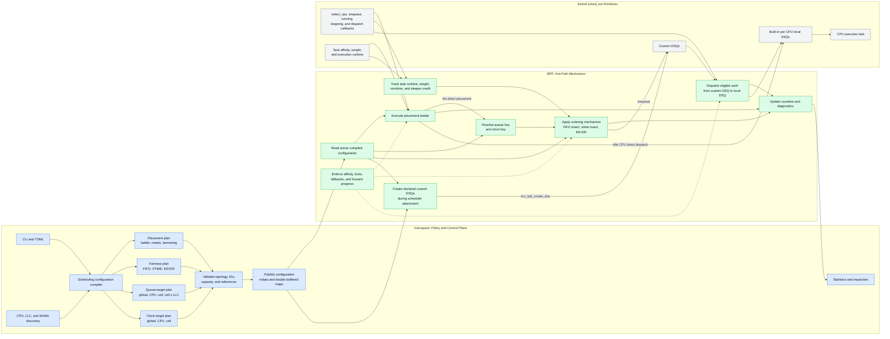

# Policy and Mechanism Boundary

Snake keeps semantic scheduling policy in userspace and executes the
latency-sensitive scheduling mechanism in BPF. Userspace compiles and validates
the desired placement, fairness, queue, and clock configuration. BPF consumes
that configuration while handling sched_ext callbacks and operating kernel
dispatch queues.

## Boundary rules

- Userspace decides which policy should exist and validates the complete
  configuration before publishing it.
- BPF performs operations that depend on the current task, CPU, runtime, or DSQ
  state and therefore cannot tolerate a userspace round trip.
- Userspace declares custom queues and clock domains, while BPF creates and
  operates the corresponding kernel DSQs.
- Queue placement and clock ownership remain separate. For example, cell x LLC
  queues can share one per-cell clock.
- Policy updates use prepared, validated state and an atomic publication step;
  the BPF hot path never consumes a partially updated configuration.
- BPF retains affinity checks, kicks, fallback behavior, and forward-progress
  guarantees even when userspace has already validated the policy.

The initial VTIME implementation uses one global queue for unrestricted work
and per-CPU queues for affinity-restricted work, all sharing one global clock.
The per-CPU queues prevent large affinity-incompatible scans and preserve VTIME
ordering for pinned tasks. Later user-selected queue targets can add per-cell
and cell x LLC layouts without changing the policy/mechanism boundary.
