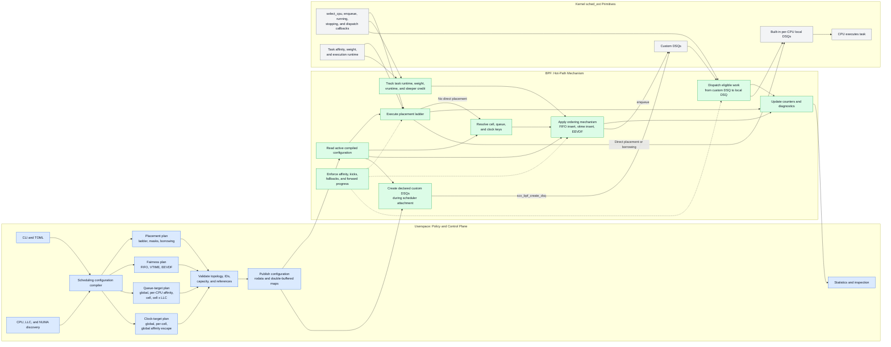

# Policy and Mechanism Boundary

Snake keeps semantic scheduling policy in userspace and executes the
latency-sensitive scheduling mechanism in BPF. Userspace compiles and validates
the desired placement, fairness, queue, and clock configuration. BPF consumes
that configuration while handling sched_ext callbacks and operating kernel
dispatch queues.

## Boundary rules

- Userspace decides which policy should exist and validates the complete
  configuration before publishing it.
- BPF performs operations that depend on the current task, CPU, runtime, or DSQ
  state and therefore cannot tolerate a userspace round trip.
- Userspace resolves custom queues and clock domains, while BPF creates and
  operates the corresponding kernel DSQs at attachment.
- Queue placement and clock ownership remain separate. For example, cell x LLC
  queues can share one per-cell clock.
- Policy updates use prepared, validated state and an atomic publication step;
  the BPF hot path never consumes a partially updated configuration.
- BPF retains live affinity checks, idle claims, kicks, fallback behavior, and
  forward-progress mechanisms even when userspace has validated static policy.

## Implemented queue boundary

Without `[queues]`, VTIME uses one global normal queue plus per-CPU affinity
queues under one global clock. With `[queues]`, userspace performs the semantic
work before BPF loads:

1. Add synthetic cell 0 for unannotated tasks.
2. Resolve overlapping claims and weights into disjoint primary CPU owners and
   per-cell borrowable masks.
3. Choose one normal DSQ per cell or one per populated cell/LLC ownership pair.
4. Assign every normal DSQ to its cell clock and every online CPU to one
   affinity escape DSQ.
5. Compile placement, enqueue, and dispatch ladders into topology-blind numeric
   records.

BPF receives dense cell indices, masks, queue descriptors, clock indices, and
callback opcodes. It does not allocate CPU ownership or interpret LLC policy.
At runtime it reads the task annotation and live affinity, maintains two VTIME
coordinates when affinity escape is needed, and moves work through the declared
DSQs.

There is one normal clock per cell even under `cell_llc`; all LLC shards of a
cell share it. The per-CPU affinity DSQs share one global affinity clock. This
is an intentional storage/clock separation and avoids per-CPU fairness clocks.

## Update boundary

Placement and queue callback ladders live in the double-buffered policy slots
and publish atomically. Queue descriptors and DSQs are attachment-time state, so
a live policy replacement must resolve to the same complete queue topology.
Dispatch sources may be reordered and the cell target/source pair may be added,
but an active target or source may not be removed because the old generation
may have left work in its DSQ. Changing the layout, cells, weights, allocation,
or queue set requires restarting Snake.

See [`QUEUE_POLICY.md`](QUEUE_POLICY.md) for the user-facing rules and
[`POLICY_LOWERING.md`](POLICY_LOWERING.md) for the shared ABI.
