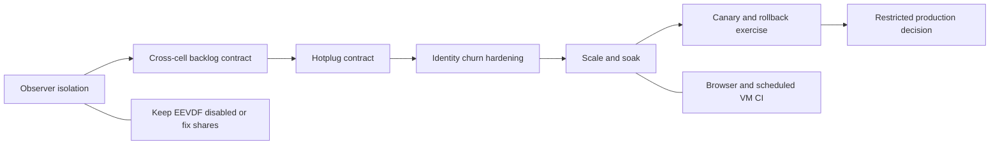

# Snake architecture and readiness review

Assessment date: 2026-08-03

Current baseline: `c365457b`

Scope: `scx_snake`, `scx_snake_inspector`, `scx_mitosis`, and selected Rust
schedulers used as prior art

## Bottom line

Snake is a coherent experimental scheduler whose userspace control plane compiles
placement, queue, and managed-resource policy into bounded BPF state. It now has
the main mechanisms needed for a guarded single-host Mitosis simulation:

- polling-based direct-child lifecycle with stable IDs and slot epochs;
- cpuset-aware allocation with configurable cell-0 holdout;
- elapsed-time demand sampling, EWMA, threshold/cooldown control, and live CPU
  ownership rebalancing;
- complete inactive-bank staging for policy and managed topology changes;
- cell/LLC VTIME queues, direct borrowing, same-cell orphan draining, and
  sibling-LLC stealing;
- live VTIME base-slice and pinned-waiter shrinking controls;
- Inspector views for managed capacity, rebalance state, physical-core placement,
  and host-tax accounting.

That is enough implementation for a tightly controlled canary on a noncritical
host. It is not unrestricted-production readiness. Observer errors can still
detach the scheduler, queued work cannot consume idle CPUs owned by another cell,
CPU hotplug has no safe contract, managed identity is eventually reconciled by
userspace polling, and scale/soak/rollback/browser evidence remains incomplete.

| Dimension | Estimate | Interpretation |
| --- | ---: | --- |
| Snake experimental feature implementation | **90%** | The intended policy, managed-cell, fairness, and observability mechanisms are broadly present. |
| Snake production readiness | **45%** | Important lifecycle contracts and operational evidence remain open. |
| Static scheduling-data-plane parity with Mitosis | **88%** | Queue domains, affinity escapes, VTIME, borrowing, draining, stealing, and slice control exist. |
| Mitosis dynamic control/resource plane | **82%** | Lifecycle, holdout, demand EWMA, rebalancing, and banked publication exist; identity remains polling-based and hotplug is unsupported. |
| Overall end-to-end Mitosis behavior parity | **85% +/-5%** | A managed Mitosis profile is runnable, but production-scale and failure evidence is incomplete. |
| Inspector, current baseline | **90%** | Managed accounting and physical-core views are strong; sparse scaling and browser E2E remain. |

These are engineering judgments, not coverage percentages. The scoring rubric and
feature evidence are in [Feature completeness](feature-completeness.md).

## Current conclusions

1. **The managed-cell implementation is no longer the primary feature gap.**
   Direct-child discovery, cell-0 protection, demand EWMA, controlled ownership
   changes, draining, and same-cell stealing are implemented. Work should now
   concentrate on failure isolation and runtime evidence.

2. **Managed identity is safe against slot reuse but not cgroup-native.** Threads
   receive `(cell_id, slot_epoch)` through recurring userspace reconciliation.
   This avoids stale slot aliasing, but fork/move visibility has a polling window
   that Mitosis avoids with BPF cgroup identity.

3. **Banked topology changes are narrower than hotplug support.** Managed cell and
   CPU-owner changes stage policy, masks, descriptors, and routes together in an
   inactive bank. The attachment-time CPU/topology envelope still does not handle
   CPU online/offline changes.

4. **Same-cell recovery does not solve cross-cell backlog.** Orphan draining and
   sibling-LLC stealing preserve progress across one cell's shards. A task already
   queued in an undersized cell still cannot run on an idle CPU owned by another
   cell and can approach the sched_ext watchdog.

5. **Inspector accounting is more representative, not yet scale-proven.** Placement
   load is aggregated by physical core so SMT siblings do not double-count whole
   cores, while host-capacity views separate Snake work from other tasks, IRQ,
   softirq, steal, and unclassified time. Large-host collection/render curves and
   a real-browser smoke suite remain missing.

6. **A guarded canary is the next validation step, not a production declaration.**
   Use a noncritical host, pre-size cells for sustained backlog, keep EEVDF disabled,
   reject hotplug operationally, monitor scheduler attachment, and exercise normal
   detach/restart rollback before expanding exposure.

## Progress since the July review

| Area | Implemented now | Still unproven or limited |
| --- | --- | --- |
| Managed lifecycle | Direct-child reconciliation, exclusions, stable IDs, slot epochs, managed workload VM fixture | Immediate fork/move identity; polling/churn scale |
| Resource allocation | Effective-cpuset claims, deterministic ownership, cell-0 minimum, infeasible-plan rejection | CPU hotplug and heterogeneous capacity |
| Dynamic control | Elapsed-time samples, runtime EWMA, threshold/cooldown, rebalances, live telemetry | Long soak, oscillation bounds at production scale |
| Publication and queues | Complete bank staging, reader quiescence, full structural drain, in-place resize, orphan drain, sibling steal | Fault-injection breadth and cross-cell queued work |
| Latency controls | Live VTIME base slice and optional waiter-aware shrinking | Pinned-latency/fairness trade-off evidence |
| Inspector | Managed allocation/rebalance views, capacity lanes, physical-core placement, host-tax accounting | Sparse 1,024-CPU pipeline and real-browser E2E |
| Runtime validation | Focused managed workload, churn/reuse, resize, queued affinity, drain/steal VM tests | Scheduled multi-kernel gate, scale/soak, canary and rollback evidence |

## Roadmap priorities

Priority meanings:

- **P0:** required before production exposure beyond a tightly controlled canary;
- **P1:** required for credible Mitosis parity and operational confidence;
- **P2:** valuable hardening or measured optimization;
- **P3:** evidence-gated research.

### Open work

| Key | Work | Priority | Completion signal |
| --- | --- | :---: | --- |
| `observer-isolation` | Isolate diagnostics and clients from scheduler lifetime | **P0** | `/proc`, task-storage, ring, and client failures return degraded data without detaching Snake. |
| `queued-cross-cell-progress` | Define the cross-cell queued-backlog contract | **P0** | Every supported resource profile either guarantees progress or rejects/alerts before watchdog exposure. |
| `hotplug-contract` | Support or safely reject CPU hotplug | **P0** | Online/offline changes are transactional, or detected and followed by controlled detach. |
| `eevdf-shares` | Fix or remove exposed EEVDF weighted shares | **P0** | Nice-weight ratios pass equal, mixed, sleeper, yield, and affinity VM cases. |
| `identity-hardening` | Close userspace reconciliation windows | **P1** | Fork, exec, cgroup move, and slot reuse cannot transiently run with the wrong managed identity under churn. |
| `scale-soak-rollback` | Build operational evidence | **P1** | Target-host scale curves, sustained soak, canary rollback, and restart-under-load campaigns pass. |
| `browser-vm-ci` | Automate privileged and browser evidence | **P1** | Managed VM coverage is scheduled across supported kernels and real-browser workflows run in CI. |
| `inspector-scaling` | Make collection and rendering sparse | **P1** | Cost scales with active topology/traffic rather than configured `CPUs^2`. |
| `typed-protocol` | Stabilize scheduler/Inspector contracts | **P2** | Shared DTOs and structured error codes replace repeated loose JSON and string inference. |
| `numa-distance-order` | Add explicit distance-ordered placement | **P2** | A measured policy improves remote placement without enlarging the default hot path. |
| `pick-two` | Evaluate approximate high-fanout selection | **P3** | A bounded explicit policy beats exact scans under demonstrated fanout pressure. |

### Completed managed-control milestones

| Milestone | Current signal |
| --- | --- |
| Direct-child lifecycle and epoch-safe reuse | Implemented with userspace polling and managed VM coverage |
| Complete banked managed topology | Policy/resource routes stage together; old readers quiesce before reuse |
| Cpuset allocation and cell-0 holdout | Implemented with deterministic feasibility checks |
| Demand EWMA and controlled rebalance | Implemented with live parameters and Inspector telemetry |
| Queue retirement and same-cell recovery | Full drain for structural changes; orphan drain and sibling stealing for stable shards |
| Live slice and shrinking controls | Implemented through the scheduler control socket and Inspector |
| Physical-core and host-tax aggregation | Implemented in Inspector models and views |

## Recommended order

## Document map

- [Architecture](architecture.md): state ownership and scheduling paths.
- [Feature completeness](feature-completeness.md): scored capability inventory.
- [Mitosis compatibility](mitosis-compatibility.md): parity matrix and remaining
  differences.
- [Modularity and performance](modularity-and-performance.md): code and scale risks.
- [Scheduler prior art](scheduler-prior-art.md): patterns borrowed and deferred.
- [Validation and risk plan](validation-and-risk-plan.md): release gates and
  campaigns.

## Interpretation limits

- Percentages do not imply production certification.
- Unit and VM test counts do not replace workload, failure, scale, or soak evidence.
- Mitosis is a behavioral reference, not a requirement to copy its non-atomic live
  apply implementation.
- Current source at `c365457b` is the baseline for this assessment; historical July
  baseline and worktree-WIP caveats no longer apply.
