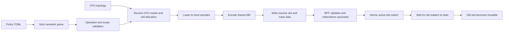
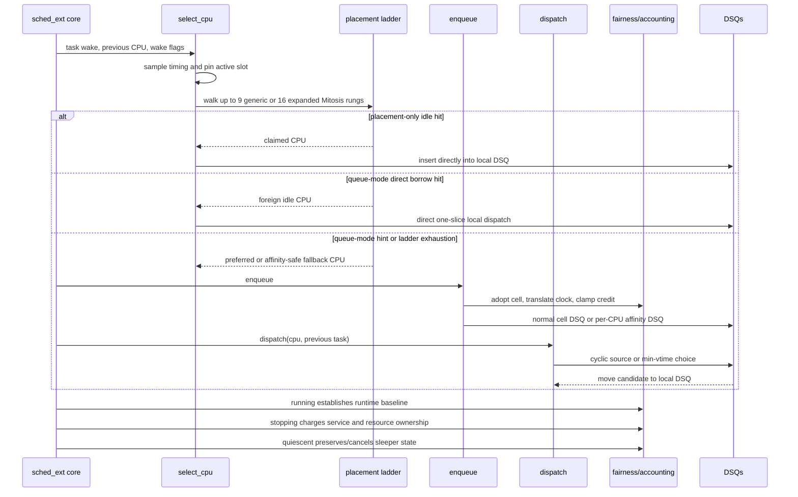
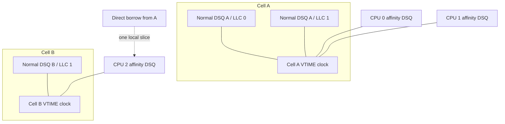
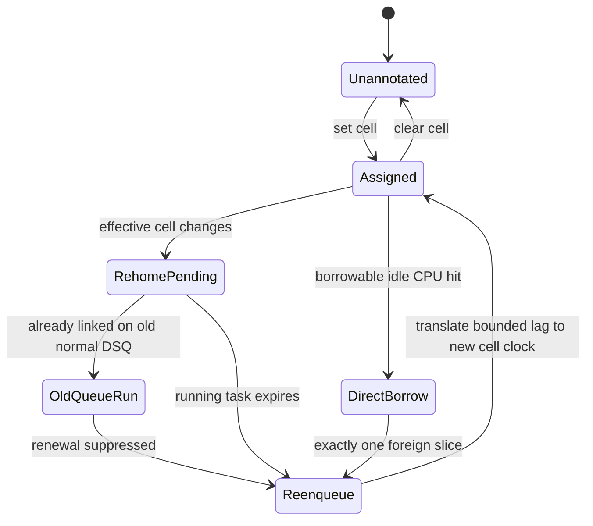
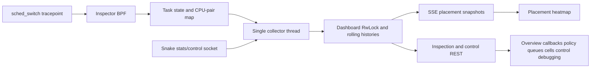

# Snake architecture

## Design thesis

Snake deliberately separates four concerns:

1. **Policy intent** is declarative TOML owned by userspace.
2. **Topology resolution** turns names such as LLC, NUMA node, or cell into plain
   CPU masks before BPF sees them.
3. **Scheduling execution** is a bounded BPF interpreter plus fairness and DSQ
   machinery.
4. **Observation and control** use `scx_stats`, per-CPU maps, bounded ring-buffer
   events, and a separate local inspector.

That split is the strongest part of the design. The hot path never parses TOML,
constructs topology objects, or waits for userspace. The README states this purpose
directly ([README](../../README.md#L5-L10)), and the lowering
pipeline is visible in the compiler ([policy.rs](../../src/policy.rs#L339-L400)),
mask resolver ([mask_tables.rs](../../src/mask_tables.rs#L25-L113)),
and fixed ABI encoder ([main.rs](../../src/main.rs#L245-L333)).

## Component and state ownership

| State or component | Owner | Lifetime | Mutation path |
| --- | --- | --- | --- |
| Semantic TOML policy | Rust userspace | Parse/update attempt | File, CLI, or inspector activation |
| Compiled placement and callback ladders | Rust then BPF maps | Policy generation | Inactive-slot preparation |
| Resolved LLC/NUMA/split/cell masks | Rust, materialized as BPF cpumasks | Ladder slot | BPF preparation syscall |
| Active policy | Two BPF slots plus active index | Scheduler lifetime | Atomic index switch |
| Queue topology and DSQ descriptors | Rust then BPF maps | Attachment | Restart only |
| Manual task-cell annotation | BPF task storage | Task or scheduler lifetime | Thread pidfd map update |
| Managed membership | Banked cgroup directory plus BPF task storage | Task and topology generation | BPF ancestor resolution; userspace publishes topology |
| Per-task fairness and queue routing | BPF task storage | Task lifetime | Scheduler callbacks |
| Global or cell clocks | BPF array maps with spin locks | Scheduler lifetime | `running` and `stopping` paths |
| Statistics | Per-CPU BPF maps | Slot/generation | Scheduler callbacks; reset switches bank |
| Fine/rung/queue timing | Sampled BPF events, Rust histograms | Capture/generation | Inspector controls |
| Inspector histories | Rust `Dashboard` | Inspector lifetime | Collector thread |

Primary evidence:

- policy and queue model: [policy.rs](../../src/policy.rs#L20-L124)
- active slots and per-CPU reader pins: [main.h](../../src/bpf/main.h#L89-L212)
- queue topology: [queue_topology.rs](../../src/queue_topology.rs#L39-L90)
- task-cell storage: [task_cells.rs](../../src/task_cells.rs#L99-L138)
- fairness storage and clocks: [fairness.h](../../src/bpf/fairness.h#L7-L82)
- scheduler control requests: [control.rs](../../src/control.rs#L34-L74)

## Compile and publish path

The update protocol is sound in concept:

- userspace chooses the inactive slot and writes a complete candidate;
- BPF validates ABI shape and creates immutable cpumasks;
- userspace publishes one active-slot value;
- every callback pins one slot with a per-CPU reader count;
- userspace waits for the old slot's readers before reusing it.

See [runtime_policy.rs](../../src/runtime_policy.rs#L112-L167),
[main.h](../../src/bpf/main.h#L170-L212), and the scheduler-side
replacement path [main.rs](../../src/main.rs#L1551-L1639).

The important boundary is that queue topology and membership policy are rejected
when a live replacement would change them
([main.rs](../../src/main.rs#L1563-L1579)). This prevents an
apparently atomic ladder update from silently invalidating live DSQ contents.

## Scheduling callback sequence

The callback implementation is concentrated in
[main.bpf.c](../../src/bpf/main.bpf.c#L82-L413). Generic
ladder walks are bounded by nine rungs. The exact expanded Mitosis template
uses a specialized 16-stage walk
([ladder.h](../../src/bpf/ladder.h#L313-L370)).

### Placement result semantics

A non-negative ladder result is not always a direct dispatch:

- placement-only idle hits normally insert directly into a CPU-local DSQ;
- ordered strict-preemption results stay in fairness ordering;
- ordinary queue-mode hits are CPU hints and still pass through enqueue;
- a queue `task_cell_borrowable` hit is the direct foreign-CPU exception;
- all-rung exhaustion returns an affinity-safe hint.

Those distinctions are explicit in
[main.bpf.c](../../src/bpf/main.bpf.c#L111-L218).

## Fairness and queue topology

Snake supports three top-level fairness modes:

- FIFO: one scheduler-owned shared DSQ for fallback work;
- VTIME: a global clock without queues, or one clock per cell with queues;
- EEVDF: global eligible and future DSQs with one aggregate virtual clock.

Queue topology is available only with VTIME. It creates normal cell queues and a
per-CPU affinity escape queue. In `cell_llc`, normal storage is sharded by populated
cell/LLC pairs, but every shard of one cell shares the same cell clock
([FAIRNESS.md](../FAIRNESS.md#L129-L157)).

Normal queues are consumed only by CPUs owned by that cell. An affinity-restricted
task that cannot safely occupy the normal queue uses one CPU's escape queue. The
two coordinates in task state preserve service in the task's cell clock and order
the escape task against the CPU owner's clock.

## Cell allocation and membership

Queue-mode cell declarations are converted into:

- a dense internal cell index;
- a disjoint primary CPU mask;
- a borrowable mask containing claimed CPUs owned by another cell;
- a synthetic cell 0 for tasks without an annotation;
- normal queue descriptors and per-CPU routing descriptors.

The allocation algorithm is pure Rust and separately tested
([cell_allocation.rs](../../src/cell_allocation.rs#L24-L136));
queue construction is also isolated
([queue_topology.rs](../../src/queue_topology.rs#L131-L230)).

Manual annotation uses `PIDFD_THREAD` to update BPF task storage and avoids TID
reuse races. It does not provide inheritance or batching
([CELL_POLICY.md](../CELL_POLICY.md#L163-L182)).

Static `[membership]` recursively reads `cgroup.threads`, retains pidfds, and
writes per-thread task storage. Dynamic `[managed_cells]` is different: userspace
discovers direct children and publishes their cgroup IDs, exclusions, cell IDs,
and slot epochs in a banked directory. BPF resolves the nearest published
ancestor and caches it in BPF-owned task storage, refreshing on a cgroup-ID or
bank-generation change. A newly created direct child is unresolved until the
next userspace topology publication; existing descendants and live moves do not
wait for a per-thread scan.

## Live rehome state machine

The unavoidable old-queue execution is an explicit semantic choice, not hidden
state loss. The next enqueue translates bounded lag between independent clocks
([CELL_POLICY.md](../CELL_POLICY.md#L129-L140)).

## Inspector architecture

The collector polls migration and top-level statistics at 250 ms, inspection at
roughly one second, and policies at five seconds
([collector.rs](../../../../../tools/scx_snake_inspector/src/collector.rs#L357-L438)). The
browser opens an SSE stream for activity while polling several inspection views
independently
([app.js](../../../../../tools/scx_snake_inspector/src/web/app.js#L313-L336)).

The inspector intentionally uses a small stack: Rust/Axum/Tokio on the backend and
plain ES modules, HTML, CSS, Canvas, and SSE in the browser. It is not a framework
mash. The problem is module size and duplicated transport work, not incompatible
technology choices.

## Core invariants

Any future design should preserve these invariants:

1. Every CPU returned or targeted remains in the task's live affinity mask.
2. Every callback sees one coherent configuration bank: a policy generation
   today, and a policy/resource/identity-binding epoch in managed mode.
3. A slot is not rewritten while any callback has it pinned.
4. A task on a normal DSQ can run on every consumer of that DSQ.
5. Affinity escape work cannot block behind incompatible normal work.
6. Cross-clock moves translate bounded lag while the source epoch exists; after
   source-clock reuse, stale tasks initialize at neutral destination lag rather
   than copying unverifiable vruntime.
7. Borrowing is separately charged to the task cell and CPU-owner cell.
8. Live updates cannot remove a queue source that may still contain work.
9. Timing and inspection failure must not alter scheduling semantics.
10. Configuration publication must have an observable generation and a defined
    failure policy.

The Mitosis-compatible design in [Mitosis compatibility](mitosis-compatibility.md)
extends these invariants to dynamic cell lifecycle and CPU ownership.
