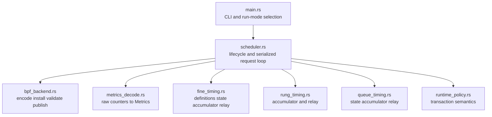
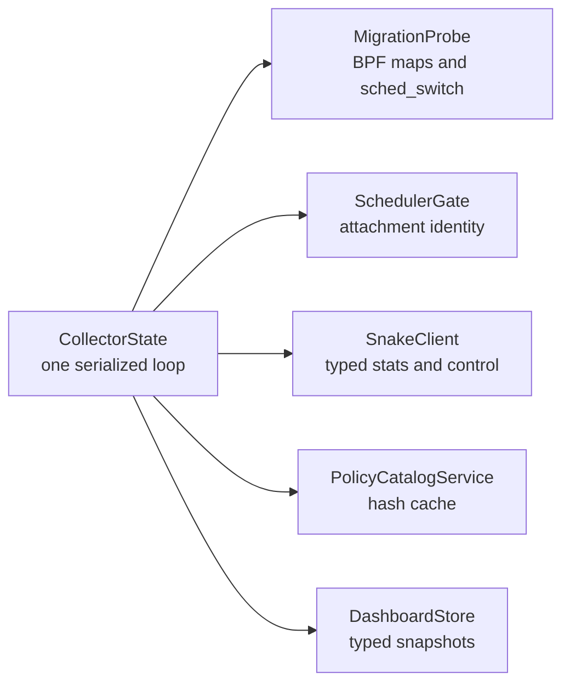

# Modularity and performance review

## Summary

Snake's problem is not inconsistent frameworks. It is rapid growth in a few
orchestration files, duplicated wire interpretation, and several algorithms whose
cost scales with configured capacity rather than active work.

Recommended changes are intentionally conservative:

- preserve the single serialized scheduler mutation loop;
- preserve one BPF task-storage lookup/value for fairness and routing;
- split files along existing ownership boundaries;
- add typed protocol DTOs rather than a generic scheduler framework;
- measure BPF stages before changing algorithms;
- address obvious inspector `N²` and repeated-parse costs first.

## Highest-priority correctness and maintainability findings

### 1. Compatibility is inferred from human error strings

The inspector partially parses policy and matches scheduler error text to decide
whether a candidate is dynamic or restart-required
([api.rs](../../../../../tools/scx_snake_inspector/src/api.rs#L843-L893)). That makes copy
changes into behavior changes.

Add a serde-only result:

```rust
struct CompatibilityReport {
    apply_mode: ApplyMode,
    issues: Vec<CompatibilityIssue>,
    policy: PolicySummary,
}

enum CompatibilityIssueCode {
    DsqTopology,
    TaskMembership,
    EnqueueTargetRemoval,
    DispatchSourceRemoval,
    FairnessMismatch,
    InvalidPolicy,
}
```

Human text remains presentation. Codes drive behavior. This is a small interface,
not a shared scheduler abstraction.

### 2. The inspector lacks one typed Snake client

`collector.rs` repeats stats connection setup, operation names, argument shapes,
and response decoding for every action
([collector.rs](../../../../../tools/scx_snake_inspector/src/collector.rs#L676-L941)).
Deadlines are also inconsistent: transport uses roughly one second while HTTP
handlers wait 5, 15, or 20 seconds, and policy replacement may wait several
seconds for slot quiescence.

Target:

```text
SnakeClient
  inspect
  metrics
  validate_policy
  activate_policy
  set_callback_rate
  set_fine_timing
  set_queue_timing
  reset_stats
  assign_thread_cell
```

Each operation owns one explicit end-to-end deadline. A transport failure invalidates
the connection instead of letting layers disagree about whether work is still live.

### 3. Inspection data crosses a loosely typed boundary

The scheduler constructs typed inspection structures
([inspection.rs](../../src/inspection.rs#L20-L258)). The
inspector receives `serde_json::Value`, validates only a shallow outer shape
([collector.rs](../../../../../tools/scx_snake_inspector/src/collector.rs#L159-L193)), stores
and clones it, then reparses subsets independently in dashboard and API code.

Create a small `scx_snake_protocol` crate containing serde DTOs only. It should not
depend on libbpf, topology, policy compilation, or scheduler internals. Parse once
at collector ingestion, store typed data, and publish canonical JSON fixtures that
the scheduler, inspector backend, and JavaScript model tests all consume.

### 4. DSQ IDs must not become JavaScript numbers

The current WIP exports Rust `u64` DSQ IDs and converts them to `Number`. Values
above `2^53 - 1` cannot be joined reliably. Use a canonical hexadecimal string in
the JSON protocol.

## Userspace module boundaries

At review time, Snake's largest files include:

| File | Approximate lines | Main concern |
| --- | ---: | --- |
| `scx_snake/src/main.rs` | 3,600+ | CLI, BPF backend, metrics, timing, lifecycle, control |
| `scx_snake/src/policy.rs` | 2,319 | Schema, validation, compilation, description |
| `scx_snake/src/inspection.rs` | 1,384 | Wire model and rendering/reference derivation |
| `scx_snake/src/stats.rs` | 1,167 | Metric model, aggregation, output, server |
| inspector `app.js` | 3,718 | State, API, routes, mutations, every renderer |
| inspector `inspection.js` | 1,907 | Pure models, now covering many unrelated views |
| inspector `dashboard.rs` | 1,436 | State store, histories, view derivation |
| inspector `host_context.rs` | 1,226 | Commands, parsers, caches, charts, ownership |
| inspector `api.rs` | 1,096 | Reads, mutations, lifecycle, compatibility |
| inspector `collector.rs` | 1,037 | Probe, gate, polling, validation, mutation |

Line count is only a signal. The recommended split follows distinct state ownership.

### Snake process



First extraction: move fine-timing accumulators and ring relay beside the existing
fine-timing state and stage definitions. The DSQ timing WIP should settle first.
Second: move BPF map encoding/installation and raw metric decoding out of `main.rs`.

Keep one serialized scheduler loop. It provides mutation ordering and avoids
concurrent BPF-map writes. Move handler implementation, not concurrency semantics.

### Policy compiler

The first issue is duplicate interpretation, not file size. Rung labels and scope
descriptions are derived separately for statistics and inspection. Put canonical
descriptors on the compiled IR, then split mechanically if managed-mode work expands
the compiler:

```text
policy/
  schema.rs       TOML-facing structs
  compile.rs      validation and lowering
  ir.rs           CompiledPolicy and CompiledRung
  describe.rs     canonical labels and summaries
```

Avoid traits and a generic compiler framework.

### BPF task state

`snake_task_runtime` mixes global fairness, queue routing, run accounting, direct
borrow state, rehome state, and timing samples
([fairness.h](../../src/bpf/fairness.h#L7-L41)). Make ownership
visible with nested structs inside the same task-storage value:

```c
struct snake_task_runtime {
    struct snake_fair_state fair;
    struct snake_route_state route;
    struct snake_run_state run;
    struct snake_queue_sample sample;
    struct bpf_cpumask __kptr *queue_cpumask;
};
```

Do not split this into multiple BPF task-storage maps. Extra lookups and partial
allocation failures would make the hot path slower and less reliable.

`fairness.h` and `queue_fairness.h` are large but algorithmically cohesive. Do not
split them only for line count. Extract timing wrappers from `main.h` only after the
current instrumentation stabilizes.

## Inspector boundaries

### Backend



This split does not require more threads. Long-running mutations such as bulk
assignment should eventually leave the telemetry loop, but scheduler map mutations
still need one ordered command executor.

### Frontend

The frontend consistently uses standard browser APIs and ES modules. Replacing it
with React or another framework would increase complexity without solving state or
transport duplication.

Incremental target:

```text
web/
  app.js               bootstrap and route composition
  runtime_client.js    fetch, token, errors, polling
  state.js             transient application state
  views/
    overview.js
    callbacks.js
    policy.js
    cells.js
    control.js
  inspection.js        shared pure models
  heatmap.js           visualization model
```

Do not broadly persist client state. Transient control state should reset on reload;
only feedback drafts intentionally use session storage. Extract polling and keyed
render state into pure controllers/reducers so tests inspect behavior rather than
regular-expression matching source text.

## Performance findings

### P0/P1: inspector migration scaling

The migration BPF map is sized toward `possible_cpus²`, capped at 1,048,576, and
the collector walks keys every 250 ms. Long-lived hosts accumulate historical
pairs. The browser then expands sparse pairs into a dense `Float64Array(N²)` and
scans it repeatedly. At 1,024 CPUs, one view update touches roughly a million cells
before painting.

Low-complexity progression:

1. use BPF batch lookup immediately;
2. keep sparse `(from, to, count)` records through the browser pipeline;
3. compute busiest routes from sparse entries;
4. paint only nonzero cells and build a sparse hover index;
5. if history growth still matters, use two generation-switched maps and drain the
   inactive bank.

Expected complexity reduction: collection and model work move from capacity-based
`O(CPUs²)` toward `O(active pairs + CPUs)`.

### P1: repeated inspection parsing and polling

The browser polls inspection, queue timing, callback timing, and fine timing every
second while the backend clones and reparses overlapping data. Parse one typed
inspection snapshot, derive views from it, and return one composite runtime response
or emit a version change that triggers only the relevant fetch.

Keep the collector running continuously; this optimization concerns client
transport, not pausing live metrics.

### P1: policy scans and bulk assignment block telemetry

Policy rescans validate files serially, and workload assignment can execute up to
1,024 sequential per-thread control RPCs. Cache validation by source hash. Add a
scheduler-side batch assignment operation before adding threads to compensate for
the current design.

Return structured per-TID errors. Today distinct failures can be flattened into a
transient list, which hides partial-success causes.

### P1: stopped-scheduler validation

When Snake is stopped, the inspector cannot ask it to compile/validate and can
present invalid policies as restartable. Export policy compilation as a library or
add a non-attaching validation command. This is both correctness and UX work.

### P2: BPF active-slot pin overhead

Every callback performs two active-slot lookups and increments/decrements a per-CPU
reader counter
([main.h](../../src/bpf/main.h#L170-L212)). This is the cost
of safe live updates. Fine timing already measures ladder acquisition. Change it
only if measured p95/p99 is material; do not weaken the update invariant for a
theoretical win.

### P2: remote shard scan

When a local cell/LLC normal queue is empty, dispatch scans every normal shard of
the cell and peeks each head
([queue_fairness.h](../../src/bpf/queue_fairness.h#L529-L627)).
The current timing stages already group this cost by queue fanout.

If measurements show a problem, add an active-shard bitmap and rotating cursor or
bounded two-candidate choice. Do not add a global heap first.

### P2: CPU-linear placement operations

Uniform random placement and some fallbacks reservoir-scan up to 1,024 CPUs.
Default policies mostly use cpumask helpers, so this cost is concentrated in random
or affinity fallback paths. If exact uniform randomness is not a requirement, reuse
`bpf_cpumask_any_distribute()` over an existing scratch intersection.

### P2: global and cell clock locks

Global VTIME/EEVDF and each cell VTIME clock use BPF spin locks on frequent paths.
Per-cell queues reduce contention relative to a global clock. Sharding normal cell
clocks would change fairness semantics and should follow real scale evidence, not
precede it.

### P2: instrumentation observer effect

The current DSQ WIP can emit multiple ring records around one sampled insert or
move. That increases ring pressure and can inflate the outer stage it is measuring.
Emit one detailed event and fold aggregate/class/outcome views in userspace. Add
drop counters per event family.

## Documentation as a contract

Concrete drift at review time:

- inspector README says six views; the UI has eight routes;
- README says EEVDF is not exposed; launcher and UI expose it;
- README says queue rows lack metrics; current views attach queue and cell data;
- timing availability changed in the current WIP;
- policy-lowering documentation names an older ABI version;
- scheduler README uses a legacy policy URL fragment.

Maintain one capability table and canonical protocol fixture inventory. Route,
protocol, or availability changes should update them in the same commit.

## What to share with Mitosis

Share now:

- existing `scx_utils` topology and cpumask support;
- existing `scx_stats` transport;
- a Snake-specific typed protocol between Snake and its inspector.

Do not share yet:

- policy compiler or policy transaction machinery;
- BPF task/fairness state;
- scheduler event loops;
- inspector presentation models;
- either current CPU allocator.

Snake's allocator and Mitosis's allocator have different inputs and semantics. First
separate Mitosis's pure allocation from its 3,800-line cell manager. Extract a
shared allocator only after managed Snake mode uses the same spec and invariant
tests.

## Recommended modularity order

1. Add golden protocol fixtures and typed compatibility codes.
2. Add serde-only Snake protocol DTOs.
3. Introduce `SnakeClient` and centralize deadlines.
4. Move timing accumulators and BPF backend out of Snake `main.rs`.
5. Move metric decoding/aggregation out of `main.rs`.
6. Introduce inspector `CollectorState` components while preserving serialization.
7. Parse and store typed dashboard snapshots once.
8. Slice `app.js` by view, preserving pure-model tests.
9. Update capability and ABI documentation.
10. Reconsider shared cell allocation only after managed-mode semantics converge.

Avoid a generic scheduler core, extra BPF task-storage maps, frontend framework
replacement, and concurrent scheduler mutation.
