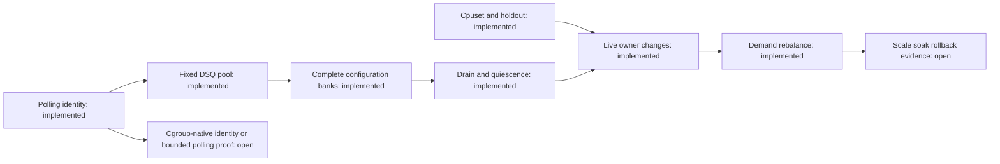

# Scheduler prior art

## Selection rule

Snake is an experimental declarative-policy mechanism, not a general-purpose
scheduler ([README](../../README.md#L5-L10)). Existing
scheduler features are useful only when they:

- preserve the userspace-policy/BPF-execution boundary;
- solve a demonstrated Mitosis, correctness, or scale gap;
- can be represented explicitly rather than silently changing semantics;
- do not require importing an unrelated classification, power, or queueing system.

The strongest shared pattern in this repository is:

```text
userspace discovers resources and computes a complete plan
    -> validates bounded state
    -> publishes a small BPF representation
    -> BPF performs scheduling without a userspace round trip
```

## Borrow/adapt/avoid matrix

| Priority | Source pattern | Benefit to Snake | Complexity/dependency | Current verdict |
| --- | --- | --- | --- | --- |
| P1 | Mitosis direct-child discovery and inode reconciliation | Automatic cell lifecycle and safe path reuse | Managed-mode semantics | Implemented with polling; harden churn evidence |
| P1 | Mitosis BPF cgroup identity/inheritance | Removes per-thread classification window | Cgroup storage and override precedence | Still missing; current userspace polling is eventual |
| P1 | Mitosis lazy generation refresh | Refresh task state only after config/cgroup changes | Requires cgroup/resource generation | Adapted with bank/slot epochs; cgroup move refresh remains polling-based |
| Done | Mitosis fixed DSQ envelope | Enables cell and CPU activation without DSQ creation | Attach cost and fixed limits | Implemented as a smaller fixed pool |
| Done | Mitosis orphaned-shard drain and sibling recovery | Prevents stranded same-cell work after CPU reassignment | High concurrency risk | Implemented and covered by focused VM tests |
| Done | Snake's staged publication | Preserves active generation on validation failure | Complete-bank reader/quiescence design | Extended to managed topology; retain |
| Done | Mitosis cpuset/holdout semantics | Overlap, claims, borrowable masks, cell-0 protection | Pure allocator input design | Implemented with consumer-preserving degradation |
| Done | Mitosis demand EWMA/hysteresis | Sustained-demand CPU ownership | Depends on identity, transaction, drain | Implemented as opt-in managed resizing |
| P1 | Mitosis cpuset change signal | Avoids constant file polling | Kernel hook compatibility | Add with polling fallback |
| P1 | Mitosis lifecycle test scenarios | Exercises real isolation and churn | VM harness work | Core cases ported; add scale, soak, faults, and rollback |
| P2 | Mitosis capability-gated lockless peek | Potential dispatch reduction with fallback | Kernel feature and benchmark | Borrow only if measured |
| Done | Mitosis pinned-waiter slice shrinking | Reduces wait behind long affinity slices | Runtime EWMA and context-switch cost | Implemented as an optional live control; benchmark before default |
| Done | Layered quantity/order separation | Allocator chooses counts; topology chooses concrete CPUs | Planner boundaries | Adapted in the managed allocator |
| Done | Layered pure allocator/property tests | Deterministic resource planning | Low | Adopted |
| P2 | Layered IRQ/stolen-time compensation | More accurate demand on capacity-reduced CPUs | Per-CPU capacity accounting | Inspector exposes host tax; controller integration remains |
| Done | Rusty fast sampler / slow planner split | Keeps frequent work bounded | Controller boundaries | Adapted as sampling plus threshold/cooldown planning |
| P2 | LAVD distance-ordered candidates | Fills Snake's remote NUMA ordering gap | Topology lowering and new explicit scope/order | Good focused addition |
| P3 | P2DQ bounded pick-two | Approximate remote selection without full scan | Requires load signal; changes semantics | New explicit operation only |
| P3 | P2DQ hot-field cacheline separation | Can reduce clock/load contention | Hardware-sensitive | Only after profiling |
| P3 | Cosmos local-underload/shared-saturation model | Locality plus work conservation | Changes queue/fairness behavior | Future explicit policy, not default |

## Mitosis: control plane, not wholesale scheduler policy

### Imported and remaining

#### Direct-child discovery and identity

Mitosis watches one parent, rescans on events, and reconciles by path and inode.
That handles event coalescing, overflow, and deletion/recreation better than trusting
individual inotify events
([cell_manager.rs](../../../scx_mitosis/src/cell_manager.rs#L918-L1045)).

Snake imported path/inode-aware direct-child reconciliation, exclusions, stable
numeric IDs, and slot epochs. It deliberately has not imported BPF cgroup identity:
its recursive `cgroup.threads` scan writes per-thread storage and is therefore an
eventual classifier. Closing or bounding that window is the remaining identity
work.

#### Stable queue envelope and drain concept

Mitosis precreates cell/LLC queues and retains enough state to find and drain queues
that lose their last normal consumer. Snake has adapted this as a smaller bounded
pool. Structural changes globally drain before rebinding; same-identity resizing
can retain stable normal shards and use explicit orphan-drain and sibling-steal
rungs after publication.

#### Cpuset and cell-0 inputs

Mitosis's allocator handles overlapping cpusets, unclaimed CPUs, borrowable masks,
demand weights, and a protected cell 0. Snake's smaller pure allocator now consumes
those inputs, preserves a consumer floor, and reports when the requested cell-0
minimum cannot be reached without starving a child.

#### Acceptance scenarios

Mitosis's shell tests cover borrowing, sensitive-versus-hog isolation, demand
rebalance, cpuset swaps, live child creation, and churn. Snake now has focused VM
coverage for managed workloads, resizing, reuse, queued affinity, drain, and steal.
The remaining value from this prior art is scheduled multi-kernel, scale, soak,
fault-injection, and rollback coverage.

### Adapt or reject

Mitosis's live apply is explicitly non-atomic and fatal after a partial failure.
Snake already has the better stage/validate/publish/readers model. Use a complete
plan, but preserve Snake transaction semantics.

Mitosis's demand accounting scans dense CPU-by-cell capacity. Snake instead samples
active identities, normalizes runtime by elapsed time, preserves EWMA by slot epoch,
and suppresses no-op or cooldown-blocked plans.

Pinned-waiter slice shrinking addresses Mitosis's long slice exposure. Snake's
VTIME base slice and waiter-aware shrink limits are now live parameters. Measure
pinned wake-to-run p95/p99 and context-switch cost before enabling it by default.

## Layered: allocator structure and capacity signals

Layered's allocator explicitly separates resource quantity from placement order.
Its pure water-fill logic documents conservation, weight, demand caps, and exact
rounding
([alloc.rs](../../../scx_layered/src/alloc.rs#L1-L226)); topology growth is
a separate strategy
([layer_core_growth.rs](../../../scx_layered/src/layer_core_growth.rs#L215-L353)).

That boundary now maps directly to managed Snake:

```text
DemandSampler -> desired CPU counts
CellAllocator -> exact per-cell counts and constraints
CpuOrderStrategy -> which concrete CPUs preserve locality
ConfigTransaction -> staged publication
```

Snake implements a deterministic topology-aware allocation path without importing
Layered's full classifier and growth-algorithm surface, which would duplicate a
different scheduler's policy language.

Layered also compensates utilization for IRQ, softirq, and stolen time so a workload
does not appear to need less CPU merely because its CPUs lost capacity
([README](../../../scx_layered/README.md#L70-L99)). This is useful after
the basic demand controller is correct. Inspector now displays other-task, IRQ,
softirq, steal, and unclassified host tax, but Snake's ownership controller does
not yet use a heterogeneous effective-capacity model.

## Rusty: fast sampling and slow planning

Rusty clearly separates domains, tuner, load balancer, and statistics at the module
level
([main.rs](../../../scx_rusty/src/main.rs#L9-L18)). Its userspace design
uses fast, cheap tuning and slower, more expensive balancing
([main.rs](../../../scx_rusty/src/main.rs#L65-L86)).

Snake uses the same cadence split:

- `DemandSampler`: frequent, bounded counter deltas;
- `CellPlanner`: slower, runs only after threshold/cooldown/input change;
- `ConfigApplier`: validates and publishes only a changed plan.

Do not import Rusty's task-migration hierarchy. It solves a different multi-domain
balancing problem and lacks Snake's cgroup/cell semantics.

## LAVD: topology ordering without hot-path topology objects

LAVD precomputes distance-ordered CPU candidates in userspace and lets BPF traverse
the bounded representation
([cpu_order.rs](../../../scx_lavd/src/cpu_order.rs#L290-L365),
[balance.bpf.c](../../../scx_lavd/src/bpf/balance.bpf.c#L344-L448)). This
directly addresses Snake's documented lack of distance-ordered remote NUMA search.

A focused Snake addition could be an explicit scope/order such as
`topology_nearest_idle` or a userspace-lowered sequence of distance tiers. It should
remain declarative and optional.

Do not import LAVD's latency-criticality classifier, virtual-deadline policy,
preemption system, frequency control, or core compaction. Those define a different
scheduler.

## P2DQ: bounded approximation, not invisible semantics

P2DQ uses bounded pick-two load balancing across LLC/NUMA queues and has extensive
arena, queue, power, autoslice, and heterogeneous-core functionality
([README](../../../scx_p2dq/README.md#L5-L14),
[README](../../../scx_p2dq/README.md#L73-L112)).

Pick-two is useful if Snake later adds explicit cross-cell queued stealing: choose
two eligible remote domains, compare a small load signal, and try the heavier one.
It is not a drop-in replacement for exact `min_vtime`; silently substituting it
would change policy semantics.

Do not import arenas/ATQ/DHQ, interactive classification, power management,
autoslicing, or big/little policy merely to gain pick-two. Those are disproportionate
to Snake's purpose.

## Cosmos and other scheduler families

Cosmos keeps local queues below saturation and switches to shared deadline queues
under pressure
([README](../../../scx_cosmos/README.md#L7-L21)). The concept is relevant
to locality versus work conservation, but it changes queue topology and fairness.
If explored, expose it as an explicit adaptive policy with observable state—not a
backend optimization.

The remaining Rust schedulers were screened rather than assumed irrelevant:

| Scheduler | Relevant idea | Decision for Snake |
| --- | --- | --- |
| [Beerland](../../../scx_beerland/README.md) | Per-CPU deadline DSQs and saturation-time remote pull | Useful work-conservation comparison; do not import its fairness model |
| [Forge](../../../scx_forge/README.md) | Closed-loop workload and evaluation workflow | Borrow validation discipline, not generated hot-path behavior |
| [Chaos](../../../scx_chaos/README.md) | Deliberate scheduling fault injection | Borrow failure-test ideas; never production policy |
| [Cake](../../../scx_cake/README.md) | Workload classification and latency tiers | Different product scope; avoid implicit classification |
| [Pandemonium](../../../scx_pandemonium/README.md) | Adaptive classification, deadlines, and migration | Too much coupled policy for a Mitosis-control-plane project |
| [Flash](../../../scx_flash/README.md) and [Bpfland](../../../scx_bpfland/README.md) | Interactivity classification and EDF-style prioritization | Scope expansion; consider only as future explicit policies |
| [Rustland](../../../scx_rustland/README.md) | Userspace scheduling decisions | Conflicts with Snake's BPF hot-path execution boundary |
| [Tickless](../../../scx_tickless/README.md) | NO_HZ/HPC-oriented event routing | Operationally specialized and unrelated to managed cells |

These schedulers do not change the prioritized import list. Their most reusable
contribution is validation technique, not scheduling behavior.

## Resulting module shape

```text
managed_cells.rs     direct children, inode identity, excludes
membership.rs        polling-based descendant task assignment
demand.rs            elapsed-time samples, per-epoch EWMA, rebalance gating
cell_allocation.rs   pure cpuset, holdout, and ownership planning
queue_topology.rs    bounded DSQ descriptors and banked routes
main.rs              transition coordination, staging, drain, and publication

BPF queue path       orphan drain, sibling steal, clock/epoch validation
slice_shrinking.h    optional waiter-aware current-runner shortening
```

Dependency order:



The design remains intentionally asymmetric: Mitosis supplies the behavioral
resource model, Layered the allocator boundary, Rusty the controller cadence, LAVD
optional topology ordering, and P2DQ only a future explicit approximate policy.
Snake's compiler, complete-bank transaction, queue clocks, accounting, and
Inspector remain the organizing system.
