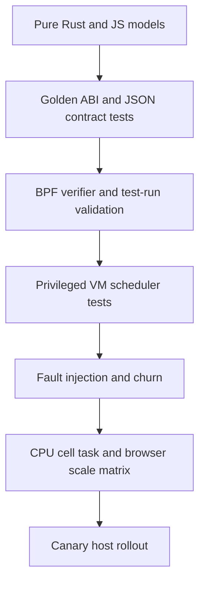
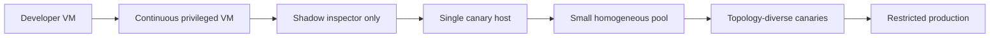

# Validation and risk plan

## Risk register

### P0: release blockers

#### EEVDF weighted fairness is known incorrect

Confidence: high. Impact: top-level fairness mode cannot be trusted.

The project records that pinned nice-level tasks receive approximately equal
service instead of expected weighted shares
([FAIRNESS.md](../FAIRNESS.md#L3-L6)). Current CI runs
the EEVDF affinity-forward-progress case but not the weighted-share contract
([ci.yml](../../../../../.github/workflows/ci.yml#L376-L384)).

Gate:

- hide or clearly disable EEVDF in non-experimental control surfaces;
- turn nice-share validation into a mandatory VM regression;
- compare BPF state transitions with a small reference model using captured event
  vectors;
- require equal-weight, two-weight, three-weight, sleeper, yield, and affinity
  cases before enabling it.

#### Cross-cell queued backlog is intentionally not work-conserving

Confidence: high. Impact: Mitosis parity and production forward progress.

Direct borrowing helps newly runnable work. Same-cell sibling stealing and orphan
draining now recover work across one cell's LLC shards, but an already queued
normal task is never stolen by another cell. An undersized cell can still hit the
sched_ext watchdog while foreign CPUs are idle
([QUEUE_POLICY.md](../QUEUE_POLICY.md#L83-L90)).

This is documented behavior, not a small hidden bug. Demand rebalancing can move
ownership for sustained skew, but it cannot rescue backlog quickly enough to be a
general watchdog guarantee. Near-term safety requires queue-age/depth warnings and
admission/rejection of obviously unsafe capacity plans. Full resolution requires
an explicit cross-cell queued-work policy with clock semantics or a specified
controlled detach before watchdog exposure.

#### CPU hotplug has no safe contract

Confidence: high. Impact: attachment-time topology can become invalid while Snake
is running.

Managed identity epochs, complete banks, structural drain, and affinity-queue
checks now provide a contract for managed CPU-owner changes. They do not make CPU
hotplug safe. Queue descriptors and custom DSQs are
attachment-time state, and Snake registers no CPU online/offline callbacks
([main.bpf.c](../../src/bpf/main.bpf.c#L887-L895)). Until a
hotplug transaction exists, detect online-mask change and perform a controlled
detach, or explicitly prohibit hotplug operationally and test that contract.

#### Diagnostic failure can stop the scheduler

`inspection()` performs task storage and `/proc` inspection for every tracked task
and propagates a non-disappearance error
([main.rs](../../src/main.rs#L3060-L3119)). The scheduler
request loop uses `?` on `metrics()` and `inspection()`
([main.rs](../../src/main.rs#L3885-L3891)), so an observer
failure can unwind the scheduler and detach it.

Required behavior:

- task inspection is best-effort per row;
- diagnostic errors are returned in the response, not as scheduler-loop failure;
- last-good inspector data remains available with freshness/error state;
- a disconnected or malformed client cannot affect scheduler attachment.

## P1: high-priority correctness and scale risks

### Managed topology publication has a measurable window

Dynamic descendant membership is now resolved from cgroup ancestry in BPF. New
threads and moves between already published children do not wait for a
userspace per-thread write. Direct-child creation, deletion, replacement, and
cpuset changes still wait for userspace to publish a new topology bank. A task
under an unpublished child therefore runs in cell 0 with `unresolved` status.

Required campaigns exercise fork/exec, cgroup moves, and direct-child churn at
high rates. Gate on `managed_mapped_cell0_runtime_ns` and
`managed_unresolved_cell0_runtime_ns`, their timeslice/affected-task counters,
and the two exit categories. The mapped category should remain zero in steady
state; the unresolved category directly bounds the topology polling cost,
including tasks that exit before userspace sees them.

### Static membership clear failure is not retried

The legacy explicit `[membership]` removal path forgets the task and retained
pidfd before clearing its task storage. A non-exit error is logged, but the next
reconciliation has no state with which to retry
([membership.rs](../../src/membership.rs#L107-L121)). A stale
static managed cell can later become visible when a manual override is cleared.
Dynamic `[managed_cells]` does not use this per-thread clear path.

Required behavior: retain known task and pidfd until clear succeeds or task exit is
confirmed. Add a deterministic injected-failure retry test.

### Inspector polling amplification is large-host material

At 1,024 CPUs and 256 cells, one full metrics request reads approximately:

```text
74 global stats × 1024 CPUs × 8 bytes
+ 256 cells × 13 stats × 1024 CPUs × 8 bytes
+ 7 callbacks × 1024 CPUs × 520 bytes
= 25,305,088 bytes
```

Four top-stat requests plus one inspection request per second are roughly 121 MiB/s
of raw map data and 13,205 per-CPU map lookup calls per second, before task inspection,
allocation, JSON, and rendering. The migration collector additionally walks its
map every 250 ms, and the browser performs dense `N²` work.

Required campaigns compare inspector absent and present at 8, 64, 256, and 1,024
CPUs. Required implementation direction is in
[Modularity and performance](modularity-and-performance.md#performance-findings).

### Dispatch has data-dependent scans

- EEVDF scans future and eligible DSQs for CPU-compatible tasks; only promotion is
  capped.
- Cell/LLC VTIME scans every normal shard of a cell after a local miss.
- Random placement scans up to 1,024 CPUs.

Do not cap EEVDF walks blindly; that can break forward progress. Keep EEVDF gated
until it has an affinity-indexed design or equivalent proof. Use existing remote
scan timing before optimizing VTIME.

### Timing transport can bias the measurement and delay control

Fine and rung ring-buffer output failures are ignored
([main.h](../../src/bpf/main.h#L249-L263),
[main.h](../../src/bpf/main.h#L354-L368)). Userspace drains
4,096-event batches until it sees a short batch, without a per-loop maximum. Under
sustained sampling this can monopolize the scheduler loop.

Add emitted/dropped counters per stream, cap drain batches per loop iteration, and
make rung streaming independently sampled or enabled. Detailed DSQ events should
remain single-source, with aggregate views derived in userspace.

## P2: bounded defects and debt

### Reset does not clear rung timing

Rung timing is keyed by policy generation, while reset intentionally preserves the
generation. The reset path clears fine and queue accumulators but not rung timing.
Old and new samples therefore mix after “Reset all statistics.”

Add a rung accumulator clear/prune operation and test every reset surface: global,
rung, callback, fine, queue, dashboard rolling history, and frozen-slot behavior.

### Queue mode allocates a cpumask per task

Queue-mode `init_task` creates a cpumask kptr for temporary intersections. At high
task counts this is material memory. After proving callbacks cannot reenter on one
CPU, evaluate the existing per-CPU scratch mechanism. Do not change this before a
memory profile demonstrates value.

### Documentation and protocol drift

Inspector route count, EEVDF exposure, queue metrics, timing availability, and ABI
version have drifted. Golden protocol fixtures and a single capability table should
be test inputs, not prose maintained independently.

## Existing validation inventory

Assessment update (2026-08-03): Inspector Rust/JavaScript tests run in normal CI.
The repository has a manually dispatched sharded VM workflow with frozen inputs,
plus focused managed scripts for workload child discovery, resizing, churn/reuse,
queued affinity during cpuset changes, sibling-LLC stealing, and orphan draining.
The standalone orphan-drain causality test preserves one exact binary and policy,
then proves the no-drain case strands depth one through the watchdog window while
the drain-enabled case empties the same queue and completes.
EEVDF mixed-affinity and fork/yield progress cases also run in CI. These are
meaningful mechanism and forward-progress gains, but they do not measure weighted
shares, throughput, latency, production-scale convergence, or long soak behavior.

Approximate source-level inventory at review time:

| Surface | Count or coverage |
| --- | --- |
| Snake Rust test attributes | approximately 368 |
| Snake privileged VM shell scripts | 26 |
| Inspector Rust test attributes | approximately 152 |
| Inspector JavaScript `test()` cases | approximately 214 |
| Mitosis Rust tests | 67 |
| Mitosis integration files | 5 shell scripts and 2 ktstr test files |

Snake's VM scripts cover FIFO fallback, VTIME cells, queue ladders, borrowing,
maximum cells, mixed affinity, low-weight yield, live rehome, managed lifecycle,
resizing, reuse, queued affinity, orphan drain, and sibling stealing. The combined
gauntlet deliberately excludes EEVDF
([FAIRNESS.md](../FAIRNESS.md#L348-L370)). Normal CI
also runs a generic Snake stress case and checks activation, expected rung activity,
and kernel errors
([ci.yml](../../../../../.github/workflows/ci.yml#L245-L290)).

The main gaps are weighted-share correctness, observer and transition fault
injection, browser DOM smoke, multi-client and large-host scale, hotplug, long
managed-control soak, and exercised rollback.

### Remaining automation gaps

The inspector declares its own Cargo workspace and is not a member of the root
workspace. Normal CI now runs its Rust and Node tests explicitly with:

```bash
cargo test --manifest-path tools/scx_snake_inspector/Cargo.toml
cargo check --all-targets --manifest-path tools/scx_snake_inspector/Cargo.toml
node --test tools/scx_snake_inspector/tests/web/*.test.mjs
```

The JavaScript tests exercise pure models and source/markup contracts; they do not
run a browser. Add a small headless suite for five workflows:
route navigation, disclosure/focus survival through polls, unapplied selector state,
policy apply/restart behavior, and cell task expansion.

The sharded Snake VM matrix is still manually dispatched. Run a short FIFO/VTIME
and managed subset for relevant pull requests and schedule the full matrix nightly.
The focused managed scripts cover core mechanisms, but production evidence still
needs multi-kernel scheduling, fault injection, scale, soak, and rollback gates.

## Test architecture



Each layer should fail a different class of error. More unit tests do not replace
VM tests; more VM tests do not replace observer and controller scale measurement.

## Required correctness campaigns

### Fairness and forward progress

- mandatory EEVDF nice-share ratios against kernel weights;
- equal and unequal VTIME weights with direct, normal, affinity, and borrowed work;
- yield, sleep/wake, overrun, weight change, and request-boundary transitions;
- hundreds or thousands of mutually incompatible affinity tasks;
- queue under-allocation with overload warning and no silent diagnosis;
- owner wake while a foreign borrower runs; borrower yields after one slice.

### Configuration publication

- repeated live policy swaps during wake-heavy load;
- concurrent policy and resource candidates serialize through one coordinator;
- monotonic epochs and correct active/frozen bank identity;
- reader quiescence and bounded activation latency;
- callbacks observe an old or new complete policy/resource/identity-binding
  tuple, never a mixed generation;
- invalid candidate leaves the active bank, counters, topology, and captures
  unchanged;
- reset and replacement races with every timing capture state.

### Task identity and membership

- fork/exec and thread churn during reconciliation;
- task moves between assigned, unassigned, and manually overridden cgroups;
- clear failure retries;
- TID reuse with retained pidfd;
- scheduler restart documents annotation loss;
- 10,000–100,000 managed-thread churn to expose scan and inspection costs.

### Affinity and topology

- dynamic `sched_setaffinity()` while sleeping, runnable, queued, and running;
- sparse CPU IDs near the 1,024 limit;
- SMT/no-SMT, one and many LLCs, one and many NUMA nodes;
- CPU offline/online with normal and affinity backlog;
- remote cell/LLC shard scans at increasing fanout.

### Observer and control isolation

- `/proc` read failure, task-storage read failure, poisoned/closed client, and
  malformed request cannot detach Snake;
- ring-buffer saturation reports drops and does not starve controls;
- API timeout does not leave an unreported background mutation;
- multiple inspector clients do not multiply scheduler map reads unnecessarily;
- stopped-scheduler policy validation rejects invalid TOML before launch.

## Mitosis-mode campaigns

Focused VM scripts now cover direct-child workloads, cpuset-driven resizing,
create/delete/reuse, queued-affinity accounting, same-cell sibling stealing, and
orphan draining. Remaining campaigns should emphasize gaps that those happy-path
mechanism tests do not close:

- high-rate fork/exec and cgroup moves that quantify the userspace polling window;
- create/delete and descendant propagation racing complete-bank publication;
- sleeping task wake after its former slot and clock have been reused;
- cgroup move while sleeping, running, queued normal, queued affinity, and borrowed;
- cpuset swaps and infeasible admission under sustained CPU-bound load;
- injected cpuset read/parse/permission failures with an explicit retain, reject,
  or controlled-detach result;
- failure at every inactive-bank validation, drain, publish, reader-quiescence,
  and membership boundary, proving the active bank remains coherent;
- long demand skew, reversal, idle decay, and burst/no-oscillation runs with
  quantitative ownership-churn bounds;
- CPU online/offline detection and the selected support-or-detach contract;
- observer faults, scheduler restart, and rollback while cgroups and cpusets churn;
- target-host scale and soak with Inspector absent, connected, and multi-client.

## Performance matrix

| Axis | Values |
| --- | --- |
| CPUs | 8, 64, 128, 256, 512, 1,024 |
| Cells | 1, 8, 32, 256 |
| LLCs | 1, 4, 8, 16 and a high-fanout host if available |
| Runnable tasks | 1×, 4×, and 32× CPU count; plus 100k sleeping/managed tasks |
| Affinity | unrestricted, one CPU, one LLC, fragmented masks |
| Sampling | disabled, 1/64, every callback; captures off/on |
| Inspector | absent, one client, four clients |
| Policy churn | none, 1 Hz validation, repeated live swaps |
| Managed control | stable, cgroup churn, cpuset churn, demand rebalance |

Measure:

- workload throughput and tail latency;
- callback/rung/stage p50, p95, p99;
- runqueue delay, context switches, migrations, LLC misses;
- watchdog margin and invalid/accounting errors;
- scheduler and inspector CPU/RSS;
- map-read bytes and calls per second;
- SSE/REST bytes and browser frame/render time;
- ring emitted/dropped counts;
- controller reconciliation/rebalance duration and owner moves;
- queue-drain duration and retired-slot count.

## Rollout gates



Required at every scheduler rollout stage:

- zero sched_ext stalls and BPF invalid/accounting errors;
- no observer-caused detach;
- known fairness ratios within tolerance;
- callback p99 within an agreed budget relative to FIFO/control baseline;
- ring-drop rates visible and below threshold;
- queue ages and depths bounded for the declared resource policy;
- rollback is a normal scheduler detach/restart, not manual state repair.

Additional managed-mode gates:

- every cell/CPU assignment has a generation and reason;
- no stale identity crosses an epoch;
- no retired queue slot is reused before drain/quiescence;
- rebalance rate and owner churn remain bounded;
- cell 0 retains configured capacity;
- inspector and dump data can explain every active, retiring, or failed resource.

## Definition of production-ready

Production readiness should not be declared until all of the following are true:

1. no fairness mode exposed as supported has a known correctness failure;
2. every declared resource policy has a forward-progress/work-conservation contract;
3. CPU hotplug is either supported or safely rejected;
4. diagnostics cannot affect scheduler lifetime;
5. BPF managed identity and the remaining direct-child publication window are
   measured and accepted for the target workload;
6. privileged CI runs the important FIFO, VTIME, queue, and EEVDF contracts;
7. scale curves exist for target CPU/cell/task counts with and without inspector;
8. dump, metrics, and alerts identify stalls, drops, topology generations, and
   rebalancing decisions;
9. canary and rollback procedures have been exercised under workload and churn;
10. documentation, protocol fixtures, UI availability, and implementation agree.

## Operational completeness estimate

These scores measure validation and rollout readiness, not feature implementation:

| Area | Complete |
| --- | ---: |
| Static Snake policy/unit validation | 92% |
| FIFO/VTIME VM validation | 88% |
| Automated CI coverage of the VM suite | 55% |
| EEVDF validation | 45% |
| Inspector API/model validation | 92% |
| Inspector real-browser validation | 20% |
| Dynamic Mitosis-parity validation | 70% |
| Performance regression coverage | 20% |
| Production rollout/runbook readiness | 20% |
| **Overall production validation readiness** | **approximately 45%** |

The fastest material improvements are scheduled use of the existing sharded VM
matrix, observer and transition fault injection, one controlled kernel-default
versus simulation workload with LLC-balance and performance output, real-browser
smoke, a long managed-control soak, and an exercised detach/restart rollback on a
noncritical canary host.
